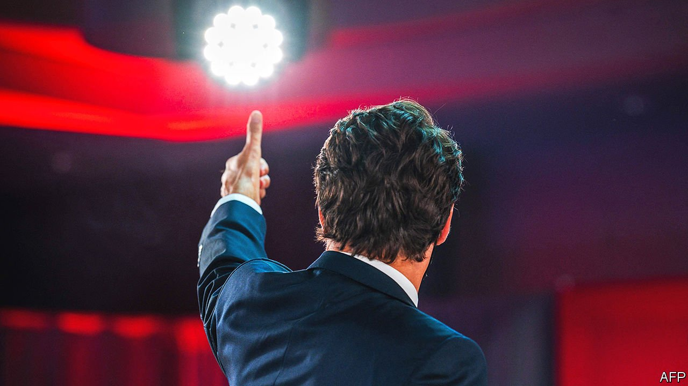
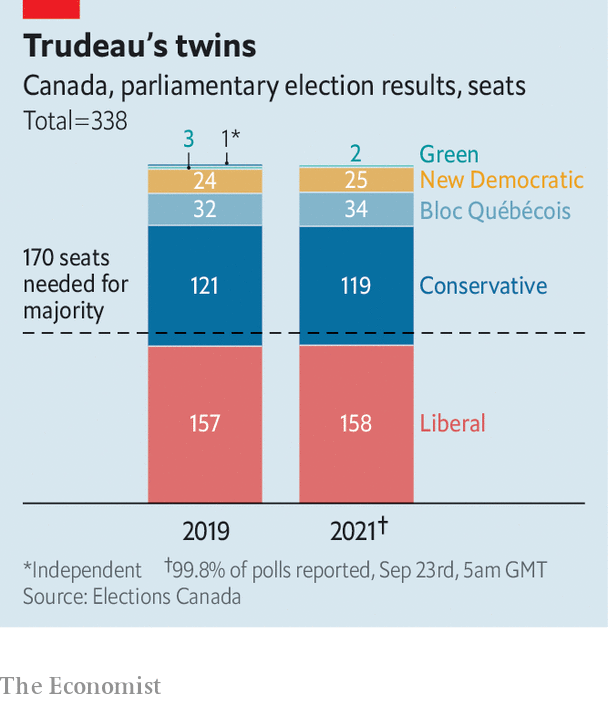

###### As you were

# Justin Trudeau keeps his job, but loses some lustre 

##### Canada’s prime minister called a pointless election 

 

> Sep 21st 2021 

BY CANADIAN STANDARDS the election campaign was ugly. Protests dogged the candidates of the main parties. Loutishness went “beyond the typical uptick” for federal elections, said the Royal Canadian Mounted Police. It came especially from anti-vaccine activists. This month someone threw gravel at Justin Trudeau, the Liberal prime minister, who says that vaccinations should be mandatory for federal employees and on aeroplanes and trains.

Yet the melodrama changed almost nothing. Mr Trudeau, who had  for September 20th in the hope of gaining a majority in the House of Commons, will instead continue to lead a minority government. The arithmetic in the 338-seat Parliament has changed little (see chart). Mr Trudeau will continue to depend on smaller parties, especially the left-leaning New Democrats (NDP), to enact his programme. The opposition Conservatives, who had 121 seats in the outgoing Parliament, will have roughly the same number in the incoming one.


None of Canada’s main political leaders will come out of the election with his standing much enhanced. Mr Trudeau has no good answer to the question of why it was necessary to hold an election during a fourth wave of the pandemic. The Liberals appear to have come second in the popular vote. Their lacklustre performance may prompt speculation that this election will be Mr Trudeau’s last. The NDP’s leader, Jagmeet Singh, failed to strengthen significantly his party as a challenger for votes of left-leaning types. He will try to nudge the government to spend more money on health care and raise taxes on the rich.

 


, the Conservatives’ leader since August 2020, may face the most painful questions. He campaigned as a reassuring centrist, offering voters a down-to-earth leadership style while proposing policies on climate change, child care and “reconciliation” with indigenous people that, at first glance at least, did not seem vastly different from the Liberals’. Yet Mr O’Toole could not ignore his party’s obstreperous right wing. He flip-flopped on gun control, which hurt his credibility.

Many Canadians who pugnaciously oppose what they see as Mr Trudeau’s smug progressivism opted for the populist People’s Party. It tripled its share of the vote, to 5%, though it failed to win any seats. If Mr O’Toole stays on as the Conservatives’ leader, as he hopes to do, he will have to work out how to win back voters who hate vaccines and political correctness, without alienating centrists.

Mr Trudeau reads the result as encouragement to carry on a fight against the pandemic that, despite the fourth wave, has been relatively successful, and to “move Canada forward”, as the Liberals’ campaign slogan has it. Canada has had 49 excess deaths per 100,000 people, compared with America’s 241, according to . In his victory speech Mr Trudeau claimed “a clear mandate to get Canada through this pandemic and to the brighter days ahead”.

Those bright days may be far off. Canada’s economy, the world’s ninth-largest, remains fragile. It shrank unexpectedly in the second quarter of this year, largely because of the pandemic and global shortages of computer chips. The Bank of Canada expects growth to resume in the second half of 2021, but says the recovery is “choppy”. Mr Trudeau’s re-elected government will continue some pandemic-related measures to shore up businesses and incomes; the Canada Recovery Hiring Program, a wage subsidy, is to be extended to March 31st.

The government will continue with plans to make child care available to families for C$10 ($8) a day within five years and to reduce Canada’s greenhouse-gas emissions in 2030 by 40-45% from levels in 2005. The Conservatives would have scaled both policies back.

In making the case for re-election Mr Trudeau promised extra spending over five years of C$78bn, roughly 3.5% of this year’s GDP. It includes C$6bn in this fiscal year to eliminate backlogs of medical procedures, plus around C$15bn over five years to help Canadians cope with high housing costs, in part by building 1.4m houses.

Although fiscal hawks worry about Mr Trudeau’s spending plans, he is not throwing caution to the wind. The Liberals will impose higher taxes, including a surtax on large banks and insurers, and promise to reduce federal deficits and debt as a share of GDP. The Institute of Fiscal Studies and Democracy at the University of Ottawa, a think-tank, says the pledge is credible.

But economists will continue to grumble that the Liberals show too little interest in promoting growth and productivity. Business investment per worker has fallen since 2014, according to a recent paper by the C.D. Howe Institute, a think-tank in Toronto. Among the main worries about the new government is that the tax-the-rich agenda favoured by the NDP will influence policy, which could discourage investment. Businesspeople are “feeling quite rattled”, says William Robson, one of the report’s authors. The Liberals’ platform has ideas for investing in research, which could help raise productivity, but has little to say, for example, about boosting competition in telecoms or aviation.

Canadian voters have given Mr Trudeau only a grudging endorsement. “There’s a lot that I don’t like, but now is not the time to experiment with new policies and new things,” says Kathy Ustel, a resident of Richmond Hill, a town located in the electoral battleground of greater Toronto. The constituency’s Liberal MP easily won re-election. The Liberal prime minister will now have four years to convince Canadians that his old approach really can move the country forward.■

