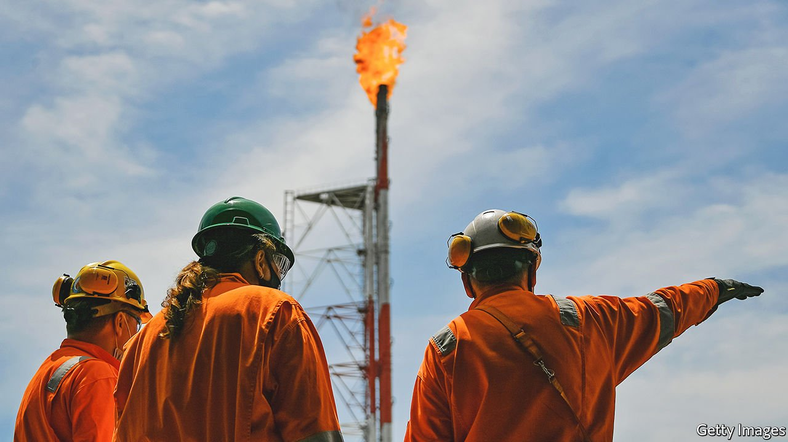

###### 

# Business this week 

#####  

 

> Sep 23rd 2021 

A global shortage of natural-gas supplies continued to convulse markets. Prices have soared in recent weeks, especially in Europe, following a convergence of adverse factors, such as booming demand in Asia coinciding with tight stocks of liquefied natural gas. In Europe some governments are stepping in to alleviate the pressure on spiralling household bills. The International Energy Agency pointed out that Russia’s gas exports to Europe are below their level of 2019, and urged it to “do more to increase ”.

A fowl situation


One of the many knock-on effects of the turmoil in gas markets was a shortage of carbon dioxide as an . A big producer of carbon dioxide had to close its factories because of soaring natural-gas prices, which in turn led to warnings from the chicken industry about a possible paucity of poultry. Carbon dioxide is used to stun hens for slaughter.

, one of China’s biggest property developers, said it had “resolved” the payment of interest on a domestic bond amid a liquidity crisis. The highly indebted company has warned of a default and has reportedly missed interest payments to bank creditors. Investors are watching nervously. The central bank has been pumping liquidity into the financial system to shore up confidence.

The official statement from the Federal Reserve’s meeting this week prepared markets for the strong possibility that it will start to taper its pandemic-programme asset purchases in November. The central bank also hinted at an interest rate rise next year.

The OECD raised its forecast for inflation in the G20 countries, in part because of higher shipping costs and energy prices. The average annual inflation rate for the group is now expected to be 3.7% this year and 3.9% in 2022. Battling inflation that is nearing 10%, Brazil’s central bank raised its main interest rate for the fifth consecutive month.

America’s House of Representatives passed a bill that would extend  until December next year in order to avoid a government shutdown on October 1st this year. Democrats supported the bill and Republicans opposed it. , amid warnings that markets will run out of patience the longer a resolution is delayed.

Douyin, a Chinese video-sharing app that has an international version called TikTok, said children under 14 in China would be limited to using it for 40 minutes a day. It is the latest move in China to tighten controls over children’s online behaviour.

Shell struck an agreement to sell its energy assets in America’s Permian Basin to ConocoPhillips for $9.5bn. The Anglo-Dutch energy giant is under pressure to quicken the pace of carbon-emission cuts. In May a Dutch court ordered the company to hit a specific carbon-reduction target by 2030 (it is appealing against the ruling). Shell described the sale of its Permian business as “disciplined stewardship of capital”. Some $7bn in proceeds have been earmarked for “shareholder distributions”.

 made a successful stockmarket debut on the Euronext exchange in Amsterdam. Its share price jumped by a third on the first day of trading, in Europe’s biggest listing this year. The music company, which counts EMI and Motown among its record labels, was spun off by Vivendi, though the French media conglomerate’s controlling shareholder, Vincent Bolloré, retains an 18% stake.

Entain, a British gambling company and owner of the Ladbrokes and Coral brands, said it had received a takeover approach, reportedly worth $25bn, from DraftKings, an American fantasy-sports and betting operator.

Mitsubishi UFJ Financial Group, Japan’s biggest lender, is to sell its consumer-banking operations in America to US Bancorp in an $8bn deal. MUFG expanded into American retail banking when it took full control of Union Bank during the financial crisis in 2008. It will hold on to its corporate- and investment-banking businesses in America, important providers of income.

In a vote of confidence for the future of office working, Google announced that it would buy the building that serves as its hub in New York for $2.1bn, even though it expects some employees will continue to work remotely.

Return of the salad days

In Britain a different indicator—the financial health of Pret A Manger—also suggested a rosy future for the office. The coffee-and-light-meal chain, a favourite of the lunchtime crowd, has seen its sales rebound in London’s financial district. During the pandemic it closed stores across Britain, but now expects to open 200 new ones by the end of 2023. However, most of those will not be in city centres, Pret’s traditional habitat, but in suburbs and regional towns.

