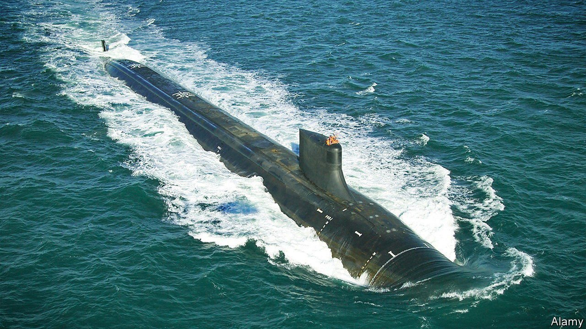
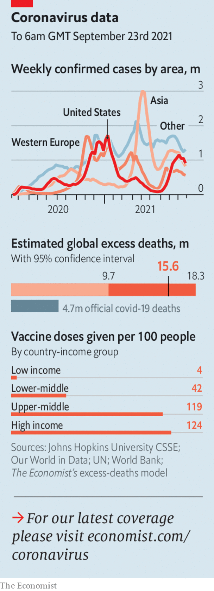

###### 

# Politics this week 

#####  

 

> Sep 25th 2021 

France reacted with fury to American, Australian and British plans to form . France was not invited to join. Australia is also cancelling a contract for French diesel-powered submarines in favour of American (or just possibly British) nuclear-powered ones. Jean-Yves Le Drian, the French foreign minister, called it a “stab in the back”, and withdrew his ambassadors from Washington and Canberra, though the French ambassador to America is now being sent back following a make-up call between presidents Joe Biden and Emmanuel Macron.

Germans got ready to vote in a general election on September 26th that will mark the end of , as she is standing down. The polls have narrowed slightly, but the Social Democrats are still running ahead of Mrs Merkel’s Christian Democrats.


In , elections to the Duma produced another supermajority for United Russia, the pro-Putin party through which the Kremlin wields legislative power. The election was widely seen as rigged. But few Russians took to the streets to protest, unlike in 2011, when thousands did.

China’s president, Xi Jinping, said that he would stop supporting new . By some estimates, 70% of all coal plants being built today involve Chinese state finance, but China’s interest in dirty power has cooled as the price of the renewable sort has fallen.

China applied to join an 11-country Asia-Pacific trade deal known as the Comprehensive and Progressive Agreement for Trans-Pacific Partnership. Taiwan also asked to join.

Hong Kong held a vote for a new 1,500-member Election Committee, which will choose the city’s next leader. It was the first after reforms that require candidates to be “patriotic”: ie, friendly to China’s Communist Party. The electorate was limited to fewer than 5,000 people. Only one government critic gained a seat.

The results of a snap  were disappointing for Justin Trudeau, the prime minister. Although Mr Trudeau gained enough votes to govern for a third term, he remains the head of a minority government, with about the same number of seats as when he called the election.

Another Trumpian turn

Speaking at the UN General Assembly Jair Bolsonaro, Brazil’s president, claimed to represent “a new Brazil, with its credibility recovered before the world”. He also spent part of the speech touting unproven remedies for covid-19 and denouncing lockdown measures.

America’s border patrol began removing the 15,000 Haitian migrants who had gathered at a bridge in Texas after crossing the border from Mexico. Hundreds were deported to Haiti immediately. The migrants had travelled up from South America.

The State Department said that the annual cap on refugees allowed into America will rise from 62,500 to 125,000, fulfilling a campaign promise by President Joe Biden.

Mr Biden doubled the number of covid-19 vaccines that America is donating to developing countries to 1bn, which Pfizer is providing for no profit. Before the announcement António Guterres, the UN secretary-general, called the unequal distribution of vaccines between rich and poor countries an “obscenity”.  of the Pfizer vaccine for the over-65s.

India said it would resume exporting vaccines. The Serum Institute of India is a big manufacturer of the AstraZeneca shot that is used in many poor countries. India had halted exports when it was hit by a devastating surge of infections in April.

, the president of the Philippines, said people would be held accountable for any unlawful killings in the country’s drug war. His critics say he has encouraged such killings. The International Criminal Court has opened an investigation into his anti-drug campaign. Mr Duterte did not mention the ICC by name, but he appeared to reject its jurisdiction over his country.

Paul Rusesabagina, whose bravery in saving more than 1,200 people during the genocide in Rwanda inspired the film “Hotel Rwanda”, was sentenced to 25 years in jail for terrorism. Observers called the trial a sham. Mr Rusesabagina is a critic of Paul Kagame, Rwanda’s president.

The authorities in Sudan thwarted an attempted coup against a transitional government that was itself installed in a coup in 2019. Forces loyal to Sudan’s toppled dictator, Omar al-Bashir, were blamed.

, the president of Algeria from 1999 to 2019, died, aged 84. He led the country out of a ruinous civil war, but was ousted in 2019 amid mass protests against his decision to seek a fifth term.

Putting out the welcome mat

The White House said restrictions on travellers entering the United States that were introduced at the start of the pandemic would be lifted in November, for people who are fully vaccinated. The restrictions, which in effect barred most passengers from Europe, China, India and a handful of other countries, had been criticised as irrational. A negative covid test will still be required, as is the norm nearly everywhere.

 


Australia is also ready to reopen its international frontiers in December, if its national vaccination rate reaches 80%. It sealed its border 18 months ago, more tightly than nearly any other country. Australians will once again be allowed to leave without special permission, and visitors will be allowed in. Thailand, which has been re-opening tourist hotspots, is aiming to reopen Bangkok and other cities in November.

Protests against vaccine mandates morphed into three days of rioting in Melbourne. The Australian city has been under various degrees of lockdown since the outbreak began, and subject to labyrinthine rules. It also endured an earthquake this week.

