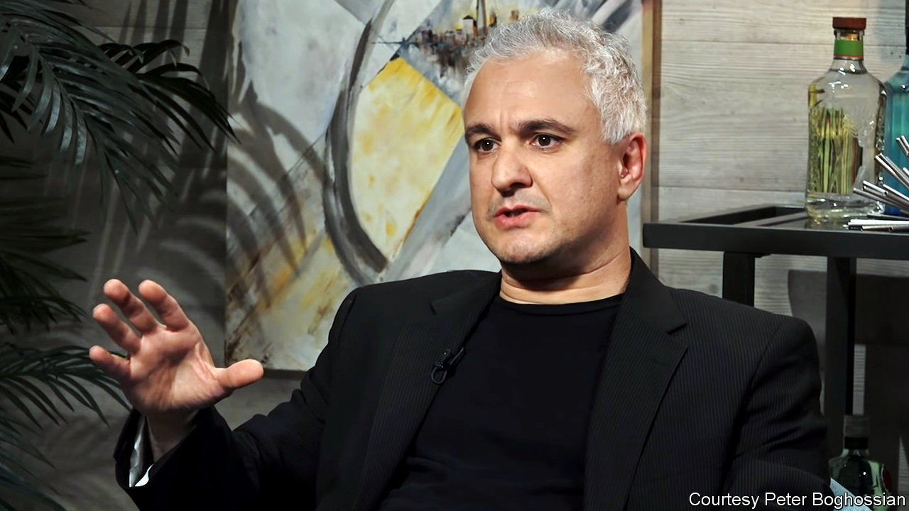

###### Free now to speak

# A professor’s resignation highlights pressures within academia to conform 

##### One man has long been a critic of post-modern ideology 

 

> Sep 25th 2021 

PETER BOGHOSSIAN, an untenured assistant professor of philosophy at Portland State University (PSU), was one of the most vocal critics of post-modern ideology in the academy, until he resigned from his university on September 8th. In 2018 he and two authors tried to publish 20 fake papers, in order to expose what they saw as a willingness to publish anything that used the right jargon. Seven were published, including one on “queer performativity” in urban dog parks, and one calling astronomy imperialist and suggesting physics departments study interpretative dance.

This is a loss to satire, but is it also representative of anything larger? In his resignation letter, Mr Boghossian wrote that the university had been changed from “a bastion of free inquiry into a Social Justice factory whose only inputs were race, gender and victimhood and whose only outputs were grievance and division”. Students at PSU are “being trained to mimic the moral certainty of ideologues,” he wrote. A spokeswoman for the college retorted that, “Portland State has always been and will continue to be a welcoming home for free speech and academic freedom.”


Other scholars have found themselves in similar situations. Those conservatives who remain in the academy may be used to this. But increasingly it is affecting liberals. A report published in August by the Foundation for Individual Rights in Education (FIRE), a campaign group, has found that since 2015 the number of scholars targeted with demands for investigation, demotion, censorship, or termination reached 113 in 2020, or a total of 426 cases in five years. Some of these cases may stretch the casual observer’s sympathies. The majority, though, are “academics on the left being attacked from further left”, says Sean Stevens, one of the authors.

The censoring is not just in the humanities. In 2020 Norman Wang, a cardiologist at the University of Pittsburgh, was demoted for publishing a paper in the Journal of the American Heart Association that analysed and criticised diversity initiatives. The journal issued an apology and retracted it. A professor at a University of California medical school was recently recorded apologising in an endocrinology lecture for using the term ‘pregnant women’.

Some on the left claim that illiberalism on campus is overblown. In an article in Liberal Currents, Adam Gurri wrote of the FIRE report that, “if any other problem in social life was occurring at this frequency and at this scale, we would consider it effectively solved.” That is doubtful. According to Mapping Police Violence, a website, police have killed 381 unarmed African-Americans since 2013. This is (rightly) considered a problem and a global movement exists to draw attention to it.

Part of the problem, says Bruce Gilley, one of Mr Boghossian’s supporters at PSU, is the “diversity industrial complex” within college administrations, that need to justify their existence. Diversity vice-presidents at Oregon’s three public universities have an average compensation of $262,000. In 2018, Mark Perry of the University of Michigan revealed that his university had nearly 80 diversity officers at a total annual payroll cost of $10.6m.

This makes it hard for anyone who wants to challenge prevailing views, especially on issues such as race and gender, Mr Boghossian argues. “Just the threat of being called in by the diversity and inclusion office is enough to silence people.” ■

