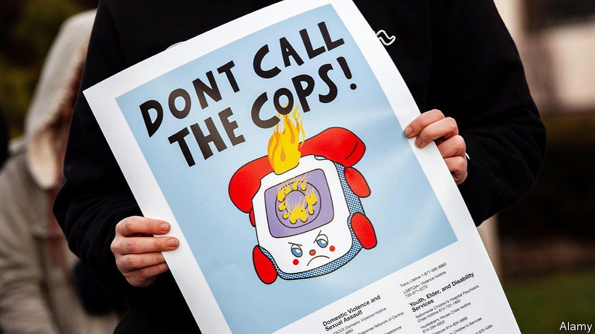
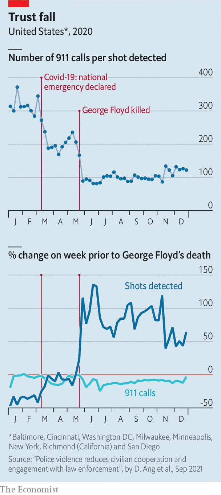

###### The Floyd effect

# As shootings rose, 911 calls fell in the aftermath of George Floyd’s murder 

##### An empirical explanation for unlawful police killings makes solving crime harder 

 

> Sep 23rd 2021 

CONVENTIONAL WISDOM says that when a police shooting captures public attention, sparking outrage over police violence, officers respond by pulling back, in a phenomenon known as the “Ferguson effect” (named for a city that saw widespread protests against police misconduct in 2014). Common sense also suggests that when people mistrust the police they are less likely to call them. Criminologists are divided over whether the Ferguson effect actually exists. But a new working paper from Desmond Ang, an economist at Harvard’s Kennedy School of Government, and his colleagues shows that the latter phenomenon is real: after George Floyd’s murder, calls to the police plummeted.

 


The authors combined police-related 911 calls with data from ShotSpotter, which uses audio sensors placed around American cities to detect and alert police to gunshots. They then calculated the ratio of 911 calls to ShotSpotter-detected gunshots in the eight cities for which data were available for 2020. You might expect that, under normal circumstances, higher crime would lead to more 911 calls, lower crime would lead to fewer calls, and this ratio would remain relatively steady.


Mr Ang and his colleagues found that in the week before Mr Floyd’s death, there were around 200 calls to 911 made for every shot detected by ShotSpotter. After the 25th there were only around 90 (see chart). This drop in the call-to-shot ratio was driven by both an increase in the number of shots detected and a decrease in the volume of 911 calls. The former may raise doubts about the accuracy of the data: the protests sparked by Mr Floyd’s death made cities much noisier places than usual. But when the authors used gun deaths and injuries in their analysis, rather than gunshots, they arrived at the same conclusion. After May 25th the number of 911 calls for every gun death or injury fell by almost half.

The findings may reshape social scientists’ understanding of the Ferguson effect. Calls from the public are an important source of information for police, says Mr Ang. “Civilian and community engagement are needed for the police to do a good job, to identify and solve crimes and to ensure public safety.” Events that harm the public’s trust in law enforcement, such as unlawful police killings hinder such engagement, putting the lives of both civilians and officers at risk. ■

