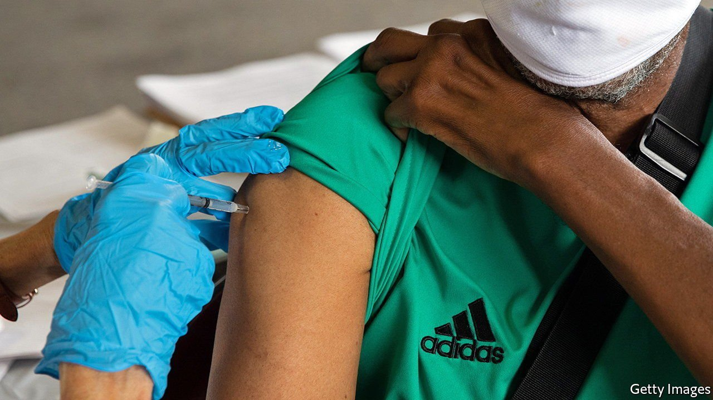

###### Ahead of the science

# Biden’s booster plan has created confusion and concern 

##### Following the science would have led to more certainty 

 

> Sep 25th 2021 

THE BIDEN administration was supposed to just “follow the science”, a welcome contrast to the previous regime. But one month after it announced covid-19 boosters would be available for everyone, Americans are still left wondering who will get boosters and when.

On August 12th, amid the Delta surge, the Food and Drug Administration (FDA) approved boosters for some immunocompromised people who had received the Moderna or the Pfizer-BioNTech vaccine. One week later, the Department of Health and Human Services (HHS) announced that every American could receive a shot eight months after their second dose of the Moderna or Pfizer vaccine, starting on September 20th. Many vaccinated Americans were eager for the extra protection.


Since then, two leading FDA scientists have announced their intention to leave or retire. Many have speculated on the reason. But shortly after announcing their intentions, they released a paper in The Lancet, a medical journal, written with several other researchers, concluding that booster doses are not needed for the general public. A few days later, on September 17th, an advisory panel to the FDA, consisting of independent experts, recommended boosters only for high-risk individuals, people over 65 and health-care workers who had received the Pfizer vaccine at least six months previously. Although the FDA does not always follow the recommendations of their advisory panels, it usually does.

The recommendation still needs FDA approval and CDC support before this group of people can get their jabs. And depending on how both organisations interpret “high-risk,” as many as 129m non-elderly Americans with pre-existing conditions could qualify, explains Howard Koh, former assistant secretary for health in the Obama administration. But the statement by the advisory panel contradicts President Joe Biden’s wider-reaching booster plan.

This back-and-forth between the administration and scientists has consequences. By announcing the need for booster shots before the FDA approved them, the administration signalled, probably unintentionally, that the current regimen is no longer effective for everyone. Boosters are common for vaccines to ensure protection from disease. Sometimes multiple doses are needed to achieve lifetime immunity. Some vaccines require an extra dose after a period of time to keep being effective. Others require additional doses to counter different strains.

Since the covid-19 virus is new, further analysis is needed to determine if additional doses are necessary. A needless booster could be harmful, as well as being a waste given that worldwide only 32% of adults are fully vaccinated. The administration’s original statement said that boosters were contingent on recommendations by the FDA and CDC, but that nuance was lost on many.

Partly as a result of the confusion, many immunised Americans are now questioning their current defence against the Delta variant, despite the HHS announcement stating that, “vaccines...continue to be remarkably effective”. Some patients are getting additional doses without approval. By mid-August, before the announcements, about 1m Americans had helped themselves to a third dose, according to the CDC. That number will probably grow. (2.2m people have received an additional dose since the CDC recommended boosters for the immuno-compromised, but it is unclear how many qualified.)

Some state governors are adding to the confusion. Several are encouraging their residents, particularly the elderly, to get boosters despite the lack of FDA approval. Governor Larry Hogan of Maryland, a Republican, signed an executive order on September 8th authorising boosters for pensioners living in communal settings, like retirement homes. Mr Hogan has repeatedly criticised the administration for its inconsistent messages.

Several other governments have done a better job of keeping their recommendations in line with the research. Britain’s and Italy’s are recommending boosters for older people, front-line health-care workers and the vulnerable. Germany’s and Greece’s governments are offering boosters for the immuno-compromised and elderly only. The booster confusion might have been prevented if the administration had stuck to its science-first pitch.■

For more coverage of Joe Biden’s presidency, visit our dedicated 

Dig deeper

All our stories relating to the pandemic and the vaccines can be found on our . You can also find trackers showing ,  and the virus’s spread across .

