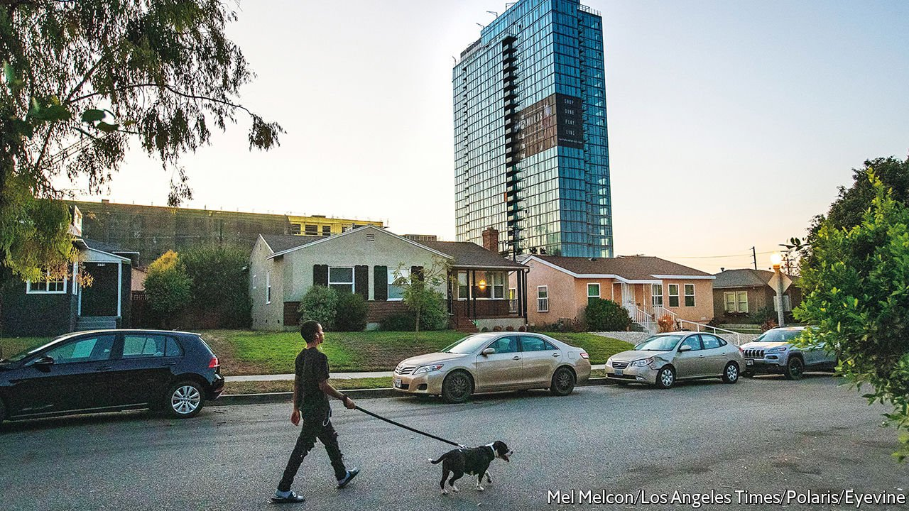
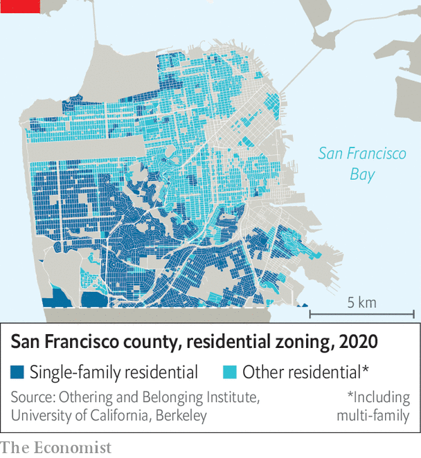

###### Build, baby, build

# California ends single-family zoning 

##### The move marks progress in the state’s urgent quest for more housing 

 

> Sep 23rd 2021 

THE GOLDEN mean in California’s one-party politics can be caricatured, only a little unfairly, as the art of sounding progressive while acting conservative. Take housing. Homeowners may recognise that housing affordability and homelessness are acute social problems. But the obvious remedy—more construction—seems unappealing, because it might hurt property values and spoil neighbourhoods. Thus the progressive-conservative position is to insist on building housing at below-market rates, which sounds compassionate but, in practice, means that little new housing actually gets built. This is why it is so encouraging that two days after Gavin Newsom handily defeated a Republican attempt to boot him from office, the governor signed two contentious measures, SB9 and SB10, aimed at increasing housing supply.

In the past decade median home values have surged 165% in both Los Angeles and San Francisco Counties to $830,000 and $1.85m, respectively. Median home prices nationwide increased by 64% to about $375,000. Before covid-19, San Francisco was the costliest city for renters; New York now barely claims the top spot. Californians make up 12% of America’s population, but 28% of its homeless.


The more controversial law of the two is SB9, which ends single-family zoning in the state. This means Californians will now be able to convert their houses into up to four units, depending on the size of their plot. California isn’t the first place to eliminate single-family zoning. Minneapolis and Oregon did so in 2019. As for SB10, that will make it easier for cities to build up to ten apartments on land currently set aside for single-family homes near busy public-transport corridors.

California has built fewer than 100,000 homes a year, on average, in the past decade. Permits issued for new construction plummeted in 2007 when the housing bubble burst, and have not yet returned to their previous level. Estimates for the number of homes the state needs to build just to keep up with population growth vary wildly. The state thinks it needs to build 1.8m homes by 2025; McKinsey, a consultancy, reckons it will need 3.5m. Ben Metcalf of the Terner Centre for Housing Innovation at the University of California, Berkeley, says the magic number is probably somewhere between the two.

If California so badly needs more housing, why is ending single-family zoning controversial? For a long time, making it in America meant having a house in the suburbs with the white picket fence, says Yonah Freemark, a researcher at the Urban Institute, a think-tank. Single-family homes are also ubiquitous. As of 2019, they made up 61% of all housing units in the country. San Francisco is America’s second-densest city after New York. Yet 51% of residential land in the county is zoned for single-family homes (see map).

 


Although single-family homes are everywhere, they were not initially meant for everyone. Today the Bay Area is a laboratory for some of the country’s most progressive policies. Yet in 1916, Berkeley was among the first places to enact single-family zoning. Banning apartments and commercial buildings was a way to exclude poor Americans from desirable neighbourhoods. At best, the practice was snobbish. At worst, it helped segregate cities by class and race. After the Supreme Court struck down explicitly racial zoning ordinances in 1917, zoning by land-use became widespread. Metal gates still ring Berkeley’s upmarket Claremont neighbourhood today; it was one of the first places zoned for single-family homes.

The new laws will bring incremental change rather than revolution. An analysis from the Terner Centre found that SB9 could make new development possible on 5.4% of existing single-family lots. That may sound very little, but it would still create about 700,000 new units, 40% more than would otherwise have been developed. The units will also probably be built slowly, since the law depends on Californians voluntarily renovating their homes.

Even so, SB9 and SB10 have incensed the state’s vocal NIMBY constituency. NIMBYs and their YIMBY nemeses have become tribal factions in California politics. Groups seemingly removed from housing policy scream their opinions. The AIDS Healthcare Foundation runs a housing advocacy outfit that took out a full-page ad in the Sacramento Bee beseeching Mr Newsom not to sign the bills.

Among the staunchest opponents of SB9 are those who liken the law to a power grab by the state that takes planning decisions away from cities. Some local officials in southern California talk about Sacramento, the state capital, with a prickly disdain usually reserved for faraway Washington, DC. Bill Brand, the mayor of Redondo Beach, a small city south of Los Angeles, has proposed an amendment to California’s constitution that would reassert local control over land-use decisions.

Opponents also argue that the law will hasten gentrification by allowing firms to buy up single-family homes, renovate them and sell them at higher cost. A requirement for property owners to live in one of their redeveloped units for three years should help assuage fears of rampant speculation. Some gentrification will probably still happen as neighbourhoods change, says Mr Metcalf. But it would come from homeowners being enticed to sell, rather than tenants being forced out because they can no longer afford the rent.

The biggest criticism levelled at SB9 is that it does nothing to create affordable housing. The new duplexes will be cheaper than the single-family homes that predated them, but may still be too pricey. Yet market-rate housing is also badly needed. “You’re criticised for having too many affordability requirements, or not enough affordability requirements”, says Scott Wiener, a state senator and the perennial author of California housing bills. “No matter what you do, people are going to nitpick at the bill. Frankly that is one explanation for why we have a housing crisis.”

To turbo-charge homebuilding, California might take a lesson from improv comedy and adopt a “yes, and” approach to housing. Yes, end single-family zoning—and build affordable housing, streamline the permit process, help cities navigate tricky policy and crack down on municipalities that are not building. These laws alone “are not going to end the affordability crisis in California,” says Jason Elliott, Mr Newsom’s housing tsar. “No one is suggesting they are.” But it’s a start. ■

