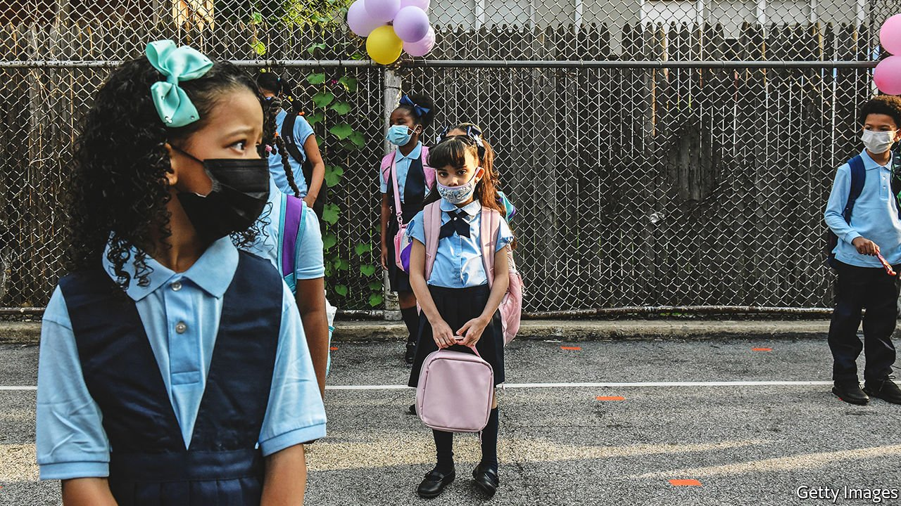
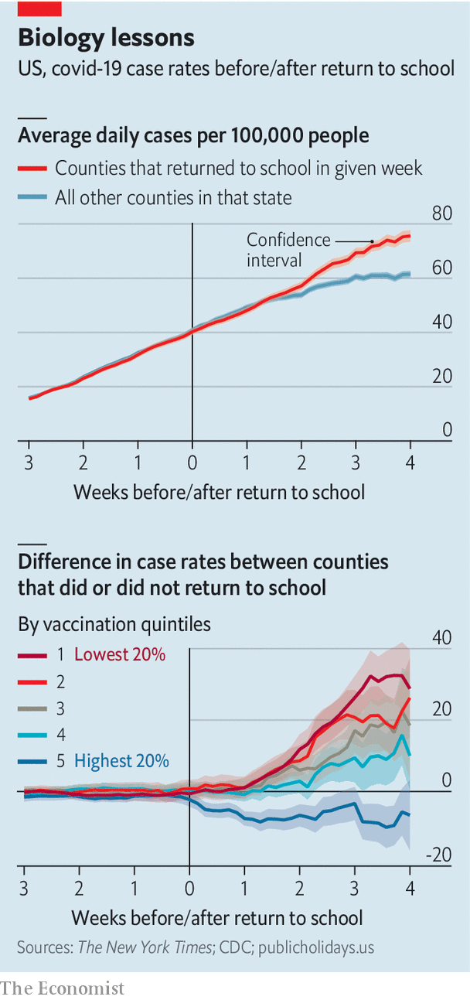

###### Safety in numbers

# Return to school has caused a surge in covid-19 cases in under-vaccinated counties 

##### Our model finds that case rates increased more than expected after the start of term 

 

> Sep 25th 2021 

THE BEGINNING of the school year normally brings a sense of relief for most parents. But with covid-19 cases in America reaching levels last seen in February, and the highly infectious Delta-variant sweeping across the nation, the start of term was instead met with fear. Though the benefits of in-person schooling are clear—children learn better at their desks, the vulnerable are less likely to be left behind, and parents are able to get on with their own work—there were concerns that mixing in packed playgrounds and classrooms would increase the spread of the virus.

Across the country there is huge variability in back-to-school dates. Children in some Texas school districts returned to the classroom in the middle of July, whereas New York City’s 1m pupils went back only last week. This variation creates an opportunity to test how the start of term has influenced covid-19 cases. So The Economist built a statistical model to do just that.


First, we calculated the average case-rates for each county for each week from the middle of June, before any schools returned, to now. We compared the case-rate in each county with the average within the state. This allows the model to control for overall trends in case numbers as well as other factors, like mask mandates or superspreader events, which might make the virus more or less prevalent within a state. We then examined the effect of the different return-to-school dates, to see if counties that went back earlier had higher case-rates than the rest of the state.

The results are clear. In the weeks after the beginning of term, covid-19 cases in a given county were greater than would be otherwise expected. Even when controlling for demographic factors like age, race, income, education and politics, going back to school drove up the case-rates (see chart). On average, for every extra week of term the increase in cases was about the same as the effect of a percentage point increase in Donald Trump’s 2020 vote share (pro-Trump counties tend to have higher covid-19 rates).

 


The effect was not the same everywhere, however. According to our model, as well as reducing the overall number of cases, the county’s vaccination rate played a big role in influencing what happened after schools returned. In counties where many people were jabbed, the start of term had little effect on the spread of the virus. In counties with the lowest vaccine take-up, cases surged after schools returned.

It is worth noting that across America very few children have been vaccinated, so jabs themselves probably have little impact on preventing spread within classrooms. In counties where more people are vaccinated, infections originating inside the school gates may not escape into the community as easily. Additionally, it may be that schools in the most jabbed regions also take more precautions. They might enforce mask wearing or social distancing more strictly, for example.

States set their own rules when it comes to controlling covid-19 in schools. More than a dozen states mandate face coverings in public schools, and nine require teachers and staff to be vaccinated or to undergo weekly testing, including Washington state and Oregon which have made vaccination obligatory for teachers. On September 9th the Los Angeles school board voted unanimously to require vaccines for students aged 12-years and over. At the other end of the spectrum, several conservative states have tried to ban schools from enforcing mask wearing.

Our model cannot pick out the effects of these state-level interventions. However, a slew of other research studies from across Europe and America have found that mask-wearing and social-distancing work to prevent the spread of covid-19 in schools. With these measures in place, schools were not the most likely sources of infections for children. And if a child did catch the virus it tended not to spread to classmates. However, the situation looks quite different when these measures are relaxed while the virus is spreading, as has been the case in much of the country.

With appropriate precautions in the classroom and high levels of community vaccination, the beginning of the new term need not have been so scary. Our findings add to the growing consensus that in-person schooling doesn’t have to be accompanied by growing covid-19 cases. But while some states continue to put politics before public safety, it probably will. ■

Dig deeper

All our stories relating to the pandemic and the vaccines can be found on our . You can also find trackers showing ,  and the virus’s spread across .

