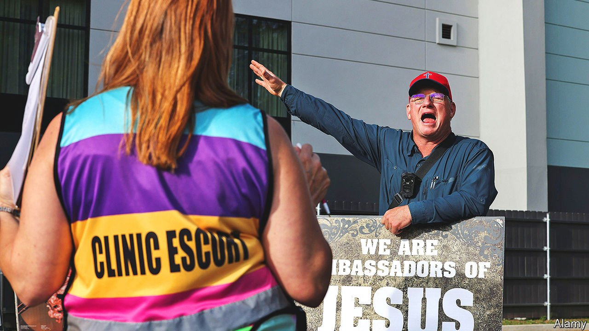

###### Legal and rare

# What would happen if the Supreme Court overturned Roe v Wade? 

##### Mississippi offers a glimpse 

 

> Sep 23rd 2021 

A  SMILING WOMAN stands in the driveway leading to Jackson Women’s Health Organisation, the only abortion clinic in Mississippi. Beside her, a large sign reads: “Bags for clinic patients here”. Though volunteers dressed in “clinic escort” vests gesticulate to drivers that they should ignore her, most stop and are handed a gift bag. Inside are images showing a fetus as it develops and a note assuring women: “You can be a great mama!”

As women get out of their cars, the protesters step it up. “Ma’am, this is your grandchild!” one woman calls to another who is hurrying her teenage daughter inside. “Don’t lead it to the slaughter!” A man in a red baseball cap embroidered with a cross yells through a fence to patients inside. An escort wearing a “Pro abortion witch” face mask turns up a stereo blasting rock music to drown out his noisy exhortations to follow the Lord and refrain from committing murder.


The pressure women endure on their way into this small building in Mississippi’s capital is one part of a larger effort to prevent them from having abortions. That they should nonetheless continue to travel, often many miles, to do so, seems to contradict the state of Mississippi’s recent claim that Roe v Wade can safely be ditched. In a recent request that the Supreme Court overturn its half-century-old ruling, the state argued women’s attainment of “both professional success and a rich family life” and improved access to contraception, among other factors, meant Roe was “decades out of date”.

The clinic tells a different story. Many of its patients are poor. More than 70% are black, though only 38% of Mississippi’s population is. (In contrast, on the day your correspondent visited, all the protesters were white.) Posters inside, meanwhile, contrasting the efficacy of contraception methods, offer a reminder that Mississippi’s schools have promoted “abstinence” over sex education. In a filing to the Supreme Court last week, the clinic’s lawyers pointed out that women’s ability to get on in life still depends on them having control over their reproductive health.

The filings were made ahead of the most important Supreme Court hearings on abortion in decades. On December 1st the court will hear arguments in Dobbs v Jackson Women’s Health Organisation, which concerns Mississippi’s ban on most abortions after 15 weeks. In 2018 a court blocked the law because it violates rulings that abortion on demand is a right until a fetus becomes viable. Speculation that the court will use the case to weaken Roe or overturn it altogether has been intensified by its refusal to prevent an abortion ban in Texas from going into effect.

No one, except perhaps the justices, knows whether the court will overturn the 50-year-old ruling next year. “If it upholds Mississippi’s law, it will have overturned Roe, regardless of whether it says those words,” says Elizabeth Sepper of the University of Texas at Austin. Even if it sets a lower gestational limit, “total bans would be around the corner,” she reckons.

Mississippi is one of 12 states with a “trigger ban” that would click into effect, eliminating most abortions, if Roe were overturned. Yet here, as in other conservative states, Roe has already been hollowed-out by laws that make it hard for clinics to operate. Six states have only one clinic left.

Curbing abortion in this way creates two big problems. The first is more abortions later in pregnancy. In Mississippi the impracticality of having one clinic covering 48,430 square miles, much of it poor and rural, is exacerbated by pernickety regulations. One, mandating that patients see a doctor on two occasions at least 24 hours apart, is especially onerous. Shannon Brewer, the director of Jackson Women’s Health, says it is not unusual for women, struggling to organise time off work, child care, travel and funding—America prohibits the use of federal money for abortions—to postpone a scheduled appointment “from next week to next month”.

Most weeks, says Ms Brewer, who is a sonographer, the clinic sees a woman whose pregnancy has passed “17, 18, 19” weeks. Because the doctors (who come in from other states because locals were targeted) do abortions until 16 weeks (one refuses to do so after 12) the clinic refers such women elsewhere. Yet it can be hard to find doctors who perform abortions much into the second trimester, which contributes to the second big problem: some women’s failure to secure an abortion altogether.

Life and liberty

No one knows how many women fall into this group, but research suggests policymakers should strive to limit the number. Using data from a nationwide longitudinal study that investigated the effects of either having an abortion or being turned away, researchers found that women who were denied abortions experienced a sharp spike in financial hardship, including debt, bankruptcies and evictions. Their children, unsurprisingly, fared poorly too. Some obstetrician-gynecologists worry that overturning Roe could push up America’s maternal or infant mortality rates.

Women who seek an abortion know very well what is at stake. But that may not make the harassment many face any less upsetting. In Mississippi, a still deeply religious state in which more than 80% of adults say they are Christian, protesters’ repeated, angry allusions to Jesus and the Bible seem particularly cruel. Ms Brewer says that by the time they get through the clinic door many patients are in tears. One question, she says, she is asked repeatedly. “Do you think I’m going to hell?”■

