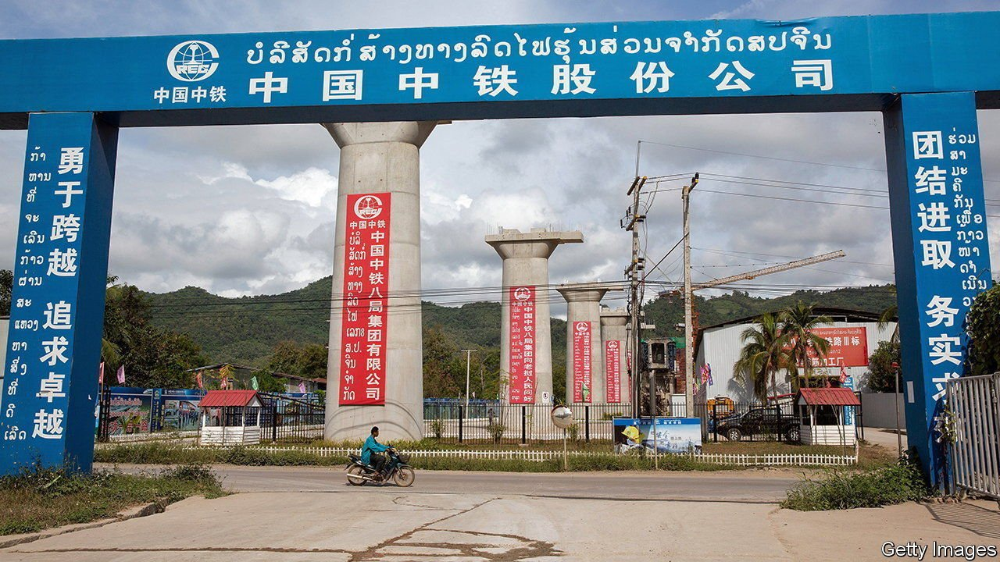

###### Laosy bets

# A new report digs into China’s labyrinthine foreign loans 

##### Asian and other developing countries owe more money than they might think 

 

> Sep 30th 2021 

ON THE OUTSKIRTS of Vientiane, the capital of Laos, workers for China Railway No. 2 Engineering Group recently welded the last two 500m lengths of “seamless rail” for the China-Laos Railway, a flagship project of China’s Belt and Road Initiative (BRI). Chinese state media celebrate the railroad, set to open in December, as a feat of modern engineering. It is also a marvel of modern book-keeping, amassing $3.6bn in debt off the government’s balance-sheet but for which the Laotian state may still end up on the hook. That financing and other “hidden debt” to China amounts to a third of the country’s GDP, which could become a problem: Laos already has sovereign debts equivalent to about 60% of GDP on its books, half of it owed to China.

Hidden debts bedevil many of China’s development projects abroad, including lots in Asia, which are financed in such complex ways, and arranged among so many different entities, that even Chinese financial authorities have had trouble keeping track. On September 29th AidData, a research unit at William &amp; Mary, a university in America, released a data set that attempted to put a dollar figure on China’s lending to projects overseas, including off-the-books debt that is not reported to the World Bank. AidData tallied 13,427 projects for which China had provided about $800bn in lending over an 18-year period starting in 2000. That includes $385bn in what AidData calls “hidden” debt. It counted 44 countries that owe the equivalent of at least 10% of their GDP to China.


Getting a grip on how much countries owe to China matters because many of these developing countries, struggling in the pandemic, are trying to renegotiate the terms of their sovereign debts not only with China but also with multilateral lenders and other countries. In 2020 the G20, which includes China, agreed to suspend debt-service payments temporarily for as many as 73 countries to give them a chance to restructure their debts. But many of China’s loans are arranged in ways that might not be covered by the agreement. As in the case of the China-Laos Railway, loans can be agreed between state-owned enterprises and joint-venture companies without being formally guaranteed by the government (Laos separately has a sovereign obligation of about $480m connected to the rail project). In some cases, governments may not even know the full extent of loans for which they may one day find themselves responsible.

The pace of China’s BRI lending has slowed considerably in recent years (the AidData research covers loans through to 2017). But there is little indication that China plans to change the way it works with debtor countries. Many of China’s BRI loans are agreed with poor countries at commercial interest rates and often include collateral obligations (such as proceeds from the sale of natural resources), neither of which is true of conventional development financing. China typically deals with unpaid debts by extending the terms of a loan rather than taking a haircut on the principal—“kicking the can down the road”, as Scott Morris of the Centre for Global Development, a think-tank in Washington, puts it. Sometimes the Chinese side takes a big equity stake in projects where debtors have fallen behind on payments. A decision in 2017 to assume control of a port in Sri Lanka led to charges of “debt-trap diplomacy”.

In debt-ridden Laos, a Chinese state-owned company has already assumed control of another piece of infrastructure, part of the electric grid. But Matt Mingey of Rhodium Group, a research firm, says the railway is an example of how a Chinese infrastructure loan can be not so much a “hidden” liability as a complicated one. The joint venture that owes China $3.6bn is already majority-owned by three Chinese state-owned firms, making the project akin to a Chinese one that happens to be in a foreign country. If the railway proves to be a financial flop, it may be China on the hook, not Laos. The “hidden debt”, then, would be one that China owes to itself. That should be simple enough to resolve.■

An early version of this article was published online on September 30th 2021

