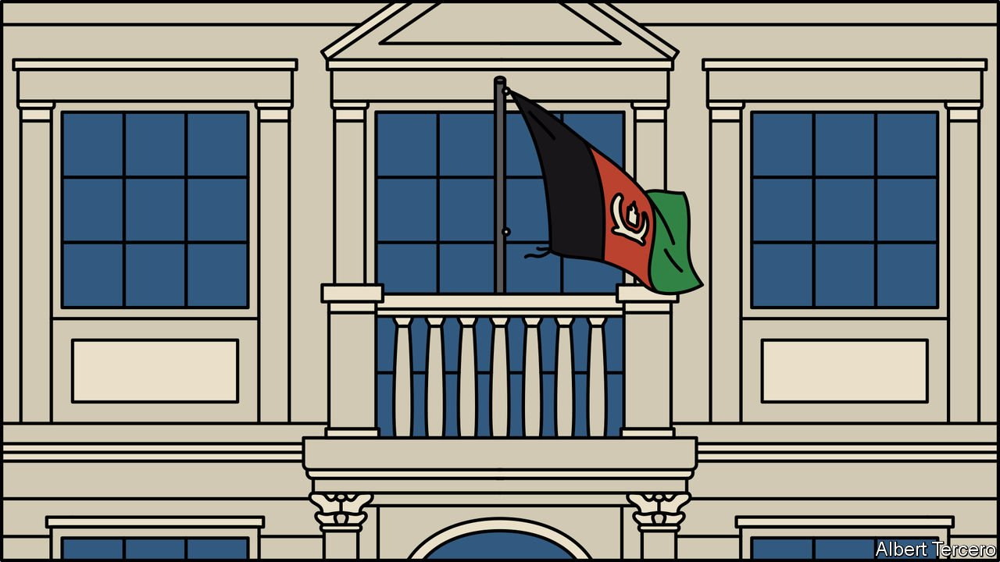

###### Mission control

# Afghan embassies don’t recognise the Taliban 

##### Diplomats remain loyal to an old regime that barely exists 

 

> Oct 2nd 2021 

THE TALIBAN prevent girls from going to secondary school in Afghanistan. Yet the country’s ambassador to America is a woman. That is not because the group has decided that women’s rights are a good thing after all. It is just that they cannot replace her. No country yet recognises the Islamic Emirate established by the Taliban. Afghanistan’s embassies still represent the old government, which fell in August.

In capitals across the world, they fly the old black-red-and-green tricolour. They stamp documents with the old emblem. There have been some changes, however. The embassy in Athens has taken down photos of Ashraf Ghani, the deposed president. Diplomats may remain loyal to their old government, but not to their old leader. They look to Amrullah Saleh, the former vice-president who has vowed to continue fighting.


Unsurprisingly, the embassies get no money from the Taliban-run government. Instead, they rely on fees for consular services. That hardly covers the bills, even in countries with big Afghan populations in need of paperwork. Embassies have had to lay off staff. Few of those who remain are being paid. To save money, embassies are extending old passports rather than printing new ones. “We have to cut down on everything,” says Khaled Zekriya, the ambassador to Italy. That includes water and electricity.

When the Taliban last held power, from 1996 to 2001, they asked to represent the country at the UN. The committee charged with making a recommendation diplomatically deferred a decision, and the previous government, run by rival guerrillas, kept the seat throughout. Meanwhile, the Taliban ran an unofficial office in Queens, New York. The embassy in Washington continued to be run by their rivals too, until 1997 when the second-in-command swore allegiance to the Taliban and took over. After that, America “temporarily” suspended operations at the embassy.

The Taliban have again begun trying to represent Afghanistan on the international stage. A member of the new government tried to set up a video call with Afghan ambassadors but most declined, says Mr Zekriya. Last week the group requested Afghanistan’s seat at the UN. The committee in charge, which also has to decide who should represent Myanmar after the army took power in a coup in February, sidestepped the issue. For now most host countries are encouraging the embassies to stay open under the old government. They want Afghan migrants and refugees to have access to consular services. And they are in no rush to reward the Taliban by establishing diplomatic ties.

Some Afghan diplomats are hoping that the war against the Taliban is not yet over. Others are lining up new jobs in their host countries. Few want to return to a place ruled by pious thugs. Embassy staff are used to helping asylum-seekers with applications. Now many are preparing their own paperwork.

