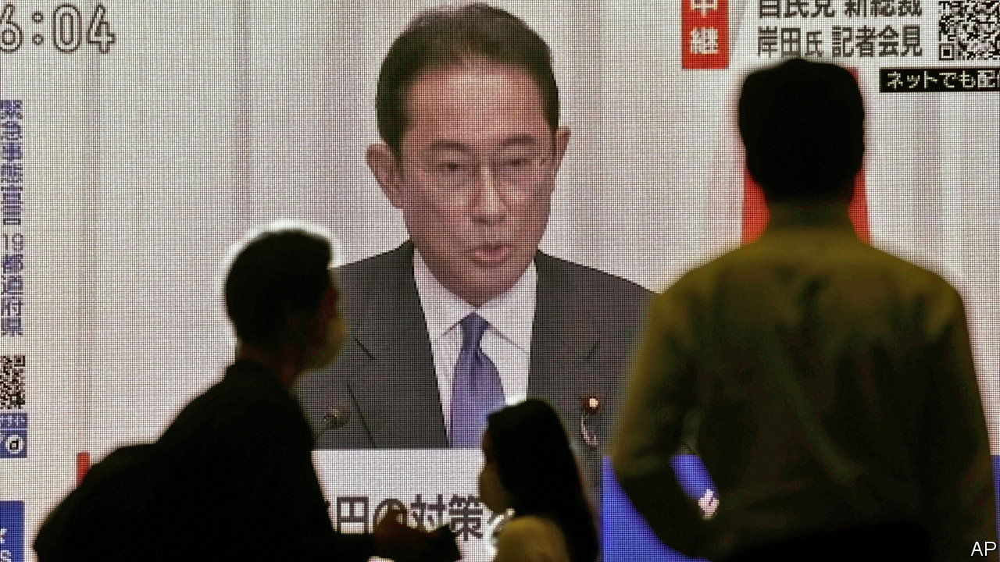

###### The party decides

# In Kishida Fumio, Japan’s old guard opts for the status quo 

##### The incoming prime minister is an uncontroversial choice 

 

> Sep 30th 2021 

KISHIDA FUMIO, Japan’s new prime minister-in-waiting, likes to jot down voters’ views in little notebooks. After being elected president of Japan’s ruling Liberal Democratic Party (LDP) on September 29th, he called his special skill the ability “to listen well to others” and warned that the growing distance between politicians and the public amounts to a “crisis of democracy” in Japan.

Mr Kishida, however, was hardly the people’s choice. Instead, his election reflects the enduring strength of the LDP’s old guard and its disregard for broader public opinion. , another former foreign minister, was the favourite in polls of the general public and among the party’s rank-and-file. Many younger lawmakers backed him, too, pitching the campaign as a generational contest. Yet Mr Kishida cut a far less threatening and more pliable figure for the leaders of the party’s factions (of which Mr Kishida is himself one). That proved to be decisive in a second-round run-off, where the party’s 382 lawmakers held sway.


In Mr Kishida, the party opted for an insider unlikely to buck the establishment. Politics is a family business for him (as it is for many of his peers, including Mr Kono). Both his father and grandfather were lawmakers; he is also related to the late Miyazawa Kiichi, a prime minister on whom President George H.W. Bush once memorably threw up.

In Japanese political circles, Mr Kishida is known as an affable colleague and a competent administrator, but a dull personality. In his time as foreign minister to Abe Shinzo, who was prime minister from 2012 until 2020, Mr Kishida co-ordinated a visit by Barack Obama to his home town, Hiroshima. He also helped broker an agreement with South Korea for Japan to compensate “comfort women”, as those forced into brothels by Japanese soldiers during the second world war were known. (The agreement later fell apart after a change of government in South Korea.) A convivial drinker, he also downed vodka with his Russian counterpart, Sergei Lavrov, in a futile attempt to improve ties.

In his political memoir, entitled “Kishida Vision: From Division to Collaboration”, he pledged to be the kind of leader who “can elicit co-operation from the public”. Like his platitudes, Mr Kishida’s vision for the country is fuzzy. Despite describing himself in the past as the dove to Mr Abe’s hawk, he sounded tougher notes on China during the campaign. He promised more stimulus to counter the fallout from the pandemic, but has also nodded to the concerns of fiscal hawks who fret about the country’s debt. One of his main campaign themes was the need for a “new model of capitalism” to reduce economic inequality and redistribute wealth. But his suggested prescriptions look more like tweaks to the safety net than the revolutionary change the rhetoric suggests. Mr Abe played a big role in his victory behind the scenes; that ensures Mr Kishida will not stray far from his predecessors’ policies.

Any change under Mr Kishida is instead likely to be incremental. He is already being talked about as a short-term prime minister, much like the man he replaced, Suga Yoshihide, who took over from Mr Abe and lasted just one year. Dissatisfaction with the government’s handling of covid-19 helped bring down Mr Suga. The number of new cases detected each day has been shrinking as the vaccination rate rises, but Mr Kishida will still have to regain public trust and present a credible plan to reopen the country safely and revive the flagging economy.

His first order of business will be to lead the party in elections for the Diet’s lower house later in November. By ignoring public opinion in choosing Mr Kishida, the LDP may spur some to cast protest votes (though the party is expected to fare better than it would have under the even less popular Mr Suga). Shortly after his election, Mr Kishida began tamping down expectations about the results. His selection is likely to deepen the disillusionment with politics that many voters already feel. Luckily for the LDP, the enduring weakness of the country’s opposition parties means there is virtually no chance of the party losing power. Mr Kishida’s new job, however, is less secure.■

An early version of this article was published online on September 29th 2021

