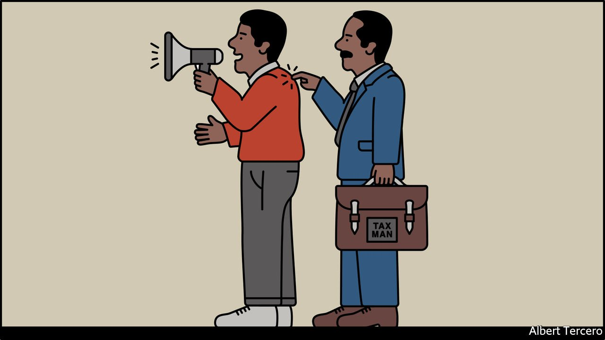

###### Banyan

# India’s government is using the taxman against its opponents 

##### Targets include vocal critics of the state but also those who make it look bad 

 

> Oct 2nd 2021 

SONU SOOD is nothing if not gracious. The square-jawed he-man of such features as “Tutak Tutak Tutiya” (2016) and “Kung Fu Yoga” (2017) says that when tax inspectors stormed his house, he tried to make it the best possible experience for them. When the uninvited guests left three days later, having kept the 48-year-old actor’s family locked inside and taken their phones and personal papers, he told them he would miss them. The taxmen were less kind. They say Mr Sood is enmeshed in a web of “bogus” dealings, has collected foreign donations without the proper licences and owes $2.7m in taxes.

Before covid-19 Mr Sood was a second-tier star, acting more in regional-language films than in the mainstream Hindi flicks watched by the whole country. But the pandemic made him a true-life all-India hero. First with his own money, then with millions donated by admirers, Mr Sood rushed to help the needy, starting last year with the thousands of migrant workers left stranded by the sudden, total lockdown of Indian cities. The foundation he started ultimately helped some 90,000 people find their way home and gave 4m meals to the hungry. So much cash has poured in that the charity now grants scholarships to covid orphans, sponsors jobs, pays for medical care, runs a blood bank and is building a hospital.


Many Indians assume that if there is anything fishy, it is not in the actor’s accounts but in the motives behind the tax raid. India’s leaders have routinely abused such tools of state power, and there is no doubt that Mr Sood’s effectiveness at delivering relief made blustering politicians look bad. It may be pertinent, too, that shortly before the raid, Mr Sood was made “brand ambassador” for a mentorship programme created by a political party opposed to Narendra Modi, India’s prime minister.

Mr Sood has distinguished company. In the same week that tax sleuths were rifling through his bookshelves, an anti-money-laundering agency raided addresses associated with Harsh Mander, an activist who is perhaps India’s most worthy candidate for the Nobel peace prize. Among Mr Mander’s initiatives is Karwan-e-Mohabbat, or Caravan of Love, a volunteer group that seeks to heal sectarian scars by quietly consoling the victims of attacks motivated by hatred. Still more inspectors were poring over the books of a covid-relief charity started by Rana Ayyub, a writer who has loudly blamed Mr Modi for stoking anti-Muslim violence.

India’s tax authorities show a particular interest in journalists. In February their victim was Newsclick, an independent website critical of the government. In July came the turn of the Dainik Bhaskar Group, a media house that publishes a big Hindi daily. It had run a powerful series exposing officials’ efforts to hide the true number of covid deaths, widely estimated at three to ten times the official toll of 450,000. In September the taxhounds again dropped in on Newsclick as well as NewsLaundry, a website whose investigative journalism has often embarrassed Mr Modi. They held workers in their offices until after midnight, confiscating phones and copying data.

These latest tax raids and so-called “surveys” do not yet seem to have resulted in any charges, though the process is often punishment enough. Another form of harassment has brought starker results. Using laws that restrict foreign funding, and which were tightened further last year, Mr Modi’s government has shut down more than 19,000 NGOs. Victims include local chapters of irksome groups like Amnesty International and Human Rights Watch, but also those engaged in poverty relief and environmental action.

Strangely, though, what applies to critics does not apply to Mr Modi himself. Laws brought by his government freed political parties from liability for illegally accepting foreign donations in the past, and created a “reformed” system that allows unlimited, anonymous gifts to parties. Meanwhile the accounts of the giant PM Cares Fund, set up by Mr Modi ostensibly for covid relief and to which millions of state employees were obliged to contribute, remain entirely opaque. With a click of a button on the fund’s website, foreign well-wishers can pour money in.

Small wonder that when Mr Modi praised India as the “mother of democracy” at the UN General Assembly last month, pointing to his own rise from poverty as proof, commentary was not always kind. “More like the father of irony,” muttered one wit in Delhi.

