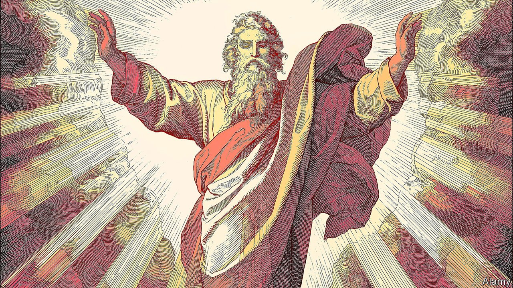

###### Picturing God

# A theologian presents God as few readers will have seen him before 

##### Francesca Stavrakopoulou’s book will offend some. But it will delight more 

 

> Oct 2nd 2021 

God: An Anatomy. By Francesca Stavrakopoulou. Picador; 608 pages; £25. To be published in America by Knopf in January; $35

PROFESSORS OF THEOLOGY are imagined to be dull, gentle souls. This book, however, is a great rebel shout. Francesca Stavrakopoulou, when a student, was annoyed to be told that the physical representations of the Judaeo-Christian God in the Bible were just metaphorical, or lyrical, or poetical. He was invisible and ineffable, of course. She wasn’t meant to see him corporeally at all. But, she fretted, why not? Why shouldn’t she see him “as a gigantic man with a heavy tread, weapons in his hands and breath as hot as sulphur”? As someone who enjoyed roast meat and pretty girls, laughed, shouted and wept? In short, as the ancient Israelites who first worshipped Yahweh so vividly painted him?


The result of her annoyance is a learned but rollicking journey through every aspect of Yahweh’s body, from top to bottom (yes, that too) and from inside out. The God in whom millions of Christians proclaim their faith each Sunday is firmly placed in a great crowd of other divinities of south-west Asia: Baal, Marduk of Babylon, Ninurta of Mesopotamia, Adad of Assyria, Teshub, Tishpak and Ra. He began life as nothing important, a minor storm god, one of 70 children of El, the Levantine father of the gods. Then he usurped the throne, and his reign began: in full tumultuous technicolour and with every aspect, feature and failing of the human beings who dutifully fell on their faces before him.

Appropriately for a book that aims to upend the notion of a cloudy, spiritualised creator, Ms Stavrakopoulou starts with his feet. Huge feet, which stroll across landscapes creating sacred spaces and which, north-west of Aleppo in Syria, stride into a temple and do not leave again. Feet that can trample his enemies like grapes one day and, on the next, relax, propped on a footstool. (Until it was destroyed, the Temple in Jerusalem was said to be the favourite footstool of God.)

Walking with God, now a description of saintly closeness and spiritual holiness, was in ancient times a sort of male-bonding exercise, over rough ground, with Yahweh setting the pace, sure-footed in the sandals all local gods wore. The worshipper, by contrast, went barefoot, as Yahweh shouted that Moses should be as he approached the burning bush. Moses emerges in this book as by far the most successful walker-with-God, even coming to resemble him, and later acquiring in art Yahweh’s original bull-horns on his head, which Yahweh himself had lost by then in light-rays and a mass of white hair.

Feet and legs are followed by genitals. Here Ms Stavrakopoulou has almost too much fun. God’s penis becomes the focus of all sorts of divine action: fructifying the world, imposing order on the cosmos, rampaging like a bull, shooting a bow and arrow. Every mention of a bow, she assures readers, really means a penis; even the rainbow is a polychrome heavenly tool.

But her purpose is serious—to show that God has been steadily and prudishly emasculated. The primary concern of the biblical God was to defend his prerogative to have sex with whomever he chose, sometimes shockingly. According to Eve, he fathers Cain, to her grateful surprise. And in the book of Ezekiel he lusts after Israel as after a teenage girl:


Rape, in other words. In the book of Hosea it is even more explicit: God takes the teenage Israel walking in the wilderness, “and there she will cry out”. Afterwards, he gives her earrings, bangles, a necklace and a crown, displaying her as his own beautiful property.

The book moves on to God’s back, turned as a sign of his displeasure, though Moses on Sinai begs to see his rainbow-shimmering front; his white shining skin, the ancient source of persistent racial prejudice; his guts, which writhe in pain when the Babylonians attack Jerusalem; his right hand, creator and shaper of humans, over whom he bends like a potter over a wheel; his writing and smiting arm. Yahweh’s stomach is dainty and discerning: he expects the cream of the crop, the first-born of the flock and the “fatty parts” of beasts, withdrawing his protective arm and sulking if they don’t appear. (An astonishing passage describes a present-day Passover in Samaria, with the wholesale slaughter of lambs and smearing of blood on doorposts, as if this is still required.) Deities other than himself, especially the wood or stone sort, are “shitgods”, says God.

After all this bold or bad behaviour by the humanised Father, God made human in the Son is a breath of fresh air. Jesus, whenever he makes a rare appearance, seems appealingly rational, restrained and modern. Yet connections with Yahweh naturally continue. The washing of his disciples’ feet is a throwback to the notion of barefoot holiness in Yahweh’s presence. The moment when he writes with his finger in the dust to save a woman from stoning, overwriting the Torah in the Temple itself, is a reminder of the finger of God that conjured the ten plagues of Egypt and inscribed the Ten Commandments on tablets of stone. Most shockingly, in several Renaissance pietàs the deposed body of Christ is shown with an erection under his loincloth, the sign of the death-defying virility of the creator-God.

Such scenes more or less guarantee that many readers will consider this book offensive. As many, and probably more, will find it instructive, vivid and frequently hilarious. Above all, it is a corrective to the notion that, when it comes to religion, modern Christians and Jews have become wanly sophisticated.

Even if most believers avowedly dismiss an anthropomorphic God as a primitive idea (Islam, of course, rejects the notion completely), they still offer prayers to a being who, they suppose, listens to them, and sometimes even speaks in reply. Indeed, it would be a rare member of a Christian congregation who, invoking God the Father in the usual Sunday way, does not catch at least a mental glimpse of a flowing beard, a white robe and those huge, world-striding, sandalled feet. ■

