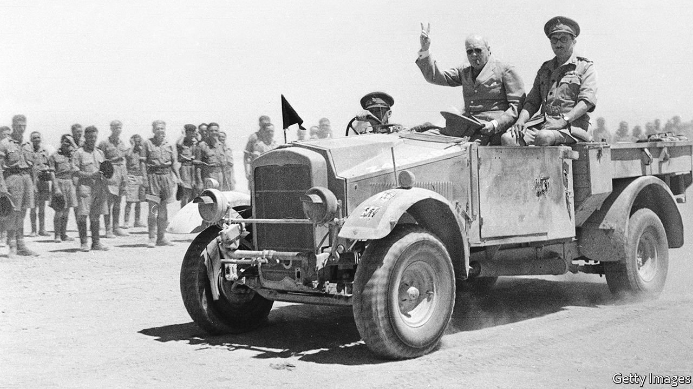

###### Graveyard of empires

# The second world war was fuelled by imperial fantasies 

##### And it sounded the death knell of the colonial era, argues Richard Overy in a new history 

 

> Oct 2nd 2021 

Blood and Ruins: The Great Imperial War, 1931-1945. By Richard Overy. Allen Lane; 1,040 pages; £40

WHY ANOTHER single-volume history of the second world war? Richard Overy has himself written more than 20 books covering different aspects of the conflict and the global crisis of the first half of the 20th century. But his aim in “Blood and Ruins” is to question the widespread assumption that the war was simply the result of the territorial aggression of the Axis powers, and Allied resistance to it. Instead, he sees the policies pursued by Adolf Hitler, Benito Mussolini and the Japanese military establishment as effects of the crisis as well as a leading cause.


It makes more sense, Mr Overy argues, to think in terms of a “long” second world war that began in China in the early 1930s and ended there—and in South-East Asia, eastern Europe and the Middle East—only in the decade after 1945. The origins of the war, he says, lay in the zenith of European colonialism in the late 19th century; it became imperialism’s violent nemesis. His title comes from Leonard Woolf, a Bloomsbury intellectual who in 1928 wrote: “Imperialism, as it was known in the 19th century, is no longer possible, and the only question is whether it will be buried peacefully or in blood and ruins.”

Resentment over the post-1919 settlement, which preserved and expanded the British and French empires—while denying the three Axis powers what they saw as their own rightful autonomy—was a powerful motive for conquest. In Berlin, Rome and Tokyo, the notions of racial superiority that legitimated the territorial drive seemed little different from those underpinning the existing empires. The so-called policy of appeasement, pursued by Britain and France in the 1930s (Mr Overy prefers “containment”), reflected a degree of sympathy for these ambitions, as well as a “sometimes incoherent” bid to “square the circle of growing international instability and their own desire to protect the imperial status quo”.

Dreams and nightmares

It was never going to work. The problem was the dynamic nature of all imperial expansion. Each success whetted the appetite for more, now driven by the belief that the old powers were in terminal decline. That conviction was reinforced by the speed of the Western collapse after the German invasion of Poland. The die was cast at the signing of the Three-Power Pact on September 27th 1940, heralding a “New Order” in which Germany would have an empire in continental Europe, Italy in the Mediterranean basin and Africa, and Japan in East Asia. The facts that the British Empire had not admitted defeat and that America, though not yet party to the fray, was preparing to throw in its economic might through the Lend-Lease programme, were not allowed to disturb this fantasy.

The Axis powers saw their imperial mission almost entirely in terms of looting resources, and of resettling new colonies at the expense of local populations, who were often regarded as less than human. Much like the Japanese in China and elsewhere in their Greater East Asia Co-Prosperity Sphere, which was “built on warfare and ruined by war”, Hitler offered people in the occupied east only brutal subjugation, deportation or death. (Nazi racial and cultural attitudes meant western Europe was a somewhat different story.)

Neither of the twin Axis imperial objectives went well. Prospective settlers were few; exploiting the resources of conquered territories in wartime proved difficult, too. In the oilfields of the Caucasus, which Hitler expected to fuel his war effort, barely any oil was actually extracted before the area was abandoned in early 1943.

There were, however, fantasies on the Allied side as well. No doubt victory for the Axis powers would, as Winston Churchill warned, have sunk the world into a new Dark Age; yet he was himself determined that the old European empires should endure—an outcome at odds with the liberal internationalism on which Franklin Roosevelt insisted, and which was spelled out in the Atlantic Charter of 1941. Given its commitment to self-determination as a right for all peoples, Churchill (pictured on previous page) signed it only reluctantly.

While Britain was locking up tens of thousands of Indian nationalists in 1942 and shooting hundreds of protesters, America also fell far short of Roosevelt’s rhetoric. The racial segregation that scarred the country was reflected in its armed forces. The navy was all white until 1942, only subsequently recruiting a handful of African-Americans, mainly as stewards. Less than 2% of army officers were black; the vast majority of the 1.2m black servicemen were deemed unfit for combat and sent to labour or service units. Neither government, meanwhile, was much interested in saving Europe’s Jews. As Mr Overy puts it, on this question the authorities in London “displayed a callousness that entirely belied the claim that the British were fighting for decent values”.

Mr Overy gives as much weight to the Pacific and East Asia as to Europe. Within the overall conflict he discerns a number of different struggles—involving how belligerents mobilised, how they adapted economically, their use of civilians (who were both participants and victims of the war on an unprecedented scale), and how they fought (American and British technology and manufacturing, he says, offset the Wehrmacht’s superior battlefield performance). And how they justified the ordeal: very few Germans or Japanese questioned the rightness of their cause, one reason they held on long after defeat was certain.

The data, information and insights that Mr Overy musters can occasionally seem overwhelming, but even the most expert reader will emerge knowing more. In his penultimate chapter, he enumerates the crimes and atrocities of the war. It is a tough read. The capacity of apparently ordinary people to do the most terrible things should no longer come as a surprise, but the extent of barbarous inhumanity remains hard to comprehend.

At the end, he gallops through the events in the decade after 1945 that shaped the world as it is today. Were the old empires simply replaced by new American and Soviet imperiums? Mr Overy concludes not, though his view that Soviet domination of the Eastern bloc lacked the essential characteristics of an empire is not wholly convincing. That is a minor criticism. This is a magnificent book that reflects the deep scholarship and humane judgment of a magisterial historian. ■

