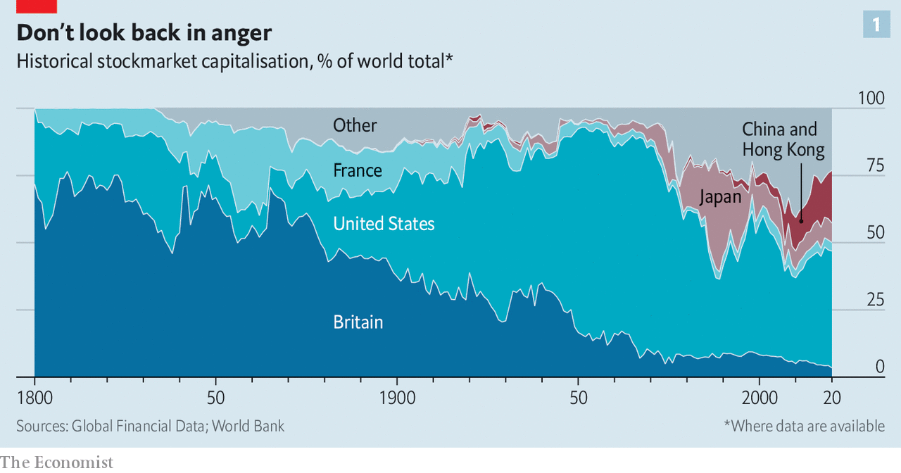
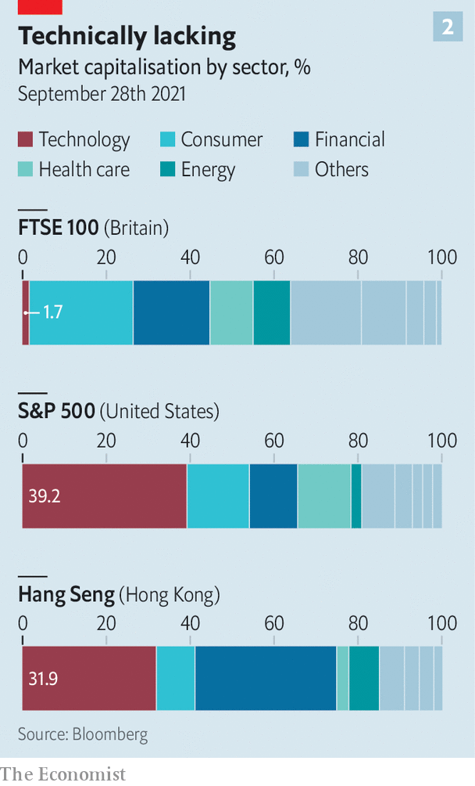

###### Who’s up, who’s down?

# The decline of Britain’s stockmarket should be seen in a broader historical context 

##### The historical context of the City of London’s slump 

 

> Oct 2nd 2021 

IT IS TEMPTING to look at Britain’s history and conclude that the loss of its empire made the relative decline of its stockmarket inevitable. But Britain’s is hardly the only one to have ballooned and shrivelled in the centuries since the idea of raising capital by selling equity to the public gained popularity. The fortunes of the world’s big exchanges have fluctuated throughout history. In recent decades two important trends have driven those shifts: the rise of Asian equities and the growing significance of the technology sector. Britain’s market has been clobbered more forcefully than those of its peers, exacerbating its decline. But these are merely the latest twists in 200 years of stockmarket history.

America’s and Europe’s stockmarkets first took off in the 19th century. Successive crazes for investing in canals, Latin America and railways led to the creation of hundreds of companies that raised capital in London, explains Bryan Taylor of Global Financial Data, a provider of historical statistics. “Once most of Europe’s railroads were built by the 1850s, British investors started financing the American ones instead,” he says. Britain’s stockmarket became a conduit for investment in a range of companies in Canada, India, South Africa, Australia and South America.


It was not the only hub for raising capital for overseas ventures. By the early 20th century, the shares of hundreds of firms were being traded simultaneously in London, New York, Paris and Berlin. America’s domestic growth was striking, too. The First Bank of the United States raised $10m ($291m today) at its incorporation in 1791. The incorporations of dozens of other banks and insurance firms followed. By 1911 the combined value of the British, American, French and German markets reached a high of $49bn—over $1.4trn today—a 175-fold expansion on a century before.

Two world wars later, a hobbled and fragmented European market offered little by way of challenge to America’s dominance (see chart 1). During the fighting bourses had largely been shuttered. When exchanges were able to open, they had frequently been subject to price restrictions that limited trading. Currencies were devalued and capital controls imposed, complicating cross-border flows. Hyperinflation in Germany and much of eastern Europe, combined with the rise of communism, had wiped out many investors. For decades after the end of the second world war, governments’ willingness to regulate and nationalise many industries kept European equities firmly in check.

 


The challenge to America, when it appeared, came from Asia. The gradual return of globalisation (which did not rebound to pre-first-world-war levels until the 1990s, as measured by flows of capital and goods) brought with it a dramatic rise in Asian exports. Japanese equities, in particular, flourished. Before 1960 Asia’s stockmarket had been worth less than 5% of the world’s; by the 1980s it had eclipsed Europe’s. In 1989 it accounted for nearly half of global market capitalisation, largely because of the Japanese asset-price bubble. Two years later, that bubble had popped and Japan’s fortunes had deflated. It was time for the Shanghai and Shenzhen exchanges to come of age, and set the scene for China’s rise as a financial superpower.

Today, China and America are by far the most important centres for raising equity capital. According to Dealogic, a financial data provider, America has so far seen 750 initial public offerings (IPOs) in 2021, for companies with a total value of $242bn. China, including Hong Kong, has counted 427, for companies worth $72bn. Compare that with France, Germany, the Netherlands and Britain where this year the combined value of the firms completing IPOs this year has reached just $45bn.

The shock of the new

Nor is it just in the sheer size of their markets or the volume of their IPOs that China and American outperform their competitors. They are also more heavily weighted towards the kind of innovative companies that are likely to drive future growth (see chart 2). Tot up the value of five of America’s tech superstars—Google, Apple, Amazon, Facebook and Microsoft—and you are left with a market worth more than all 1,964 companies listed on the London Stock Exchange.

 


A bias towards technology has its downsides. The returns of American equities are increasingly dependent on the fortunes of a handful of tech giants. China’s repeated crackdowns on its technology companies are all the more worrying for investors in stockmarkets dominated by them. That is especially true for the growing numbers of foreign shareholders who find the Chinese Communist Party’s mood hard to parse. But countries whose markets are light on innovation could learn from the British investors of the 19th century. Back then, the firms building railways were technological trailblazers, too. ■

