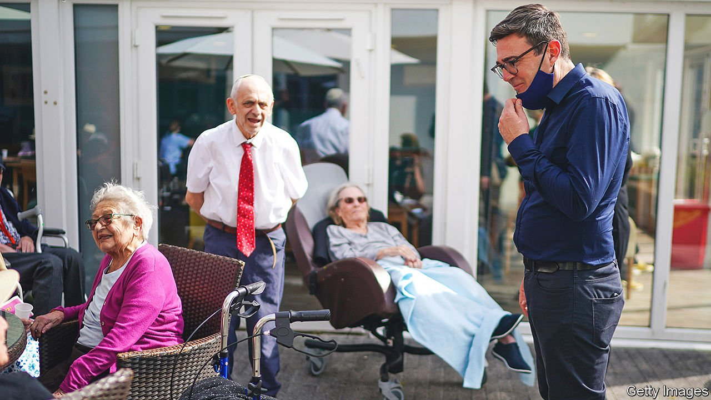
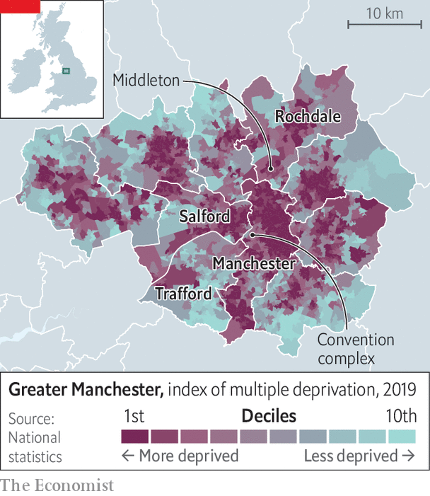

###### Manchester’s mayor

# Andy Burnham wants to help rescue the Tories’ signature policy 

##### His suggestions just happen to benefit Manchester 

 

> Oct 2nd 2021 

ALTHOUGH IT IS not the poorest part of the Manchester conurbation, Middleton needs some love and attention. The council estates that were built in the 1950s to house working-class families from central Manchester are showing their age. A derelict cotton mill, which is missing many panes of glass, looms over the town centre. “It’s a pretty depressing sight,” says Andy Burnham, Greater Manchester’s mayor.

Delegates to the Conservative Party conference, which kicks off on October 3rd, will be able to admire the middle of Manchester, which has been transformed over the past few decades from a post-industrial barrens to a grove of residential towers and offices. But Mr Burnham prefers to talk about a town of under 50,000 people 8km north of the city centre. He went to Middleton almost immediately after winning re-election in May, and it is a focus of his economic policy. That emphasis says much about Manchester, about the government’s vague ambition to “level up” Britain, and about the canny Mr Burnham.


Greater Manchester is a metropolis of ten boroughs—only a fifth of its 2.8m inhabitants live in the city of Manchester itself. Although long dominated by the Labour Party, it has managed to grab attention and money from national governments of all political persuasions. It was given the Commonwealth Games in 2002 and much of the BBC’s production from 2011. HS2, a vastly expensive railway line, will eventually connect it to London. In a series of devolution deals between 2014 and 2017, the government in Westminster gave it greater powers over health, criminal justice, transport and planning.

But Manchester’s salience is not as assured as it used to be. George Osborne, chancellor of the exchequer from 2010 to 2016, saw the metropolis as the main engine of economic development in northern England. The bigger it grew, and the more its economic tentacles reached across the north, the better. Mr Osborne particularly admired Howard Bernstein, then chief executive of the city of Manchester, whom he called “that brilliant star of city government”.

The current prime minister, Boris Johnson, seems to think differently about regional economic development, which he calls levelling up. Exactly what he thinks is unclear—his speech on the subject in July was a rambling mess, and a poll by Ipsos MORI in September found that only 9% of people felt they knew what levelling up meant for their area. But Mr Johnson appears to be more interested in towns than in cities. He laments the disparities within regions as well as the gaps between them.

Aware that cities remain Labour strongholds, his government has developed an anti-urban streak. Ministers bash the metropolitan elite and spar with its leading lights, including Mr Burnham and Sadiq Khan, London’s mayor. Last October the government forced Manchester into a lockdown to slow the spread of covid-19, refusing to pay what the mayor claimed the metropolis was owed in compensation. If the aim was to humble Mr Burnham, it failed utterly. Earlier this year a poll by the Centre for Cities, a think-tank, found him to be better-known in his region than any other mayor in theirs.

 


Still, the Manchester way is not to hold grudges, or fight with the national government, but to charm money and powers out of it. Mr Burnham has learnt to speak fluent Johnsonese. The government is quite right to focus on towns, he says. Manchester’s urban core is a success, but Middleton and other small towns on its fringes have indeed been overlooked. Lou Cordwell, chair of the Local Enterprise Partnership, talks of the need to “level up” the metropolis. As both know, much of inner-city Manchester remains deprived (see map). But if the government wishes to focus on towns, they can point to places that need help.

Mr Burnham and the leaders of Rochdale borough (in which Middleton sits) have plans. They want to connect Middleton to the tram network, create a mayoral development corporation for the town—which would give them more power to acquire and develop land—and build a vast industrial park nearby. The mayor also argues that Middleton’s residents would benefit if he was allowed to take control of the metropolitan bus network. His post-election trip was designed to show the high cost of travelling between there and Media City, where the BBC is based.

Such moves would, of course, entail further financial transfers to Manchester and enhance Mr Burnham’s power. He cannot help that. If the government really wants to level up the country, he says, it must work with the places that are competent enough to get things done. It should give Greater Manchester more power and money, he argues, and then hold it to account. “We’re trying to offer them a solution, not a fight.” ■

