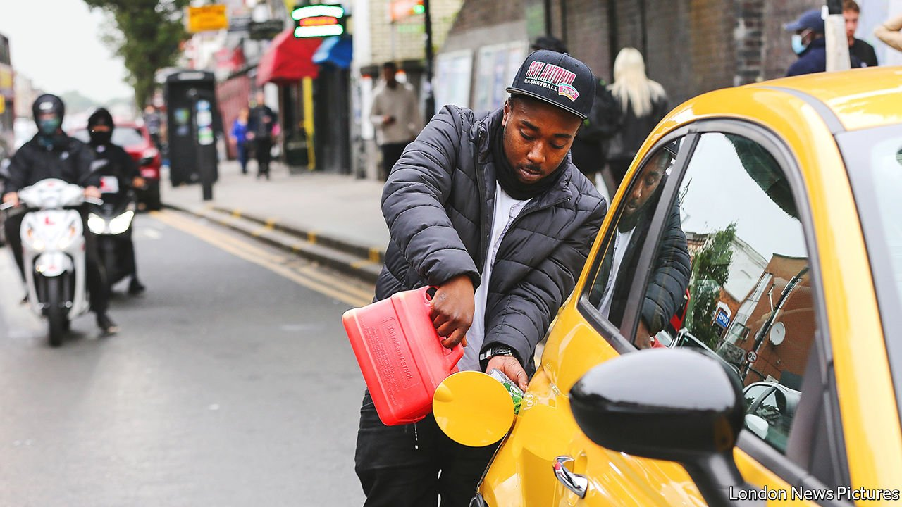

###### Running on empty

# Boris Johnson dodges the blame for Britain’s petrol-pump nightmare 

##### But his government has not got any better at crisis-management 

 

> Sep 29th 2021 

FEW THINGS spook a prime minister like a petrol crisis. In his autobiography, Tony Blair recalls one in 2000 caused by fuel protests. The Downing Street machine was moving at a glacial pace. Decisive orders were needed. “I would like the army to come in and if necessary drive your tankers,” he recalls saying, “and if they meet with any violence from protesters, I want you the police to deal with them very firmly, and if not, to let the army take care of them. They’re very good at it.”

Where Mr Blair had protesters to rage at, Boris Johnson has had to make do with . The Petrol Retailers Association, a lobby group, says that fuel is now returning to the pumps. But for the past week many Britons have been , and others have wasted hours queuing to do so. Although the crisis is in large part the result of temporary forces beyond ministerial control, it also highlights enduring problems with both British logistics and Mr Johnson’s government.


Global supply chains have been under stress for the past 18 months, thanks to lumpy consumption patterns caused by covid-19. An ageing workforce and grim conditions have created shortages of lorry drivers across Europe. Both problems are, though, especially acute in Britain. Supply chains have been stressed by Brexit-related form-filling. Tax tweaks have cut take-home pay for some lorry drivers, and the number from the EU has fallen by more than 12,000, or 10% of the total.

Throughout, ministers have insisted there is no shortage of petrol. The fact that rumours, which emerged from talks over , led to a run on the pumps reflects two issues. One is a frazzled public. Recent weeks have seen surging gas prices and empty supermarket shelves. In the words of Dominic Cummings, the prime minister’s former adviser, “The stooges who trusted No 10, and those who trusted the stooges, now have no petrol.”

The other is the government’s abject communication. Studying past fuel crises, Eben Upton and William Nuttall of the University of Cambridge find that “unbiased propagation of information about inventory levels can help to reassure consumers”. On September 24th Nadine Dorries, the culture secretary, tweeted, in a typical message: “There is no fuel shortage. I repeat, THERE IS NO FUEL SHORTAGE”, followed by a red-car emoji.

The government has propagated precious little information about petrol stocks. Its solutions have twinned the technocratic with the desperate. Migrant flows used to respond to the state of the economy, but under the post-Brexit immigration regime they have responded to ministerial diktat. The government spent the summer resisting pleas to allow in more workers, insisting that firms should improve conditions and raise wages instead. Data from Indeed, a job-listings website, suggests they did. Pay in advertisements for heavy-goods vehicle (HGV) drivers increased by 12.8% from February to August, compared with 1% for all jobs.

Still, problems persisted. Under the new immigration regime, drivers count as “low-skilled workers”, and are not welcome in Britain. In an attempt to reduce the pressure, on September 25th the government announced 5,000 visas for HGV drivers, as well as 5,500 for poultry workers (another industry suffering shortages). Although the extra workers will be welcome, they will not make an enormous difference given the small numbers involved. The visas expire on Christmas Eve.

Other measures kicked in more quickly. Before leaving the EU, officials drew up a “National Emergency Plan for Fuel”, which offers ministers a menu of escalating options. In July Grant Shapps, the transport secretary, increased the number of hours lorry drivers were allowed to work. On September 27th the government activated the “Downstream Oil Protocol”, which exempts firms from competition rules, allowing them to share data on shortages. Combined with the fact that there is only so much petrol that can fit in a car’s fuel tank, this was enough to get the stuff flowing once more.

The army was put on standby, with 150 soldiers preparing to drive tankers, but as The Economist went to press it had not been called into action. Given the difficult circumstances, it may not be the last time it goes on alert this winter. Indeed, Mr Johnson highlighted the possibility of problems until “Christmas and beyond”. There is, however, some reassurance for the government as it faces up to the possibility of festive disruptions. Despite a crisis that was partly created by its flagship policy and was mismanaged by ministers, it is escaping the blame. A poll by YouGov asked who was at fault. Some 23% said the government. Nearly half said the media. ■

 A previous version of this article misstated the number of visas offered to lorry drivers, and the date on which they were announced. Sorry.

An early version of this article was published online on September 29th 2021

