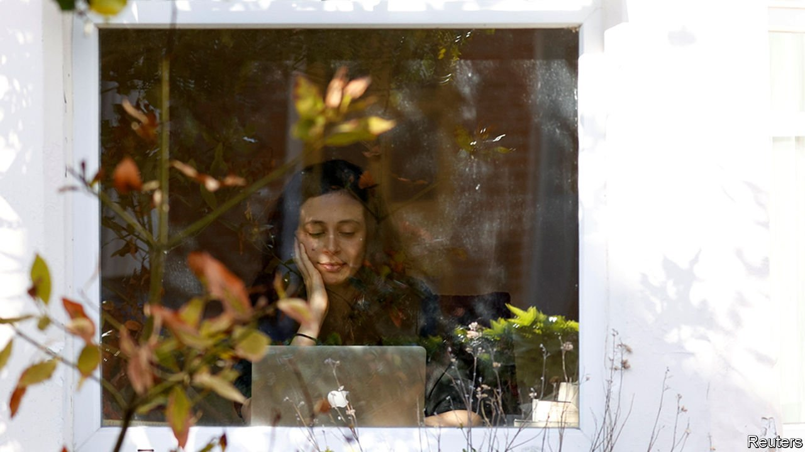
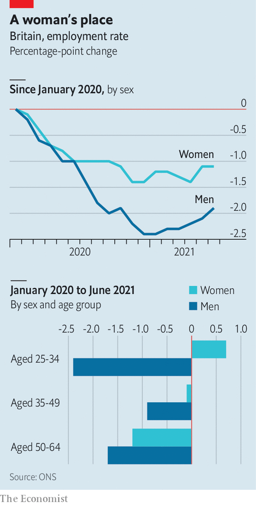

###### Labour markets

# In Britain, young women got more work during the pandemic 

##### Fears of a she-cession were ill-founded 

 

> Oct 2nd 2021 

ASK A HARRIED mother whether Britain suffered a pandemic-induced “she-cession”—a jobs downturn that hits women disproportionately—and she might retort that she had hardly been twiddling her thumbs. When schools first closed, mothers took on an outsize share of unpaid caring for children, and experienced a huge drop in uninterrupted time in which they could get on with work. Ask an economist the same question, and they will tell you that British women increased their share of formal employment, too. Although the pandemic hit most groups’ employment rates (see chart), men’s were hit harder.

 


This was unusual. One study of 38 countries found that around two-thirds saw men’s lead in employment over women widen between 2019 and the second quarter of 2020. But in Britain it narrowed, by an amount second only to Luxembourg. Most stark was the divergence between the paths of young men and women. In June the employment rate for men aged 25-34 was 2.4 percentage points below January 2020. For women of the same age it was 0.7 percentage points higher.

A generous furlough scheme probably contributed at first, as until May more of the affected jobs were held by women than by men. (People on furlough count as employed.) More recently, however, the balance has evened out. Another factor is that before the pandemic, men were twice as likely to be self-employed as women, and self-employed workers were not covered by the furlough scheme. That left them more exposed when covid-19 hit.

Why did the experiences of younger men and women diverge so much? Hannah Slaughter of the Resolution Foundation, a think-tank, says that before the pandemic 25- to 34-year-old men were about as likely to be self-employed as men in other age groups. But the sectors they worked in, such as construction and manufacturing, were hit harder when lockdowns started. For the population in general, there was little connection between the male-female split of the workers in a sector and whether it was badly affected. That link was stronger, however, for younger workers.


The bigger mystery is perhaps why employment among younger women fared so comparatively well. One clue is a large drop-off in people staying out of the workforce to care for their home or family, says Ms Slaughter. That could suggest a silver lining to the pandemic, namely the rise of remote working, which makes it easier to juggle employment and family. A gloomier possibility is that some women have been pushed into paid work because their partners have lost income, as happened during the preceding recession, in 2008-09.

On September 30th the furlough scheme will finally close. And a new study by Jonathan Cribb and Adam Salisbury of the Institute for Fiscal Studies, a think-tank, suggests that women could be more vulnerable to consequent job losses. Once you strip out the sectors most likely to bounce back from pandemic-related shutdowns, such as air travel and tourism, women made up 55% of those furloughed in June. The researchers also cite evidence that when you adjust for unemployed or furloughed women’s work experience and the pattern of vacancies in the economy, those women face particularly tough competition for jobs. The pandemic may not have caused a British she-cession. But for women, the post-pandemic jobs market will not be especially welcoming. ■

Dig deeper

All our stories relating to the pandemic and the vaccines can be found on our . You can also find trackers showing ,  and the virus’s spread across .

