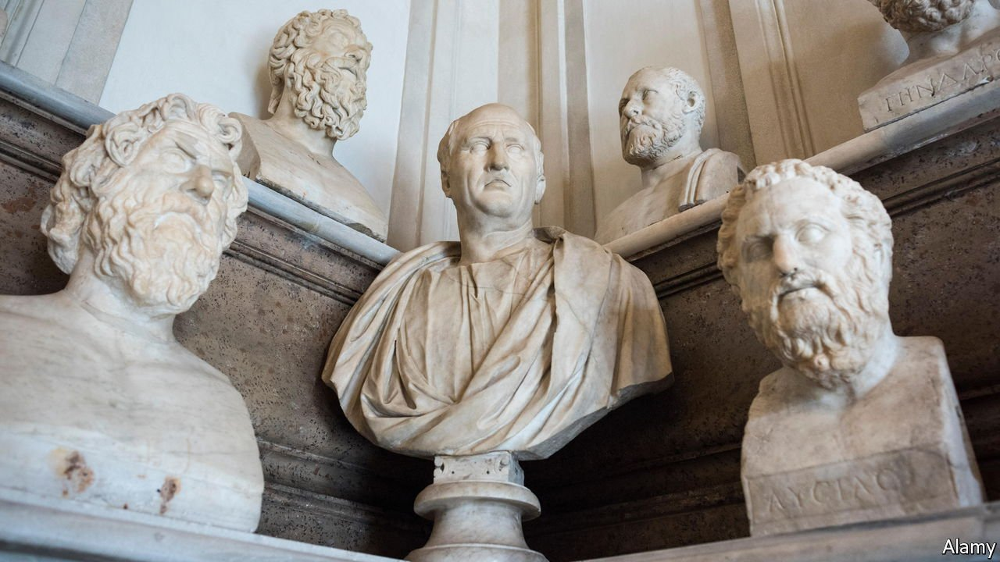

###### Bearing gifts

# Professors and students seek to widen the appeal of classics 

##### Reasons to study Greek and Latin are many and varied 

 

> Oct 2nd 2021 

YAAMIR BADHE is looking forward to his final year as an Oxford classics student. He finds Latin and Greek texts a source of “wisdom, joy and consolation” and is dismayed by the idea that his degree course, taken by generations of grandees, might slacken its language requirements. He was among the students who objected last year when some faculty members floated the idea of dropping the compulsory study, in the original, of Homer and Virgil. The proposal was part of a discussion on how to make classics more accessible to students who did not attend high-powered schools.

Mr Badhe is no traditionalist, nor insensitive to the charge that classics come with colonial baggage. Rather, he brings a fresh perspective. As a Briton of Indian origin, his special interest is in the melding of Greek, Indian and Buddhist culture 2,300 years ago after Alexander the Great swept through what is now Afghanistan. To the sculptors and poets who engaged in that Indo-Greek fusion, the modern idea of classics being a colonial imposition would seem, Mr Badhe says, “highly bizarre”.


All this is part of a controversy that first surfaced in America. Dan-El Padilla Peralta, a black professor at Princeton University, is the best-known advocate of the view that classics as a discipline is incorrigibly tainted by racism and elitism. On British campuses, radically minded students have challenged professors to rethink the curriculum to make it more accessible, as well as free of racist and colonial overtones.

An elitist strain to the classics tradition is not hard to find. British Victorians loved the passages in Thucydides, the father of Greek history, that celebrate the role of Athens as a benign imperial power, spreading civilisation. But that is not the whole story. On British campuses in the 20th century, the most influential classicists included Eric Dodds, an Irish socialist, and Moses Finley, an American who fled his homeland as a suspected communist.

And elitism need not be the discipline’s future. From October the Institute of Classical Studies, a professional body, will be led by Katherine Harloe, a black woman with a chair at Reading University and a declared interest in exposing the distortion of classics for ideological purposes. Her expertise is in the romantic, patronising way ancient Greece was seen in 18th-century Germany. In a recent broadcast, she said that the attitudes of the British public, not just those of professors, need to change. When an educational animation portrayed a Roman family in Britain as dark-skinned, it drew protests on social media from people unaware of the archaeological evidence that Roman settlers were of many races.

In July the Cambridge classics faculty issued an elaborate plan to counter racism and elitism. It pledged to increase the share of ethnic-minority undergraduates, which was 14% in 2017-19 compared with 23% for the whole university. Selectors will be helped to “understand the impact of their decisions” on diversity. There was even a vow to modify a display of plaster-cast statues to make plain that the ancient figures depicted were not all white.

Still, the statistics suggest that if British classics have a diversity problem, it is at least as much to do with social and educational class as ethnicity. Latin, Greek and ancient history are concentrated in fee-paying and academically selective state schools. Elsewhere, they barely feature. In 2019, 1,121 English pupils took Latin at A-level, the exam which opens university doors. Only 12% of those went to non-selective schools; a scandalously low share, according to Classics For All, a voluntary group that promotes the subject for non-privileged youngsters, and has helped over 1,000 schools.

Spreading the classics to all classes and races is noble work, says Sahil Thapa, a sparky 19-year-old who co-edits a student law journal at Oxford University. His parents, who moved from Kathmandu to Essex, were puzzled when he opted for Latin A-level; he explained that ancient orators like Cicero would help his studies, which include Roman law, and stimulate his own rhetorical skills. Classics in Britain shows no sign of dying out, but the people who study it, and the reasons for their choice, would amaze Victorian imperialists. ■

