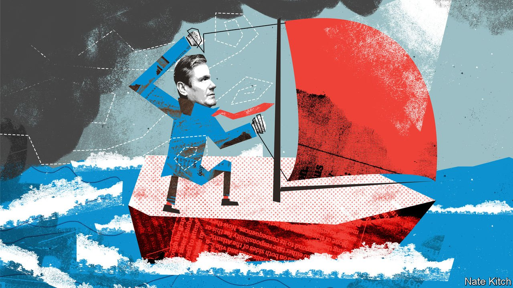

###### Bagehot

# Sir Keir Starmer is sailing the Labour Party in the right direction 

##### Despite mutinous left-wingers’ attempts to knock him off course 

 

> Sep 30th 2021 

THE WEATHER in Brighton was decidedly blustery as the Labour Party gathered for its annual conference between September 25th and 29th. The handful of hardy souls who braved the sea were repeatedly flattened by the waves. But the wind turbines off the coast also whirled furiously, providing an energy-starved country with much-needed power. The mood inside the conference centre matched the squalls outside.

Sir Keir Starmer’s carefully charted attempt to introduce himself to the party he leads (and to Britain; last year’s affair consisted of little more than a speech to camera) was repeatedly blown off course. The big news on the first day was Angela Rayner, the deputy leader, calling Tories “scum”. On the second, it was a fight over the rules for electing the party leader. Then came the resignation of the shadow employment minister, Andy McDonald, over Sir Keir’s refusal to back an hourly minimum wage of £15 ($20), a policy supported by delegates, but with no chance of becoming law.


The squalls were powered by a combination of an ideological battle over the party’s direction and a more subtle one over succession. Labour’s hard left made a great deal of noise in fringe meetings and on the pavement outside. After his departure Mr McDonald, the last remaining fellow traveller with Jeremy Corbyn, Sir Keir’s hard-left predecessor, in cabinet, was welcomed by some as a hero. Ms Rayner and Andy Burnham, the mayor of Greater Manchester, competed to become heir-apparent, Ms Rayner by giving her best impression of La Pasionara and Mr Burnham by presenting himself as a problem-solver (and football-lover).

All the squabbling inspired criticism of Sir Keir’s leadership style. The left accused him of picking an unnecessary fight with the party’s heart and soul. The right worried that he was washing dirty linen in public. One frontbencher described him as a “caretaker”; another dismissed the conference as a “total disaster”. But just as the salty breeze blew the turbines around outside, so the bluster and blasts inside powered the party towards renewal.

The Labour left has been significantly weakened. Sir Keir did not succeed in returning to the electoral-college method of choosing leaders, as he had hoped. But by increasing from 10% to 20% the share of MPs from whom a prospective candidate must gather support, he all but ruled out another hard-left takeover. And by scrapping rules that force MPs to endure periodic reselection by local party activists every year, he further weakened the party’s lunatic fringe. “We’ve nailed the hard left into their coffin,” said one shadow cabinet member. “There’s a lot of kicking and screaming because they know they’re not coming back to life.” A senior adviser gloated: “Job done.”

The conference also saw the outlines of a new Labour philosophy: more mainstream than Corbynism but also more communitarian than Blairism. It is aimed at the just-about-managing in provincial towns, rather than the socially liberal affluent types who formed the core of New Labour. Rachel Reeves, the shadow chancellor, focused on what she called “the everyday economy”—that of collapsing high streets rather than lines on a graph. She promised to spend £28bn a year on the green transition, an ambitious figure, but one that is broadly in line with centre-left administrations elsewhere. And she said her party was on the side of workers against companies that don’t pay their taxes and contractors who don’t come up with the goods.

Sir Keir’s speech was too long and his delivery too slow (coming days after a 12,000-word Fabian pamphlet, it suggests that he struggles to self-edit). But it succeeded in advancing his most important aims—to detoxify his party and to define Starmerism. He used his background (a factory-worker father and a mother with a rare, and awful, type of inflammatory arthritis) to lay claim to traditional values such as hard work and aspiration, as well as to more obviously left-wing values such as care and community. He praised the armed forces for defending the country, and the Crown Prosecution Service (which he ran from 2008 to 2013) for tackling criminals. He also praised Tony Blair, the Labour prime minister the Labour left loves to hate, for delivering the “levelling up” that the Tories only talk about. The left played into his hands by heckling after words like “patriot” and gave him a chance to taunt them with his best line—“shouting slogans or changing lives?”—which was taken up by the largely sympathetic audience.

Above all, Sir Keir made it clear that he is serious about winning power. “We will never under my leadership go into an election with a manifesto that is not a serious plan for government,” he proclaimed: cue Corbynista fury. He spouted endless detail about policies such as setting up an office to make sure taxpayers get value for money (hence the speech’s inordinate length). He criticised the prime minister, Boris Johnson, not because he is “Tory scum”, as Ms Rayner put it, but because he is a “trivial man”. In tumultuous times, he said, Britain deserves a leader who is dedicated to public service rather than one who treats it as a game.

Batten down the hatches

Among the Labour Party’s biggest weaknesses is a habit of underestimating the Tories, and Mr Johnson in particular. But the Tories may now be doing the same with the man they like to call “the nasal knight” (Sir Keir’s voice is not his best feature). Both are pursuing the same swing voters: the just-about-managing who feel short-changed by globalisation and the 40% of young people who leave school without essential qualifications. They are offering similar policies: higher taxes and bigger government. But Sir Keir’s seriousness and centre-left values may be more suited than Mr Johnson’s bluster to darkening times. The winds of political change have blown left-of-centre parties into power in two of the West’s biggest countries, America and Germany. With Sir Keir fixing the hull and patching the rigging, the same winds might yet do the same for the good ship Labour. ■

An early version of this article was published online on September 29th 2021

