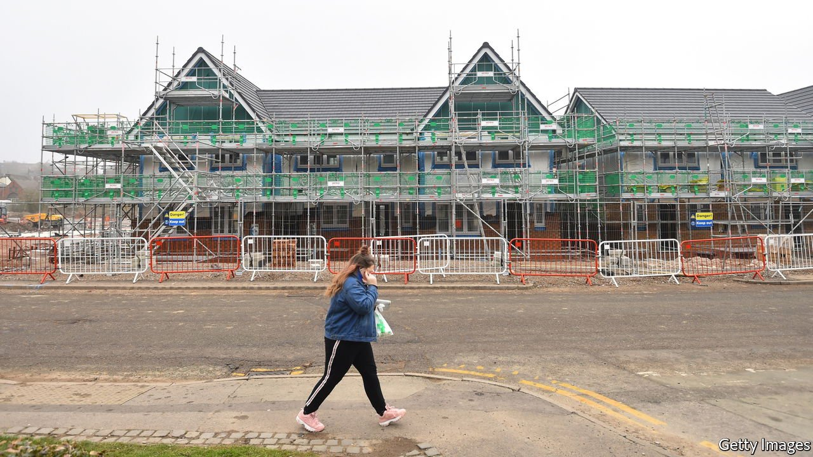
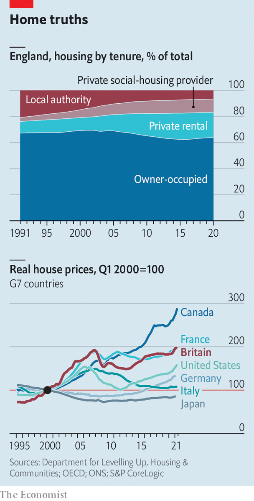

###### Change of plan

# The government looks set to ditch an ambitious target for housebuilding 

##### It wants more home ownership, but is less keen on building more homes 

 

> Oct 2nd 2021 

IN 1975, IN her first conference speech as Conservative leader, Margaret Thatcher pledged to build “a property-owning democracy”. More than 45 years later homeowners are still more likely to back the Tories than their rivals, and so the government would like there to be more of them. In 2017 it set an ambitious target of increasing the housing stock by 300,000 units a year in England. To help hit that target, in 2020 Boris Johnson, the prime minister, promised to simplify planning and weaken locals’ rights to object to development.

But housing and planning present the Conservatives with a dilemma: although they want more homeowners, they do not want to annoy existing ones. A by-election loss in June to the Liberal Democrats in the constituency of Chesham and Amersham, prosperous commuter towns, was chalked up in part to local anger over planned development. It spooked the party leadership. Backbenchers, too, are growing nervous. Political insiders now expect a shift in emphasis at the Conservative Party conference, which starts on October 3rd, away from building new homes and the 300,000 annual target, and towards increasing taxpayer support to enable first-time buyers to take on larger mortgages.


British homes are expensive. Since 1995 prices have gone up by 170% in real (ie, inflation-adjusted) terms, one of the fastest increases among rich economies (see chart). The median house in England and Wales cost five times the median salary in 2002, but closer to eight times by 2020. Home ownership, which had been rising for decades, peaked in the early 2000s). Over the past two decades a consensus has emerged among politicians and policymakers that the main reason has been too little supply. But since the mid-2010s Ian Mulheirn, an economist who now works at the Tony Blair Institute for Global Change, has argued that the main causes of higher house prices have been falling real interest rates and looser credit.

 


For a long time, Mr Mulheirn seemed a voice in the wilderness. But now, it seems, the government is listening. Michael Gove, who became the minister responsible for planning and housing in September’s reshuffle, has reportedly taken to telling colleagues that only around 15% of the growth in house prices of the past two decades can be explained by lack of supply. Nick Boles, a minister for planning in the early 2010s, an ally of Mr Gove and long almost evangelical on the need for planning reform, has changed his view too.

Mr Mulheirn provides cover for the new direction. He has long argued that there is little evidence of an undersupply of housing. He cautions against reliance on house-building volumes: what matters, he says, are total net additions to the dwelling stock. The conversion of a three-storey house into three flats is materially the same as building two new flats, but is not captured by a focus on new building. Between 1996 and 2018, the dwelling stock in England grew by an annual average of 168,000 while the number of households grew by an average of 147,000. The result was that the net surplus of dwellings rose from around 660,000 to around 1.1m. And although the price of houses as an asset has indeed soared, he argues that the price of housing as a service has not. Rents have risen more slowly than median household incomes since 1996.

On this view—which, it now seems, the government shares—the main cause of higher prices is the role of housing as an asset. Owning a home produces an implicit income: the saving that would otherwise have been spent on rent. As with other assets that provide an income stream, such as stocks or bonds, the value of that income is determined by the interest rates available elsewhere. According to this , house prices are high for the same reason that bond and stock prices are high: because interest rates have collapsed and credit has become looser. Mr Mulheirn does not entirely reject the notion that more supply would lower prices, but estimates that two decades of adding 300,000 units a year would reduce prices by only around 10%.

Castles in the air

This theory is not without critics. The rental data on which it is based is of low quality. Household formation does not just influence house prices; it is also influenced by them. For example, high prices may nudge young adults to stay living with their parents for longer. Real interest rates are low pretty much everywhere, but housing markets vary by country and region. Rental yields are considerably lower in London than in northern England.

In any case, even if global factors explain most of the past two decades’ rise in house prices, increasing stock in the places where people most want to live would be both welfare-enhancing and good for productivity. And encouraging young people to take on more debt need not be the sole way to improve their living conditions. More social housing could be built, and conditions in the private rental sector improved. The taxation of housing could be reformed, the better to reflect rising values. But for a government committed to increasing home ownership, none of this would help hit its central target. ■

