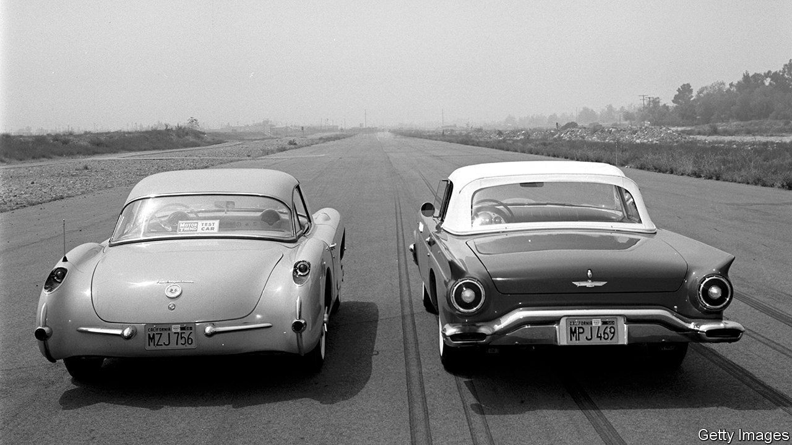
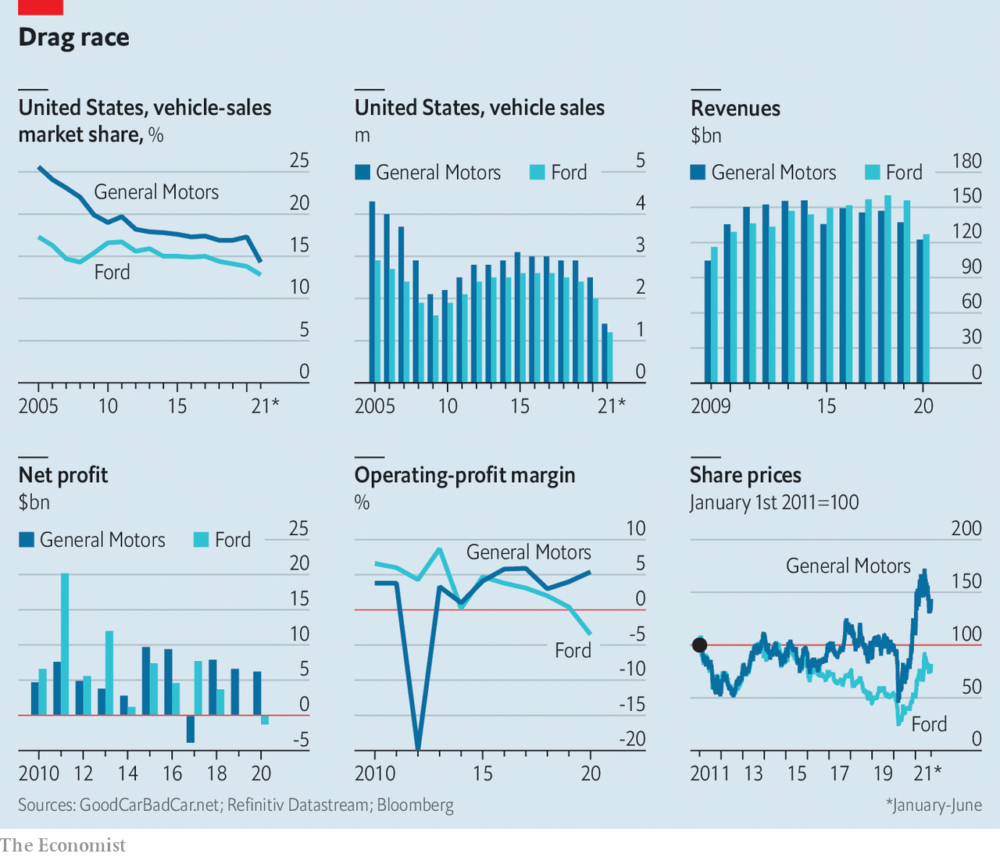

###### Electric Motor City

# Ford and General Motors fight it out to electrify 

##### The switch to battery power is the latest showdown between Detroit’s heavyweights 

 

> Sep 30th 2021 

IN 1909 THE founder of General Motors (GM), William Crapo Durant, offered to buy Ford for $8m. Henry Ford spurned the advance, making way for one of the fiercest and most multifaceted rivalries in corporate history. Does Ford’s harnessing of mass production with the one-size-fits-all Model T in 1908 trump the marketing genius of GM’s Alfred Sloan, who promised a “car for every purse and purpose” in the 1920s? Which is Detroit’s finest V8 engine: Ford’s “flat head” or the “small block” from Chevrolet, GM’s main brand? Did the looks of the Ford Thunderbird outshine the Corvette in the 1950s? Did the Chevrolet Camaro outmuscle the Mustang a decade later?

Even as petrolheads continue to squabble over the history, a new contest is brewing between America’s two mightiest carmakers that may be the most momentous in a century. It is the race to electrify their fleets, and especially pickups, the biggest source of profits for both companies. As part of this campaign GM has said it will build four battery factories by 2025 with its partner, LG Chem, a South Korean battery-maker. And on September 27th Ford and its battery partner, SK Innovation, also of South Korea, announced an investment of $11bn in three battery factories and an assembly plant for electric F-Series pickups.


Ford reckons that 40% of its global sales will be electric by 2030 (the deadline President Joe Biden would like to set for half of all new cars in America to be battery-powered). GM wants all its vehicles to be . The ultimate result of this competition will determine which of Detroit’s giants will have the upper hand in the market for electric vehicles (EVs) and autonomous driving. It will also help shape the future of both motoring and carbon emissions in the country that invented the gas-guzzler and car culture.

After a slow start compared with European and Japanese rivals like  and Nissan, the Detroit duo are revving up their EV plans. The new investment by Ford and SK Innovation, $7bn of which will come from the carmaker, is part of a pledge the company made in May to spend over $30bn on electrification by 2025, up from a previous commitment of $22bn. That put it ahead of GM’s target of $27bn by that date. But not for long: in June GM responded by raising its goal to $35bn.

The reason for this newfound ambition is the firms’ painful decline in their home market. America “defines both companies”, says Dan Levy of Credit Suisse, a bank. In 2020, 65% of Ford’s revenues and over 80% of GM’s, along with most of their profits, came courtesy of domestic buyers. But although America defines both of them, they no longer define America (see chart). Hubris, bred from decades of effortless success, ran up against smaller, cheaper and better vehicles made by foreign firms. Ford’s and GM’s combined market share of 30% is a shadow of the combined 50% they commanded 20 years ago, let alone the 70% in the 1970s.

 


GM was quicker to start getting out of the rut. Ironically, that is in part owing to Ford’s efforts to do so in the mid-2000s. In 2006 Bill Ford, chairman and Henry’s great-grandson, appointed Alan Mulally, an outsider from Boeing, a planemaker, to revive the firm. Mr Mulally’s plans included a $24bn credit line. When the financial crisis hit in 2008, this saved Ford from bankruptcy protection and a government bail-out that befell GM and Chrysler (the smallest of Detroit’s big three that is now part of Stellantis, a global carmaking group whose largest shareholder, Exor, part-owns The Economist’s parent company). But it also let Ford avoid the deep transformation into which GM had been forced.

Neither Mark Fields, a Ford insider who took over from Mr Mulally, nor , an outsider who replaced him as CEO in 2017, managed to turn things round. New Fords underwhelmed and the firm made a series of missteps, such as the botched launch of the Explorer SUV in 2019. Profits dived between 2016 and 2019. If Mr Hackett indeed had deep thoughts about the future, the ostensible reason Mr Ford appointed him, he proved inept at enunciating them to investors. Critically, he failed to get his hands dirty running the day-to-day operations in the present, says Philippe Houchois of Jefferies, a bank.

By contrast, Mary Barra, who took the helm at GM in 2014, ran the firm with a laser focus on profits over market share. Slashing underperforming parts of the business, she took GM out of Russia and India, and sold Opel, its European operation, to PSA Group. Mr Levy of Credit Suisse says that, thanks to Ms Barra, “not much is left underperforming”. This in turn gave GM greater self-confidence in communicating its future direction to investors. Its  has outperformed Ford’s by a country mile in the past ten years.

Ford’s new boss, Jim Farley, appointed just over a year ago, has brought fresh urgency. His credentials as a “car guy” are indisputable. He proudly displays his intricate model cars on Twitter. Only Carlos Tavares, boss of Stellantis, spends more time on the racetrack. Mr Farley’s love of speed and his attention to detail are evident in Ford’s electrification plans.

The company has stolen a march on GM with its current EV line up. GM says it will have 30 electric models by 2025, but the only car on the road now is the Chevy Bolt, a small hatchback in a market hungry for pickups and SUVs. Ford’s offerings look more compelling, desirable and closer to the firm’s areas of expertise. The battery-powered Mustang Mach-E has revived a dying brand. Whereas the electric Chevy Silverado may not hit the showrooms until 2024, Ford’s F-150 Lightning can already be pre-ordered and goes on sale next year. Mr Farley is also exploiting Ford’s strength in commercial vehicles by electrifying its famous Transit van. The company expects revenues from the commercial-vehicle unit to rise from $27bn in 2019 to $45bn by 2025. It has an undisclosed but sizeable stake in Rivian, a EV-trucks startup that is set for an IPO that could value it at $80bn (roughly equal to GM’s market capitalisation and half as much again as Ford’s).

GM is not asleep at the wheel, however. In January it created BrightDrop, a new division dedicated to electric delivery vehicles. And it retains an edge in basic technology, as well as in making batteries in-house, a sure route to cutting the costs of the priciest element of electric cars. Its Ultium batteries, with a wire-free system that cuts weight and costs, married to its new electric motors, could make for a car with a range of 450 miles (724km), nearly 50 more than the longest-range Tesla.

If the electric race is tight, the longer-distance one to autonomous driving is even harder to call. Both companies are tight-lipped about progress in their self-driving divisions. Cruise, of which GM is the majority owner, is widely seen as being ahead of Argo, jointly owned by Ford and Volkswagen. Cruise has landed the backing of SoftBank, a giant Japanese tech-investment group, and a funding round in April valued it at more than $30bn. But its robotaxis, now set to hit the road in 2023, are four years behind schedule. Despite a humbler valuation of around $7bn, Argo is already starting trials of its autonomous cars and is planning to go public this year. And so the age-old rivalry shows no signs of slowing. ■

For more expert analysis of the biggest stories in economics, business and markets, , our weekly newsletter.

Editor’s note (September 29th 2021): This article has been amended, to correct the target dates set by Ford and President Biden for electric-car sales. Also, revenues from Ford's commercial-vehicle division were $27bn in 2019—not 2020, as an earlier version misstated.

An early version of this article was published online on September 28th 2021

