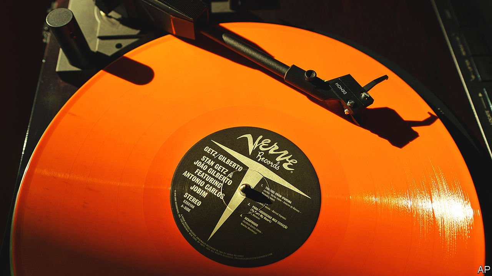
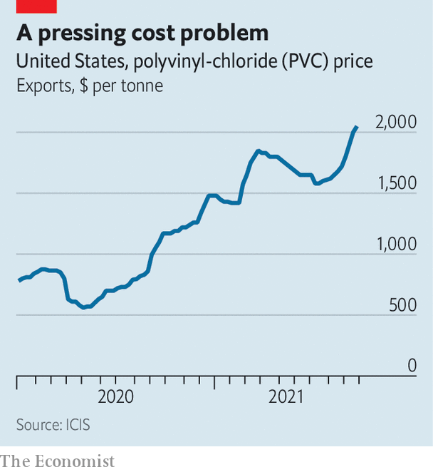

###### Out of the groove

# The music industry is an unexpected victim of a plastics shortage 

##### The strange knock-on effect of supply-chain bottlenecks 

 

> Oct 2nd 2021 

AT THE START of 2020 Green Lung, a London heavy-metal act with a cult following, were about to go on their first American tour. Then came covid-19. The band used ensuing lockdowns to produce a second album, “Black Harvest”. By December it was recorded and ready to be mastered and pressed onto 5,000 gold-vinyl records. Given pandemic disruptions, Green Lung gave itself lots of time, fully nine months, to make these in time for a tour this September. “We were fairly comfortable,” says Tom Templar, the lead singer.

Instead the first pressing of the record, which is sold out in pre-orders, will not be available until October. The band could have launched on a streaming service like Spotify. But it wanted to wait for the LP, which generates far more money in the short run. “The vinyl sales prop up the US tour,” explains Mr Templar. In the end, Green Lung played its album-launch gig on September 1st record-less. The band thus became the latest, unexpected casualty of upheaval in global supply chains.


First CDs, then digital downloads and now streaming have made vinyl records look like a vintage curiosity. In recent years, however, sales have soared, as fans have taken to owning their favourite bands’ music in physical form (waxing insistent about its supposedly better sound quality). In March vinyl sales in Britain reached highs last seen in 1989. “Every artist in the world has spent 18 months twiddling their thumbs, so they are making records,” says Ed Macdonald, the manager of 100% Records, which represents artists such as We Are Scientists, an indie rock band. “Vinyl is such an integral part of our turnover,” he says. Mainstream artists are increasingly involved. Taylor Swift’s album, “Evermore”, first released digitally in December, broke a 30-year record for vinyl sales. Albums are expected to be released soon by Ed Sheeran, ABBA and Coldplay.

 


Unfortunately for musicians, getting them pressed is becoming close to impossible. In the late 1990s and early 2000s most vinyl-pressing factories closed. As covid-19 raged the biggest remaining ones—in America, the Czech Republic, Germany and Poland—had to shut temporarily, creating a backlog. Now demand from musicians is outstripping capacity. On top of that, the price of PVC, the plastic used to make LPs, has surged after Hurricane Ida knocked out 60% of America’s production in August, while demand has boomed from firms that use the stuff in cars, pipes and much besides (see chart).

Dirk van den Heuvel of Groove Distribution, a distributor of dance music in Chicago, says that the big labels created the crisis by closing their own pressing factories in the 2000s. If they had kept these running, he grumbles, the majors would have been ready for the demand and smaller musicians would not now be so squeezed. It is true that big labels can often secure priority on the presses. But not always. It may be cold comfort to Mr van den Heuvel or Green Lung, but Ms Swift’s fans had to wait months for their LPs, too. ■

For more expert analysis of the biggest stories in economics, business and markets, , our weekly newsletter.

