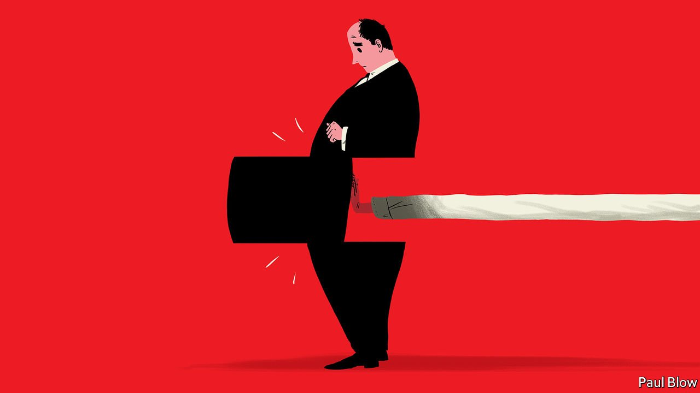

###### Bartleby

# Why companies need middle managers 

##### Organisations embrace flat hierarchies at their peril 

 

> Oct 2nd 2021 

EVERY LARGE business has a boss and minions, who do most of the work. What comes between the corner office and the shop floor is a matter of managerial preference. Some firms’ organisational charts are towering mille-feuilles, with staff piled into rigid hierarchies stuffed with assorted supervisors. More fashionable of late has been the pancake organigram: fewer layers of workers reporting to a smaller cadre of chieftains. As appealing as such “flat” organisations might seem, the thinning of managerial ranks comes at great cost.

Vice-presidents, area supervisors and other department heads were once the corporate machine’s central cogs. Now such middle managers are derided as pound-shop CEOs, there largely to organise and attend pointless meetings. A few modish startups bill themselves as having no administrative tiers at all, leaving independent employees flitting between tasks as they see fit. Such holacracy, as it is dubbed, clearly won’t do for a Unilever or Goldman Sachs. But even big firms now ritually boast about “delayering” their ranks.


Flat organisations are meant to reflect the modern workplace. Businesses in generations past used to be steeply hierarchical to mimic the armed forces, remembered by bosses of yesteryear as a place where missions were accomplished. Starting off at the bottom of a pyramid, perhaps six or seven rungs below the top brass, wasn’t so bad if you intended to progress at the same firm for your entire career. Millennials and later Gen-Z recruits had other ideas. Reporting to an overbearing boss crimped their ability to make an immediate mark.

Several factors contributed to the “flattening” trend. Businesses discovered that having lots of mini-barons could lead to stultifying silos. New ways of working—starting with modern technology—mean that executives can manage more subordinates, including some far away. Add enough direct reports to each supervisor, and the number of rungs between the chief executive and the graduate trainee shrinks accordingly.

Proponents of flat organisations say they give each employee added responsibility: bosses with dozens of flunkeys can hardly be expected to micromanage them. Uncluttered organigrams make companies more agile, enable faster decision-making and trim costs to boot. Business titans like Elon Musk of Tesla, a car firm, have painted delayering as a way of improving communication and shedding corporate deadweight.

Clearly there are limits to how far one can go. Not every Tesla factory hand is going to seek their annual appraisal from Mr Musk. In fact any amount of delayering hacks away at what it means for an employee to be part of a company. The key corollary—indeed the enabling factor—of flat organisations is for each employee to have less boss. That will sound appealing to some workers.

Such bosslessness, however, is a false Utopia. Companies that went furthest in scrapping management tiers discovered that getting rid of a formal pecking order resulted in informal hierarchies taking hold instead. A leadership vacuum risks being filled by petty tyranny. It is inevitable when large groups of people spend time together, in the office or elsewhere, that someone ends up in charge (and often lots of people end up in charge of different little tasks). That can be layers of managers put in place formally according to their competence and track record. Or, if everyone is on paper holacratically equal, it might be whoever talks loudest at meetings.

Fewer tiers mean fewer people with day-to-day experience of corralling employees. Yet managing others is not an ancillary task which companies do to reach other aims. It is the precondition for any of their aims to be reached. Sometimes skimping on the degree to which each human resource is supervised doesn’t matter much. But there inevitably comes a time—for the employee or the company—when it matters a great deal. Having lots of organisational tiers means that those in charge of managing lots of people have had experience managing fewer people before.

Covid-19 has already upended many individuals’ working lives. Gone are the days of sitting every day in the same office as your co-workers. Plenty will be adapting to the new managerial normal for a while yet. That makes keeping employees in the loop and engaged more important than ever. Layers of bosses provide structure. For all the joy of belittling them, middle managers are part of the solution.

For more expert analysis of the biggest stories in economics, business and markets, , our weekly newsletter.

