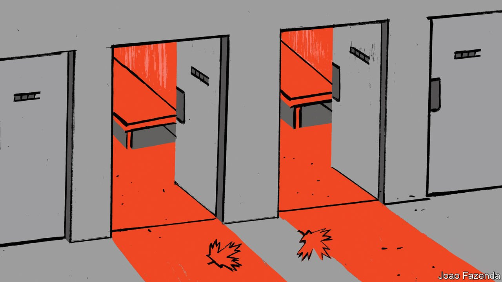

###### Chaguan

# When China wants to be feared 

##### Taking Canadian hostages was a message to America’s allies 

 

> Oct 2nd 2021 

SURPRISINGLY OFTEN, Chinese diplomacy resembles an iron fist in a silk glove. Depending on political winds back home, China’s envoys learn to balance fist-waving threats with silken words about peace and friendship. Just now, the gloves are coming off.

China is in a triumphant mood after Meng Wanzhou, a boss at Huawei, a technology firm, was allowed to fly home on September 25th after almost three years of legal battles in Canada. Ms Meng, who is also the daughter of Huawei’s founder, was fighting extradition to America on charges relating to sanctions-busting business dealings with Iran. Celebrations peaked with the arrival of an Air China plane bringing Ms Meng to Shenzhen, where Huawei is based. State television carried the landing live, as if Ms Meng were a returning astronaut. She was greeted by flag-waving crowds and a welcome message blazing from Shenzhen’s tallest skyscraper. “Without a powerful motherland, I would not have my freedom today,” declared Ms Meng. The People’s Daily, the Communist Party’s official mouthpiece, called her return a sign that China’s rejuvenation as a great power is now a “historical inevitability”.


Neither the businesswoman nor state television mentioned a less stirring reason for her return: her signing, hours earlier, of a Deferred Prosecution Agreement offered by American prosecutors, admitting that in 2013 she misled bankers in New York about Huawei’s links to a company active in Iran. That legal deal ended what Ms Meng called 1,028 days trapped in a dark “abyss”. By this she meant her enforced stay in Vancouver, while her team of expensive lawyers fought her extradition after her arrest by Canadian police in December 2018 on an American warrant. Granted bail, Ms Meng lived in her own house, took painting lessons and English classes, and was free to explore Vancouver by day.

Nor, at first, did state television discuss the almost-simultaneous departure from China of a plane carrying two Canadians, Michael Kovrig and Michael Spavor. The two were snatched by secret police in 2018 just days after Ms Meng’s arrest, an act that Canada’s government called an “arbitrary detention”. Kept alone in a cell measuring nine square metres, Mr Kovrig wrote to his family of passing time with meditation, press-ups, reading when allowed and walking 7,000 paces a day, ears ringing from the silence. The pair were allowed access to lawyers only after a year of detention and interrogations lasting for up to eight hours at a time.

For a day or two after Ms Meng’s return, state media barely reported the two Canadians’ release. Indeed, censors deleted postings by Chinese netizens asking about rumours that “Canadian spies” had been freed. Asked if Mr Kovrig and Mr Spavor had been hostages swapped for Ms Meng, the foreign ministry’s chief spokeswoman, Hua Chunying, called the cases completely different. It is “crying wolf” to suggest that China would detain foreigners on trumped-up charges, added Ms Hua, before accusing America and Canada of the arbitrary detention of Ms Meng.

Some foreign commentators express surprise that China sprang Mr Kovrig and Mr Spavor on the same day that Ms Meng began her journey home. Given that China says it deplores hostage-taking, surely it should wait a bit before exchanging foreigners for Ms Meng. Puzzlement misses the point. China wants the world to know that it is willing to grab foreigners, if needs be. More than once, court hearings and legal moves against Mr Kovrig and Mr Spavor tracked important moments in Ms Meng’s extradition battle. The message was that the cases were linked.

This is not a guess. Months into the detention of Mr Kovrig and Mr Spavor, Chaguan discussed the case with a Chinese official at an event in Beijing. By then, Canadian diplomats had seen both men for tightly controlled consular visits. Mr Spavor is an entrepreneur who organised tours into North Korea. He was locked up in the north-eastern city of Dandong, near the North Korean border, and would later be sentenced to 11 years for spying. Prosecutors said he took pictures at airports and other banned locations, including of military planes, and was Mr Kovrig’s informant.

Mr Kovrig was a diplomat at Canada’s embassy in Beijing before joining the International Crisis Group (ICG), a think-tank. During hours of interrogations, he was asked about his work for ICG but also about his role at the embassy, when he enjoyed diplomatic immunity. Word of this spread to other embassies in Beijing. In private conversations, diplomats called it “frightening”. Chaguan raised this with his host, asking how it helps China to scare Western diplomats. The official’s tone became icy. Canada must feel pain, he replied, so that the next time America asks an ally to act against China, that country will think twice.

The rule of law with Chinese characteristics

There are coherent arguments that China could make against Ms Meng’s detention, drawing on its dislike of extraterritorial sanctions and prosecutions by America. Instead, in explaining her case, officials mostly present a cynical view of the law as a tool by which power is exercised. The party line is that a jealous America tried to break Huawei as a high-tech champion but was stared down by a stronger China. No details are offered. If relations with the West are turbulent, that is because national rejuvenation is close at hand. To quote Xinhua, the state news agency, Ms Meng’s arrest was prompted by China’s rise and “so was her release!”

Within China news is spreading of the Canadians’ deportation, ostensibly on health grounds. Propaganda chiefs see an interest in publicising a claim by the White House that Ms Meng’s release was decided by prosecutors without political interference and denying that she was swapped for two Canadians: a claim that netizens find risible. Guancha, a nationalist website, created a hashtag mocking the White House statement, inspiring social-media posts that have been read over 300m times. Anti-American glee is hard to reconcile with official half-denials that China takes hostages. China seems to sense a moment for fists, not gloves.■

