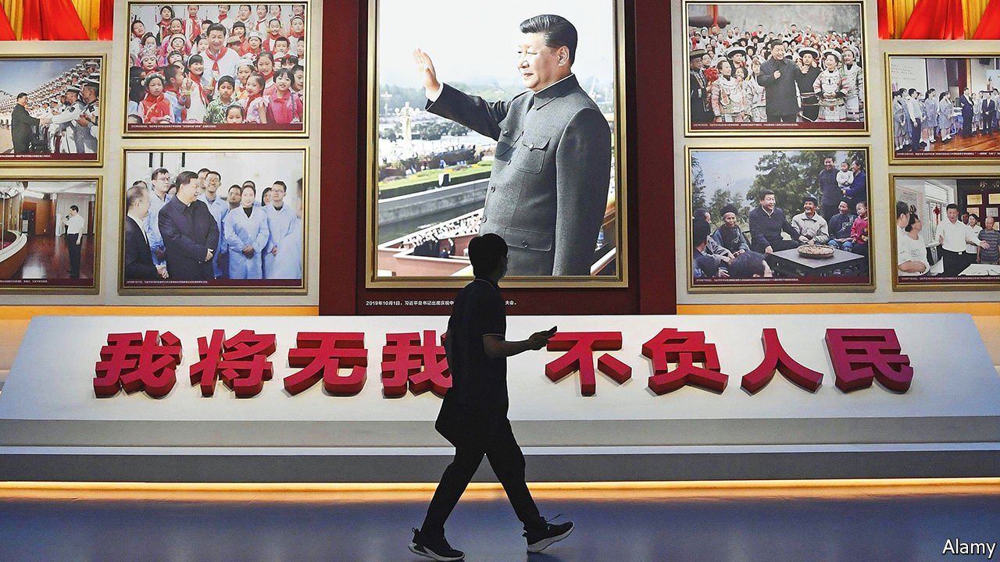
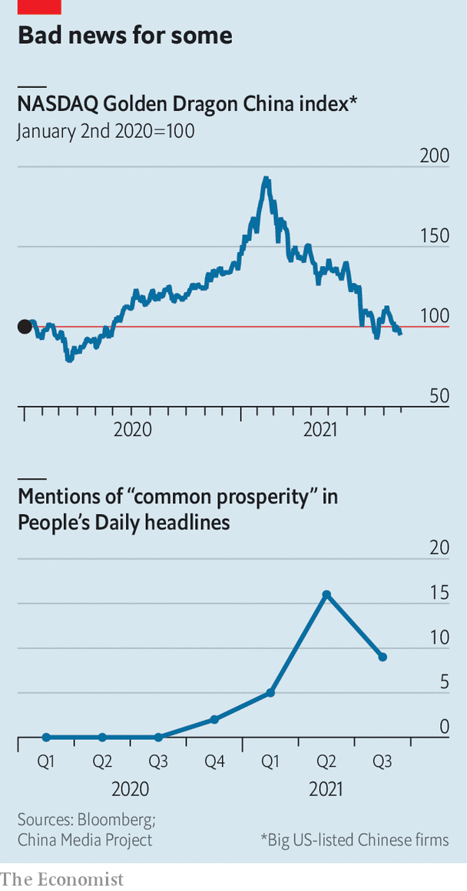

###### The people’s dictator

# Xi Jinping’s clampdowns herald a tense political year in China 

##### In the build-up to a crucial Communist Party gathering, ideology matters more than usual 

 

> Oct 2nd 2021 

THE TERM “cake theory” has a resonance in China that goes far beyond the kitchen. A decade ago it became shorthand for a fierce debate about the country’s future. There were two opposing camps. One believed that China should focus on making China’s cake—its economy—bigger. The other said the priority should be to share the existing cake more fairly. It was a feud that permeated the febrile politics of China in the build-up to Xi Jinping’s anointment as the Communist Party’s chief in 2012. A powerful advocate of the sharing approach was later accused of plotting a coup.

The political landscape in China now looks different. There is no sign of a struggle, as there was during the cake debate, between the party’s titans. Less than a year after Mr Xi took over, the alleged coup-plotter, Bo Xilai, was sentenced to life in prison for corruption and abuse of power. Similar fates befell several others close to him, including the man once in charge of China’s domestic-security apparatus. Mr Xi looks firmly in charge. There are no provincial party chiefs waging thinly disguised battles for national power as Mr Bo was then, in his case by casting himself as a champion of the poor.


But there are striking similarities. Once again, the political atmosphere is heating up. Mr Bo’s mantra then, the need to create “common prosperity”, has become Mr Xi’s. Regulators have staged a series of dramatic strikes against some of the country’s biggest tech firms, wiping more than a trillion dollars off their share values and sowing widespread alarm among wealthy Chinese businesspeople. The government, eager to reduce dangerous levels of debt, has allowed a giant privately owned property firm, Evergrande, to teeter on the brink of collapse, sending jitters through global markets and sparking protests by angry investors and contractors in several cities. The party does not publicly justify these moves in the name of common prosperity, but there are plenty of online commentators in China who see the pursuit of that nebulous goal as well-served by anything that creates pain for the super-rich. China's underdogs are enjoying a moment of Schadenfreude.

An important link exists between recent events in China and the struggles of a decade ago. It is the approach of a crucial party congress. Such gatherings occur every five years. The next is expected to be held late in 2022. Those that take place ten years into a leader’s rule—like both next year’s and the one in 2012—are particularly important.

Normally such a congress would involve sweeping changes in the party leadership, with the election of a new Central Committee that in turn chooses a new general secretary and reshuffles the Politburo (in fact, these changes are decided in secret before the congress begins). After next year’s congress Mr Xi is expected to secure another five years in office—a break with precedent that, by the time of the 21st congress in 2027, would make him the longest-serving party chief since Mao Zedong.

As always in the build-up to such events, tension is evident as the party tries to forestall any unrest by ratcheting up security. Early this year a nationwide purge began of the police, secret police, judiciary and prison system. Its stated aims include stamping out corruption, as well as removing the “lingering poison” of Mr Bo and his alleged clique. More than 170,000 people have been punished so far, officials say. This month investigation teams moved into provincial- and central-government-level departments to begin assessing the behaviour and loyalty of high-ranking security officials.

There is no sign of concerted opposition to Mr Xi’s plans to remain in power. He has ruled with such ruthlessness that any dissenters are likely to keep their mouths shut. But even if he does not face any rival whom outsiders can identify, Mr Xi will be on guard. Not only will there be the usual jockeying among officials for seats in the party’s highest echelons, but also—as was the case a decade ago—internal debate about China’s direction. At the congress, Mr Xi will present a report summing up his decade in power and setting out his vision for his next five (or more) years of rule.

On July 1st, the 100th anniversary of the party’s founding, Mr Xi declared that China had become a “moderately prosperous society in all respects”. Inside the party, and among the public, many want to know when it will become fairer. Mr Xi’s report next year is unlikely to go into specifics about taxes and government spending. But to judge from officials’ recent emphasis on the common-prosperity theme, it will feature prominently in what is sure to be a state-of-the-party address filled with chest-thumping references to China’s “resurrection” as a global power that will be modern, rich and strong by 2049.

The pace of recent events suggests Mr Xi is in a hurry. He has clamped down not only on big business but also on the entertainment sector. Ideological education in schools has been reinforced: children as young as six are being taught about “Xi Jinping Thought”.

 


And as often happens when congresses approach, ideology is becoming a bone of contention. Since the launch of the country’s “reform and opening” policy in 1978, a huge gap has emerged between the party’s professed socialism and China’s reality. The country is much richer, but it practises a  kind of capitalism that offers far less protection to the poor than many capitalist societies in the West provide. The disposable income of people in the top fifth of Chinese households is ten times higher than those in the bottom fifth, official figures show. Credit Suisse, a bank, reckons the top 1% own more than 30% of household wealth, about the same as in America.

Mr Xi appears to enjoy the support of many Chinese, not least for beefing up China’s global power and fighting corruption at home. Since last year, his popularity appears to have grown as a result of his successful efforts to crush the coronavirus and his intransigence in the face of what many in China see as the West’s ganging up on their country at the instigation of President Joe Biden. Mr Xi has critics within the system, but they are scared to show their hand. It may be, in part, with them in mind that he is patching an ideological vulnerability by appealing to the less well-off. The turmoil of a decade ago suggests how grumblings of the poor can be exploited. Mr Xi still snarls about Mr Bo’s “independent kingdom” in the south-western region of Chongqing, where he was party chief and gained support by tapping in to nostalgia for the more socialist features of the Mao era and reviving memories of the late leader by promoting Mao-era songs.

Raising the red flag

Chinese critics of the country’s state-led capitalism often refer to Mao. It is a relatively safe way of poking at the party, which remains officially wedded to Maoism and Marxism even though it is highly selective in the way it applies those ideologies. Mr Bo—as much a state capitalist as other leaders—even tried to show sympathy with the downtrodden by pandering to neo-Maoists, a motley bunch whose websites often carp about China’s drift from the true socialist path. They comprise various kinds of people. Some have retired from the civil service or state-owned firms and yearn for what they recall as the simpler, fairer times of Mao. Others are younger idealists who grew up in the post-Mao era and abhor its inequalities. They are loyalists, but acerbic in their dissection of China’s social ills. Few Chinese support their extreme orthodoxy (such as calling, as Marx did, for the abolition of private ownership). But many share their analysis.

One reason for Mr Xi’s recent clampdowns may be an attempt to show ordinary people that he takes ideology seriously and is on their side. There is no sign that he plans to adopt the neo-Maoists’ proposed remedies for China’s unfairness. However, like Mr Bo, he is surely conscious that taking rich businessmen down a peg or two can win much applause (several were targeted in Mr Bo’s anti-corruption drive in Chongqing). Prominent businesspeople are frequent targets of online venom, not only from the neo-Maoists. The internet has been brimming with complaints from stressed-out white-collar workers about long hours and low pay.

Since he came to power, Mr Xi has been trying hard to convey the impression that he is faithful to Marxism and Maoism. “Do not forget the original intent” has long been one of his favourite slogans. It means the party must bear in mind why it was formed in the first place: most importantly, to create a fairer society. The slogan has long been ubiquitous on streets.

But if Mr Xi is serious about this, it will involve big economic and social reforms. He has not spelled out what these might entail, or when they will be implemented. He could, for example, levy new taxes on property or inheritance. Or he could end the hukou system of household registration that gives urban residents far better access to welfare and education than their rural counterparts have, and makes it difficult for people from the countryside to enjoy such benefits when they move to cities. However, there would be huge resistance to all these moves. Such taxes have been discussed for years, but officials have dithered because of fears of upsetting property-owning middle-class Chinese. Hukou reform has been slow, too, in part for similar reasons: middle-class urbanites do not want to share schools and hospitals with huge numbers of poor rural migrants.

Details of any reforms, it appears, can wait (the annual session of China’s parliament, the National People’s Congress, in March 2023 will be a forum to watch). For now, Mr Xi is scoring easy points by attacking the rich and famous. In August one of the country’s best-known film stars, Zheng Shuang, was fined more than $46m for evading taxes. She is one of several celebrities who have recently been blacklisted from the entertainment business for various reasons. These range from engaging in casual sex to rape and, in the case of one actor, circulating a photo of himself grinning in front of a shrine in Tokyo where war criminals are among those honoured. Punishing these stars has proved popular.

Mr Xi is also taking this opportunity to tighten political control. In August the state-backed China Federation of Radio and Television Associations called for “zero tolerance” of performers who “touch the ethical bottom line”. Forbidden behaviour, it said, should include having the “wrong” attitudes towards history and the country—code for anything that might upset party ideologues. That was made official in September, when the broadcasting regulator said the selection of actors should exclude anyone with an “incorrect political stance”, as well as those deemed immoral.

The end of fun?

In the 1990s, when the party began encouraging private enterprise, it also allowed people a degree of personal freedom, at least outside politics. Hitherto suppressed forms of art and entertainment, from the avant-garde to punk rock, were given freer rein. Mr Xi, however, has been signalling that his “Chinese dream” is of a conservative society: Xi Jinping Thought is suffused with references to ancient Chinese philosophies stressing conformity.

In its edict this month, the broadcasting regulator also called for a “resolute end” to shows featuring “perverse tastes”, such as for effeminate men. It banned publication of celebrity rankings: officials want to tame their boisterous fan clubs. Separately, to make sure youngsters spend more time studying and less time shooting zombies, under-18s have been barred from online gaming on weekdays and limited to a mere three hours at the weekend.

There are echoes in this of the 1980s, when the party launched brief campaigns against Western lifestyles (such as by forcing men to cut their hair short) and liberal beliefs. The question now is whether recent clampdowns represent a longer-term shift, involving ever greater party interference in a broad range of less-tightly controlled activity. The signs are not encouraging. Mr Xi is a harsh authoritarian, differing from Deng Xiaoping who, in the 1980s, veered between relaxation of cultural and economic freedoms, and tighter control. Mr Xi’s direction is far clearer.

Like Deng, Mr Xi sees a big role for the private sector in boosting economic growth and providing jobs. On September 6th Liu He, a deputy prime minister, tried to reassure private businesspeople, saying their endeavours were critical to the country’s economy. But he wants them on a shorter rein. One reason is justifiable. China’s private tech firms have long been in need of better policing to curb rampant antitrust abuses, exploitative labour practices and misuse of data. Property firms do indeed pose a threat to financial stability with their heavy borrowing and Ponzi-like business models. But Mr Xi also wants tighter political control of private firms. He has devoted great energy to establishing party committees inside them, requiring that they have a say in important decision-making. That will remain a priority.

Many people in China seem happy with this. The crumbling of Evergrande has triggered small protests by people afraid of losing their down-payments on houses, or by contractors who have not been paid. But most people appear to believe that the government will protect them from the fallout of the company’s troubles.

Mr Xi is certainly winning applause from the neo-Maoists, and appearing to relish it. On August 29th the website of one of the party’s flagship newspapers, Guangming Daily, published an article by one such ideologue, a little-known writer called Li Guangman. He had posted it a couple of days earlier on his blog. It was a paean to the clampdowns, including on effeminate men. Mr Li hailed recent developments as a “profound revolution” that would “wash away all the dust”. His blog post was a declaration of victory: “Red is back, the heroes are back, courage is back.”

It quickly became clear that Mr Li’s article enjoyed official approval. Though not published in the print edition of a big newspaper, within hours it appeared on the websites of the party’s most important news organisations. Never mind that its Mao-era language caused ripples of unease among liberals and even some establishment types. On September 2nd Hu Xijin, the editor of Global Times, a tabloid owned by the People’s Daily, used his blog to condemn the article as “inaccurate” and “exaggerated”. Mr Hu said he was afraid it would cause “terror” by reviving “certain historical memories”—an obvious reference to Mao’s Cultural Revolution of the 1960s and 1970s, when mobs killed and persecuted millions. But the articles remained online. Mr Xi certainly does not mind his multi-front campaign being praised as a big deal.

Nothing like the Cultural Revolution appears in the offing. That event pushed the country to the brink of civil war. Unlike Mao, Mr Xi is obsessed with preserving stability. In May a spokesman for the Ministry of Public Security said the emphasis of the police force’s efforts to “protect the state’s political security” would be on preventing a “colour revolution”. But there is no sign of an incipient one. In the months leading up to the congress, the country’s handful of active dissidents will be subjected to even tighter surveillance than usual.

Mr Xi is already remoulding society in a way that neo-Maoists endorse. Recent events have taken place against a broader backdrop of more-visible involvement by the party in people’s everyday lives. Especially since the pandemic began, it has become omnipresent in neighbourhoods in a way not seen since the 1980s. Grassroots party members are the chief enforcers of quarantines and controllers of people’s movements. In the past two years, several central-level documents have promoted the establishment of “moral review councils” in the countryside. These are made up of party worthies and, sometimes, police officers who sit in judgment on fellow villagers’ behaviour and publicly shame those who have committed offences such as littering or failing to look after an elderly parent. Some urban neighbourhoods have set up similar “moral clinics”.

Assuming Mr Xi keeps his job as China’s leader at least until 2027, if not longer, control will be his watchword, not disruption. “East, west, south, north and centre; the party leads everything,” Mr Xi keeps insisting. Without ideological discipline, he says, its grip will be dangerously weakened. But it is Xi Jinping Thought, not that of Mao or Marx, that will really count. He will interpret it as he pleases. ■

