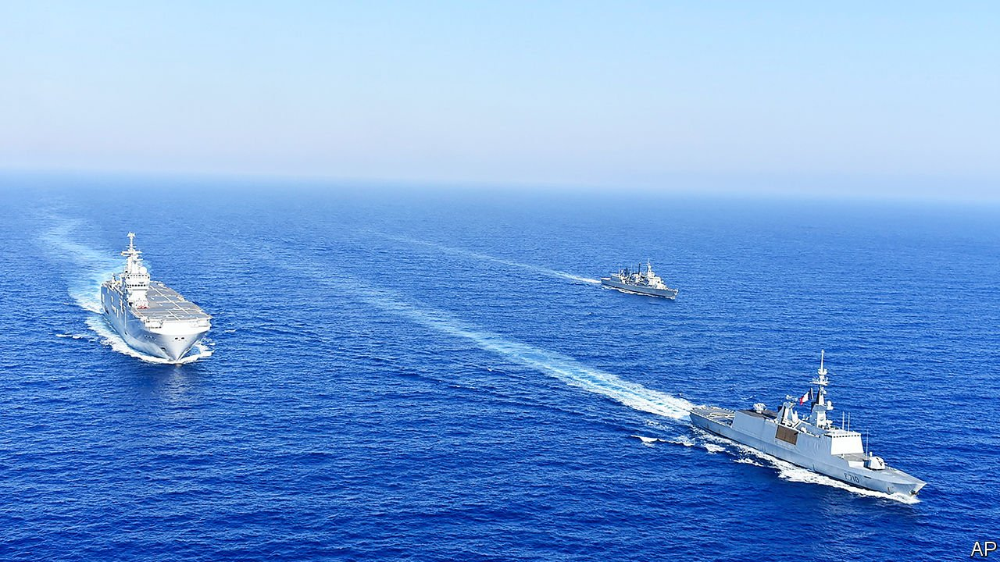

###### Paris Philhellenic

# France and Greece hedge their bets with a new defence pact 

##### The new alliance reflects their shared fears of Turkey 

 

> Oct 2nd 2021 

KYRIAKOS MITSOTAKIS, Greece’s prime minister, cast it as a love story. “History…wants us together,” he told Emmanuel Macron, France’s president, in Paris on September 28th. “So does geography.” He serenaded Mr Macron with tales of Ionian seafarers landing in Marseilles and the French Philhellenes who backed Greece’s war of independence. Mr Macron said that Greece was “a civilisation that has inspired us and enabled us to be ourselves”. Then the two leaders consummated their courtship with what they are calling a “strategic” defence pact.

The Franco-Greek relationship has been forged in rivalry with Turkey, which last year squared off with Greek warships around Cyprus, and with French ones off Libya. An anti-Turkey bloc, including France, Greece, Israel, Egypt and the United Arab Emirates, has gradually taken shape. Mr Mitsotakis, eager to secure French support and bolster his own armed forces, had already agreed to buy 18 Rafale warplanes from France in January, at a cost of €2.5bn ($2.9bn), and six more in September. Now he will also buy three new French frigates, with the option of one more.


That is a boon for Greece’s navy, which has just 13 ageing frigates against Turkey’s newer fleet of 16. It is also a well-timed consolation prize for Naval Group, the majority-state-owned French arms firm which Australia turfed out of a lucrative submarine contract on September 15th as part of its AUKUS pact with America and Britain. Naval Group is building the new frigates in Brittany; Greece is supposed to take delivery of its first in 2025.

Yet both sides were keen to show that this was no mere arms contract. “It strengthens…our strategic autonomy and our European sovereignty,” said Mr Macron. Mr Mitsotakis agreed that it was “the first bold step towards European strategic autonomy”. Mr Macron has long been fond of such language—often irritating his eastern European allies, who see it as antagonistic to America—but it has a particular resonance after AUKUS. French officials have portrayed the Anglophone pact as a demonstration of American unreliability and a wake-up call for Europeans to collaborate more on defence matters.

To that end, the new agreement also includes a striking element that is absent from AUKUS: a mutual defence clause. France and Greece are already obliged to support each other in the event of an attack, through Article Five of NATO’s charter and the more obscure Article 42:7 of the EU’s Lisbon treaty. Notably, Mr Mitsotakis said that the partnership now “goes beyond” those obligations. The decision to formalise a separate, bilateral alliance suggests that both Mr Macron and Mr Mitsotakis are concerned that, should a serious crisis erupt in the Mediterranean, Turkey might stymie NATO from the inside.

The idea of a mutual-defence clause that is beefier than Article Five—which obliges an ally only to take “such action as it deems necessary”— is not unprecedented. France did the same thing with Germany in the Aachen treaty of 2019. The Anglo-French Lancaster House treaty of 2010 also implies far-reaching nuclear guarantees.

But such bilateral deals are bad news for NATO, says Wess Mitchell, an American former state department official who co-chaired a reflection group for the alliance last year. The new pact “will be viewed in NATO and especially by eastern members of the alliance as implicitly undermining Article Five,” he says. Others, like Poland, may be encouraged to seek their own ad hoc guarantees from America.

Moreover, despite the rhetoric of European sovereignty and autonomy, the ever-closer alignment of France and Greece reflects the EU’s divisions more than its cohesion; it does not, after all, involve the rest of the EU. In recent years both countries have grown frustrated with the bloc’s reluctance to put more pressure on Turkey. Germany, in particular, with its large Turkish diaspora and trade links, has been eager to water down such measures.

Germany is also selling advanced diesel-electric submarines to Turkey’s navy. So later this decade, a very European contest will play out in the Mediterranean: France’s finest frigates tracking Germany’s best submarines. ■

