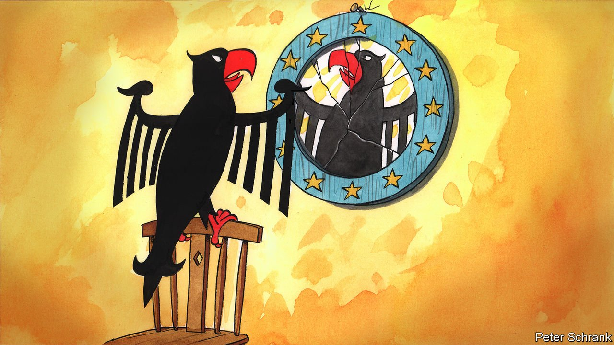

###### Charlemagne

# Germany’s election is revealingly European 

##### A fractured vote, a big age divide and long coalition talks ahead 

 

> Oct 2nd 2021 

GERMAN ELECTIONS are idiosyncratic affairs. Armin Laschet, the leader of the Christian Democrat Union, was grilled over his choice of bratwurst condiment (ketchup, not mustard). Annalena Baerbock, the Green candidate for chancellor, was skewered over plagiarism claims, a sin that bedevils only German politics. All politics is local, but in Germany it is parochial. The country may be Europe’s hegemon, yet foreign affairs and the future of the EU were barely mentioned. An at times surreal campaign ended with Angela Merkel, the outgoing chancellor and most powerful person in Europe, being photographed with a parrot on her head.

If the campaign was unmistakably German, the result was European. A slim victory for the Social Democratic Party (SPD) over its centre-right rivals, the Christian Democratic Union and its Bavarian sister the Christian Social Union (CDU/CSU), will kick off months of coalition negotiations. German politicians struggled with the same problems as their peers across the continent; German voters behaved the same way as their neighbours. Europe was invisible in the campaign. But it is visible in the outcome.


Politics in Germany has fragmented in the past decade or so, just as in every other western European country. Five parties got more than 10% of the vote each. When Angela Merkel came to power in 2005, only two did. In that same election, the CDU/CSU and SPD won 70% of the vote. On 26th September they managed barely half. It is a familiar story. In the Netherlands, 19 different parties now sit in parliament. In Italy, four parties ranging from centre-left to far-right hover around the 20% mark. Traditionally two-party systems, such as Spain, have become complex multi-party affairs. Germany is simply catching up.

After posting the worst result in their history, the CDU/CSU can take some consolation from the fact they are not alone. Their political siblings in other countries have also lost ground. At the start of the 2010s, practically every big EU country had a centre-right government. Now, barring extremely canny negotiations from the CDU, none will. Conservative politicians used to run a continent; now they control a rump. In Germany, a bad campaign by a gaffe-prone candidate is part of the explanation. But the causes of the CDU’s malaise run deeper, and stretch beyond Germany’s borders.

By contrast, after a decade of losing ground, the centre-left had something to cheer. Although not too loudly. Olaf Scholz, the SPD’s prospective chancellor, ran a cautious campaign based on competence, with enough radicalism to stop his party’s left from leaving for the Greens. It resulted in his party’s third-lowest postwar vote share, but paved a likely path to power.

Now, Mr Scholz will endure the fate suffered by his fellow leftie leaders: staying in office via rickety coalitions. In Spain the Socialist Workers’ Party, another grandee of the centre left, took power with a little over a quarter of the vote. Once-mighty Scandinavian social democrats are still in government, but weaker than before. In the late 1990s centre-left parties were dominant across Europe. Their pitch was usually some variant of: “Things can only get better.” Now it is more like: “Things might not get worse.”

Older voters keep the big-tent parties alive, both in Germany and across the EU. Call it the boomer bulwark. While four in ten under-30s backed the liberal Free Democrats or the Greens, 70% of over-60s voted for the SPD or the CDU/CSU. In Spain younger voters swoon for challenger parties, such as Podemos or Vox. But their parents and grandparents stick to traditional ones. In France, Marine Le Pen’s base is the discontented young. In Italy the far-right Lega and Brothers of Italy also rely on youthful voters. Parties now stand for young or old as much as left or right.

Fractured politics mean complicated coalition talks. Germany is used to haggling between two parties. This time three will be necessary and negotiations could drag on. In a first for Germany, the Greens and the FDP (who came third and fourth) pledged to agree to terms with each other before negotiating with SPD or CDU/CSU. Again, Germany is joining a new European norm. Negotiations in Belgium are notorious for taking years and producing cumbersome coalitions. In the Netherlands, stuck in coalition talks since elections in March, the GreenLeft and Labour party discussed their own pact. In Nordic countries, four- or five-party coalitions are common. European politics is an increasingly complex (and increasingly Belgian) beast.

Stick a pin in almost any rich, western EU country and one will find a populist party polling between 10% and 20%, offering a cocktail of immigrant- and Brussels-bashing. Germany, again, fits the norm. Alternative for Germany (Af D) won about 10% of the vote on just such a platform. Only Italy, where such parties collectively attract 40% of the vote, and France, where Marine Le Pen is a possible (though unlikely) president, buck the trend. By contrast, the alternative on offer to German voters is standard European fare.

All European life is here

When asked why Germany does not take a bigger role in running the EU, Angela Merkel argued that it was impossible, since Germany was too much like the EU. Germany was already a delicate compromise between 16 different Länder (states), with a complicated relationship between its levels of government. German leadership was simply not feasible.

But if Germany resembled the EU constitutionally, it now matches the club politically. Germany is fragmented, like its neighbours; its main centre-left and centre-right parties share the same woes as their peers. The nightmare of forming coalitions will draw sympathetic noises from Dutch, Belgian and Nordic neighbours. Old voters behave in the same way in Germany as they do in France or Italy, as do their children; fringe parties are better at causing a racket than winning power. When it comes to elections in the EU, the votes may still be national. But the politics are distinctly European. ■

