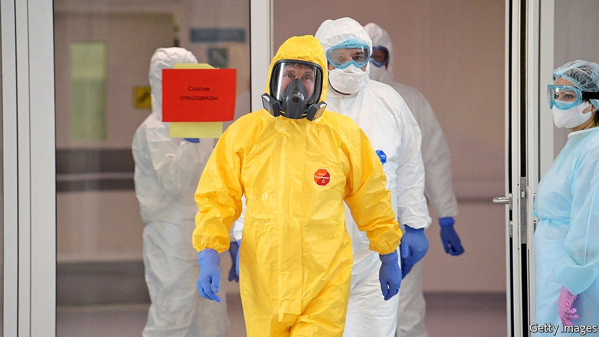

###### In hiding

# Thanks to covid-19, Vladimir Putin has become almost invisible 

##### The Russian president doesn’t seem to trust his own vaccine 

 

> Oct 2nd 2021 

FRESH FROM victories in Tokyo, Russian Olympic medalists were preparing for a reception with Vladimir Putin earlier this month when they were told they would spend a week in quarantine before meeting the president. “I still can’t believe I’ll have to sit in one room for seven days,” Angelina Melnikova, a gymnast, wrote on social media. But the requirement wasn’t new: senior officials, journalists and even veterans of the second world war have had to self-isolate before coming within breathing distance of the man who has stood at Russia’s helm for over two decades, and who next week turns 69.

When Russia first recorded a surge in coronavirus cases in March last year, Mr Putin donned a yellow hazmat suit to visit Moscow’s main covid-19 hospital. State TV cameras captured him taking selfies with staff and shaking hands with the hospital’s chief physician, Denis Protsenko. “No head of state has so far dared to come so close to the infected,” gushed the Kremlin’s chief propagandist, Dmitry Kiselyov, on his Sunday night news show. All par for the course for a strongman who has built his reputation on action-man stunts.


But in the months since then, perhaps no world leader has been as shielded from the virus. Days after Mr Putin’s hospital visit, Mr Protsenko announced that he himself was sick with covid-19, and Mr Putin holed up in his residence outside Moscow, haranguing officials by video-link as his approval ratings sank. Special tunnels were installed at the residence to douse visitors in disinfectant. Alexei Navalny, Russia’s main opposition figure, who is now in jail, coined a new nickname for his political foe: “grandpa in a bunker”.

In March, the BBC reported that the Kremlin had spent $85m on quarantine accommodation for staff and visitors coming into contact with Mr Putin and other measures to ensure his well-being. That figure is all the more startling when you consider that Russia has had a working vaccine since last August, when the president approved the Sputnik V jab. On September 14th Mr Putin announced he was going into self-isolation after covid cases were detected in his inner circle, less than three months after he revealed he had been vaccinated. He emerged two weeks later, to be seen meeting Turkey’s president, Recep Tayyip Erdogan on September 29th. But Muscovites are not expecting to see him around the place.

