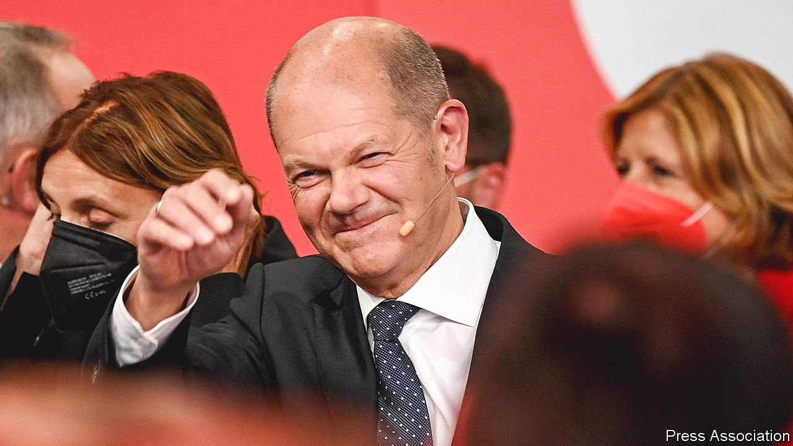
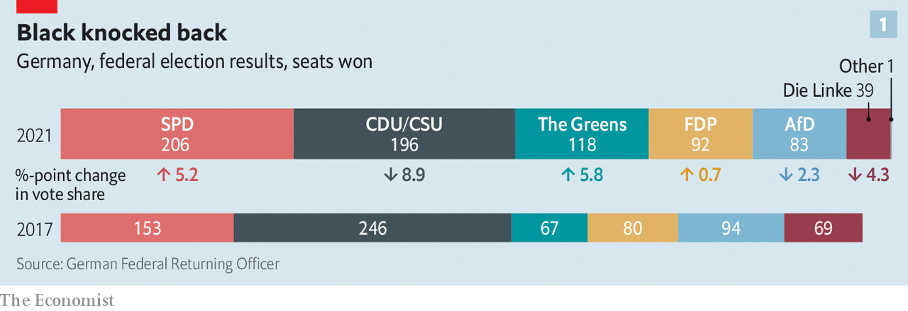
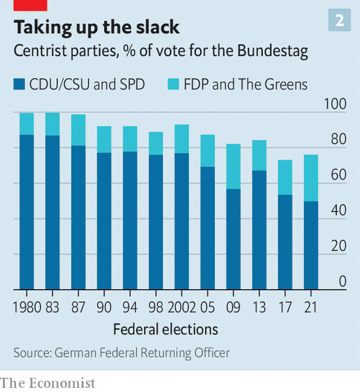
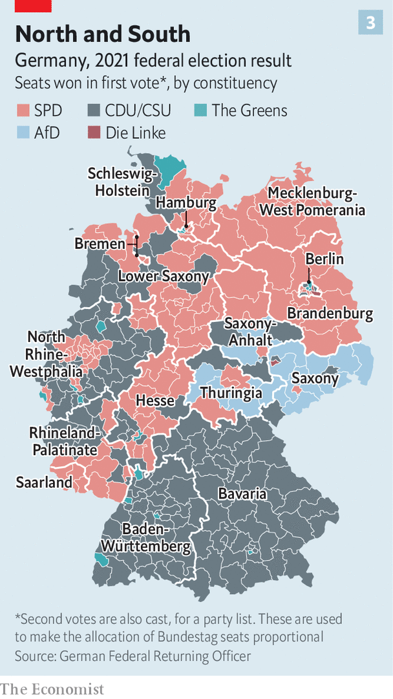

###### Advantage Scholz

# The Social Democrats are likely to take charge in Germany 

##### But forging a coalition will be slow and difficult after a tight election 

 

> Sep 30th 2021 

AT 6PM ON September 26th the atrium of the Willy Brandt House, the Berlin headquarters of Germany’s Social Democratic Party (SPD), erupted in cheers when an exit poll suggested it had won the country’s federal election. If victory was narrow, it was also sweet. Having long been in the polling doldrums, the SPD rode a late surge to 25.7% of the vote, 1.6 points ahead of its conservative rivals, the Christian Democratic Union and its Bavarian sister party, the Christian Social Union (CDU/CSU). Olaf Scholz, the SPD’s candidate to replace Angela Merkel as chancellor, said voters had told the CDU/CSU that it “should no longer be in government, but in opposition”.

Mr Scholz’s emphasis was appropriate. For if this election had no clear winner, there was an obvious loser. At the Konrad Adenauer House, the CDU’s nerve centre, the mood was markedly gloomier. If the CDU/CSU had slightly outperformed the worst polling prognoses, the conservative bloc had still slumped to by far the worst election result in its history, losing some 4.1m votes and a whopping 8.9 percentage points since Mrs Merkel’s fourth and final win in 2017. After 16 years the chancellor, who remains in charge until a coalition is formed, will leave office with high approval ratings. But her party is in tatters.


The CDU was battered across most of the country, with an especially dismal performance in the eastern states of the former GDR. It shed votes to every other party except the far-right Alternative for Germany (AfD) and the hard-left Die Linke. Over 1.3m voters, concentrated among the elderly, defected to the SPD. Several CDU cabinet members lost their direct seats (although they will, under Germany’s mixed-member proportional system, return to parliament on party lists). The Baltic-coast seat vacated by the departing Mrs Merkel went to the SPD. Infuriatingly for those CDU members who had grown frustrated with the lukewarm support, or worse, from their notional Bavarian allies, the CSU lost just one seat compared with the CDU’s 49.

 


Much of the blame falls on the shoulders of Armin Laschet, the unconvincing candidate chosen by the CDU/CSU to fill Mrs Merkel’s shoes. In the campaign’s closing stages Mr Laschet relied increasingly on the negative message that the CDU/CSU had to be re-elected to block Mr Scholz from inviting Die Linke, along with the Greens, into government. Never entirely plausible, this proposition will not be tested because the notional left-wing coalition does not enjoy a majority.

The CDU/CSU seemed no better prepared for the election aftermath. Rashly, Mr Laschet claimed to have discerned a “clear mandate” to lead a “Jamaica” coalition, with the Greens and the Free Democrats (FDP), a small, liberal outfit, as junior partners (the parties’ colours match the island’s flag). As the scale of the defeat sank in, he ditched that dubious notion in favour of another: that the second-placed party in German elections had often proceeded to form a government. Yet none had suffered a defeat on the scale of the one he had overseen. As several of Mr Laschet’s colleagues pointed out, the party needed a better argument than this to stay in office.

Discontent quickly grew in the conservative ranks. There were calls for “personnel discussions”; code for Mr Laschet to quit. A potential rebellion over the identity of the head of the CDU/CSU parliamentary group was quelled only with a last-minute compromise. And friction between the sister parties intensified. On September 28th Markus Söder, the CSU leader, whom Mr Laschet had defeated in an internecine struggle for the chancellor-candidacy in April, acknowledged that Mr Scholz was “best placed” to assemble a coalition.

More than two-thirds of German voters think Mr Laschet should throw in the towel. With his chances of forming a government fading, his remaining hope is to make the FDP and Greens an offer he imagines they cannot refuse. If that fails, says a CDU MP, he will be gone within a month.

Germany’s magic middle

 


As in other European countries, the German vote is fragmenting (see Charlemagne). The SPD’s comeback cannot mask a long-term decline in the share of the vote that goes to two big “people’s parties”, from 82% in 1987 to below 50% this time (see chart 2). This is why Germany is probably heading for its first three-way coalition since the 1950s. (A continuation of today’s CDU/CSU-SPD “grand coalition”, with Mr Scholz as chancellor, is possible, but neither party wants it.) Fully 40% of voters said they wanted “fundamental change”.

 


But unlike much of the rest of Europe, fragmentation has not come at the expense of Germany’s (broad) centre. The AfD lost ground, even if the CDU collapse in eastern Germany left it the strongest party in Saxony and Thuringia (see chart 3). Die Linke did even worse, barely scraping into the Bundestag. The four mainstream parties, meanwhile—the CDU/CSU, the SPD, the Greens and the FDP—will hold 85% of seats in the new Bundestag, up from 78% in 2017. In Germany, at least, the centre is holding.

It is also moving leftwards. The SPD and the Greens, natural coalition partners, together won 40.5% of the vote, up 11 percentage points from 2017 and almost all at the expense of the CDU/CSU. The conservative bloc of the CDU/CSU and FDP together took 35.6% of the vote. This leftward shift is one reason for the momentum behind Mr Scholz’s attempts to put together a “traffic-light” coalition, led by his SPD with the FDP and Greens as junior partners. Another is the aura of humiliation now hanging over the CDU/CSU. The talk is of a “coalition of the winners”. If the FDP vote was broadly flat on 2017, the Green score of 14.8% was by far the best in their four-decade history.

Indeed, the smaller parties have made the early running. At a televised debate on election night, Christian Lindner, the FDP’s leader, said that his party would speak to the Greens before attempting to come to terms with either of the larger parties. The FDP and Greens, needed in either a Jamaica or a traffic-light arrangement, will command 210 seats in the new Bundestag, more than either the CDU/CSU or the SPD. A joint platform would carry more weight than a typical kingmaker could hope for. “This would be an eye-level negotiation,” says Janosch Dahmen, a Green MP.

Those close to the FDP-Green talks urge caution. The two parties must overcome serious political and cultural differences. They disagree on taxation and spending, investment policy, Europe’s fiscal rules and much more. In 2017 it was Green-FDP tensions that ended Angela Merkel’s hopes of forming her own Jamaica coalition. Their respective bases detest each other. “F.D.P.: Fick den Planeten (“Fuck the planet)”, tweeted Jürgen Trittin, a former Green leader, during the campaign. The road to any FDP-Green deal looks rocky.

Yet “rocky roads don’t scare us,” says Alexander Graf Lambsdorff, an FDP MP. “We build good cars in Germany.” Towards the end of the campaign, as the SPD’s surge brought the prospect of a traffic-light coalition into view, Mr Lindner moderated his language accordingly. Robert Habeck, the Green’s co-leader, who will play a crucial role in the talks, has told his party colleagues to seek common ground with the liberals rather than victory over them. Economic boffins on both sides are drawing up plans to square the many circles, including a fudge on tax rises, and the creation of off-budget vehicles that could raise public investment without violating Germany’s “debt brake”, which limits deficit spending—a red line for the FDP.

Moreover, the two parties, which between them won a near-majority among first-time voters, can present a credible narrative of change. This might find expression in support for projects like improving Germany’s ropy digital infrastructure, education reform or a streamlining of planning procedures. On September 28th, just after the CDU/CSU MPs had weighed Mr Laschet’s future, the Green and FDP leaders surprised everyone—including their own colleagues—by posting an Instagram selfie with an earnest caption speaking of “common ground”. The signal was clear: while others squabble, the new guard is getting down to business.

The FDP-Green talks, say insiders, are about building trust more than assembling detailed policies; much less apportioning ministerial jobs, a complicated business that tends to happen at the end of coalition talks. The unflappable Mr Scholz is happy for his potential partners to learn to work together before opening negotiations with his team. Even if Mr Laschet is a dead man walking, for now neither the Greens nor the FDP will rule out a Jamaica coalition. To do so would instantly increase Mr Scholz’s bargaining power. Besides, there are murmurs that the CDU/CSU could seek to unseat Mr Laschet and approach the smaller parties with a different candidate.

Yet the momentum is firmly with the SPD. Its officials hope to begin traffic-light talks by mid-October, and to meet Mr Scholz’s goal of finalising a government by Christmas—just in time for Germany’s G7 presidency in January. Nothing is certain. The FDP and Greens may fail to come to terms, and for now the CDU/CSU is clinging on to its hopes of remaining in office. But the stars are lining up for Mr Scholz. ■

