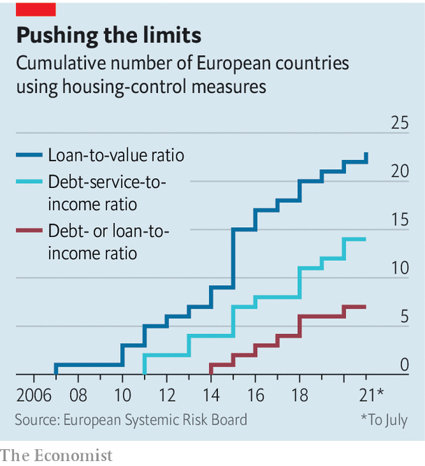

###### Home truths

# Can lending controls solve the problem of unaffordable housing? 

##### More central banks are tightening curbs on risky lending. But that is unlikely to make housing much cheaper 

 

> Oct 2nd 2021 

HOUSE PRICES in the rich world are growing at their fastest rate for 30 years. Those in America rose by a record 19.7% in the year to July, according to figures published on September 28th. House prices measured relative to incomes are above their long run averages in three-quarters of OECD countries. Policymakers nearly everywhere are under increasing pressure to make housing more affordable.

Higher interest rates would bring down house prices relative to incomes, by making mortgages more expensive to service and tempering housing demand. But raising interest rates to cool the property market now runs the risk of jeopardising the economic recovery from lockdowns. More promising, in some people’s eyes, could be to tighten the “macroprudential” tools available to central banks and financial regulators, which seek to limit risky mortgage lending.


On September 23rd the Reserve Bank of New Zealand tightened macroprudential housing policy for the third time this year, saying that past tightening had not done enough to tackle unsustainable house prices. Regulators in several other countries, including France, have also become stricter this year. Although these tools were designed to make lenders and borrowers more resilient by restraining the growth of debt, the case for using them to control house prices directly is weak.

 


Macroprudential policies have a long history and encompass a wide range of levers, such as capital and reserve requirements and direct controls over lending rates and quantities. Policies aimed at the housing market can include restricting the amount of lending that banks can do at high loan-to-value (LTV) or loan-to-income ratios. LTV tools are the most common: in Europe more than 20 countries deploy them, and their use has increased significantly since the global financial crisis of 2007-09 (see chart).

These controls, by having limited credit growth, may well have been one reason why last year’s covid-induced recession did not trigger a financial crisis. Because household-borrowing growth and house-price growth often feed off one another, it could be tempting to tighten lending controls in order to improve affordability. But there are three reasons why that policy would be a mistake.

The first is that research suggests that the effects on house prices do not seem to be large enough to make much difference to affordability. One intriguing example is a recent paper by Steven Laufer of the Brookdale Institute and Nitzan Tzur-Ilan, then of Northwestern University, which studies an LTV policy introduced in Israel in 2010. Faced with rampant house-price inflation, the central bank told lenders to hold additional capital against loans with LTV ratios of more than 60%, but only for lending of more than 800,000 shekels (around $220,000). This allowed the authors to compare the price growth of the houses subject to the measure with that in the rest of the market. The measures were found to reduce aggregate Israeli house prices by no more than 0.6%.

Moreover, lending controls typically make mortgages more expensive for affected borrowers by rationing credit. So even if prices end up slightly lower, houses may not be more affordable. A study of European countries, for instance, shows that average mortgage rates rise when LTV policies are tightened.

The third reason why macroprudential policies are not suited to improving affordability is that LTV controls may affect disadvantaged households disproportionately. The Israeli study found that the biggest negative effects on house prices were in the less desirable parts of more expensive cities, which they suspect occurs because credit-constrained households tend to buy in those areas. A previous paper by Ms Tzur-Ilan concluded that affected borrowers in the residential areas around Tel Aviv had to move on average 4-7km farther from their place of work following LTV-policy tightening, and faced up to an hour a day of extra commuting time. These side-effects may be justified if the ultimate goal is a more resilient financial system. But if the policies were intended to reduce house prices to help poorer households, they could prove counterproductive, entrenching existing inequalities.

Over the past decade macroprudential policies, including housing tools, have played a big role in reducing borrowing growth in some countries, making the financial system safer. But the tools were never designed to improve housing affordability, and are ill-suited to that job. People frustrated by eye-watering rises in house prices might do better to press governments, rather than financial regulators, to solve the problem. ■

For more expert analysis of the biggest stories in economics, business and markets, , our weekly newsletter.

