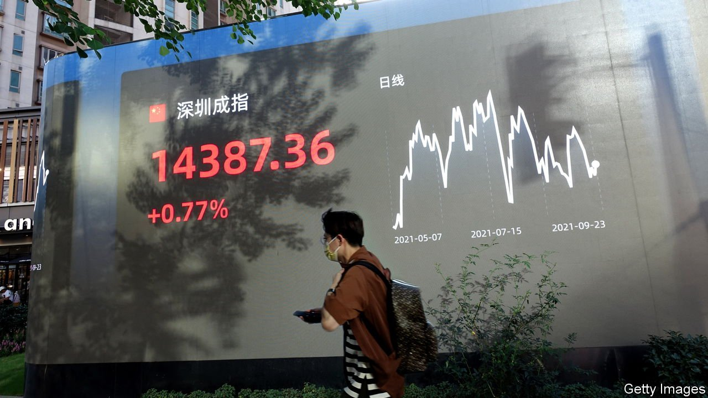
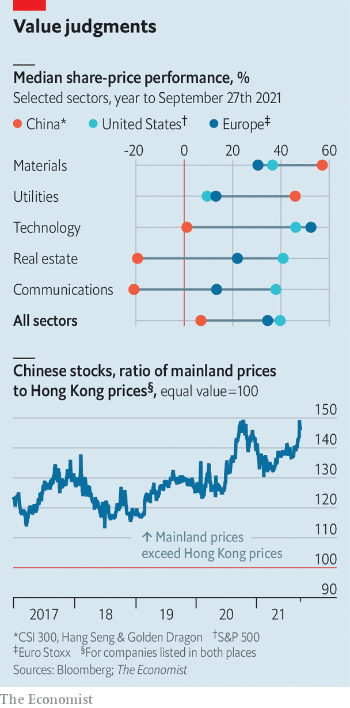

###### The China discount

# China’s new political risk premium 

##### A series of policy upheavals is putting off some investors 

 

> Sep 30th 2021 

FOR THE average investor, China is the source of all sorts of uncertainty. A regulatory crackdown on social-media and education firms has sent stocks tumbling. Companies with exposure to property are suffering as a result of a clampdown on leverage and , a developer. A ban on cryptocurrency transactions briefly knocked the price of bitcoin. And a rush by provincial authorities to meet carbon-emissions targets is causing s, which could weigh on both the economy and asset prices.

If investors expect policy to remain volatile, then they could start to demand a greater premium for holding Chinese assets. “The intensity of policy change has caught investors off-guard,” says Chetan Ahya of Morgan Stanley, a bank. “It’s not clear what the end game is for each sector, so there’s a lot of uncertainty, and it’s this uncertainty that adds to the risk.” Indeed, a risk premium may already be becoming apparent for some assets.


Over the past six months the MSCI China index of stocks listed on the mainland and in Hong Kong has underperformed global equities by the most in over 20 years. Yields on offshore Chinese high-yield dollar bonds, at around 14.5%, are higher than they were during the covid-induced market panic of March 2020.

 


Analysis by The Economist suggests that stocks in sectors that have been most affected by crackdowns, such as information technology and property, have lagged behind those of similar firms in America and Europe (see chart). Goldman Sachs, a bank, has examined what a change in the policy treatment of “socially important” sectors, such as media and entertainment, might entail for private firms. Although privately owned companies have always had higher returns on equity than state-owned enterprises (SOEs), recent policy changes will curtail their profits. The range of potential outcomes is huge, depending in part on how much of the private sector will see SOE-like returns. In the most optimistic case, the MSCI China index may already be undervalued by a double-digit percentage. In a more pessimistic scenario, it could still be overvalued by a similar amount.

Working out which case is more likely is a question more of politics than finance. The policies of any government have a bearing on investment outcomes, and are tracked by asset managers around the world. But monitoring and predicting the machinations of the Chinese Communist Party is no simple task for experts, let alone the average Western financier. “For an offshore bond investor, why play this game?” asks Alex Turnbull of Keshik Capital, a Singapore-based investment fund.

Sure enough, investors in offshore assets have cooled towards China. One way to gauge this is to compare the stock prices of Chinese companies that are listed both on the mainland and in Hong Kong. Equities are typically more expensive at home, as China’s capital controls leave punters with few alternatives. But the gap has widened substantially, with onshore investors paying a premium of around 45%. That is roughly as wide as in 2015, when domestic stocks enjoyed a frenetic rally driven by margin debt. This time mainland stocks have been roughly flat. The wedge reflects the pessimism of foreign investors, rather than the optimism of mainland punters.

Not all assets have a higher risk premium attached to them. Interbank-lending markets have been quiet so far (perhaps aided by support from the People’s Bank of China). Safe, state-run companies at the heart of the financial system have shown no signs of turmoil. On September 17th the Industrial and Commercial Bank of China, a state-owned lender and by some estimates Evergrande’s largest bank creditor, issued $6.2bn in contingent convertible bonds, with the lowest coupon for such a sale for a Chinese company on record. The sovereign-bond and foreign-exchange markets have been calm, suggesting that investors do not think that current woes will shake China’s capital controls.

What does a reduction in foreign investment mean for China? For now the economic effect is limited. Although overseas ownership of government bonds has risen in recent years, corporate borrowing is still very much a domestic affair. Foreign institutions own just 1.5% of the roughly 7.6trn yuan ($1.2trn) in medium-term notes in the corporate-bond market. Some economists argue that China’s ageing population will mean that it will run current-account deficits instead of surpluses, which would need to be funded with more foreign capital. But those expectations have yet to be realised. The current-account surplus declined to a 25-year low of 0.2% of GDP in 2018, but picked up again in 2019 and 2020.

A broad risk premium, though the result of various government initiatives, would however defeat another policy aim. In recent years regulators have tried to encourage investors to be more discriminating about risk. They have allowed more company-bond defaults, in order to dispel the idea that the state will always bail out troubled firms. Those efforts had some clear successes. The spread between the yields of AAA- and AA-rated onshore corporate bonds has risen from 1.7 percentage points two years ago to 2.3 points today. Investors paid more attention to the credit fundamentals of Chinese companies.

Now those efforts are being undone. Investors are instead guessing where government policy might go next, and a blanket risk premium is in place, particularly on assets most accessible to foreign investors. Instead of helping investors differentiate risks, the recent barrage of shocks has forced them to apply a broad brush again, with Chinese companies the biggest losers from the shift. ■

An early version of this article was published online on September 27th 2021

