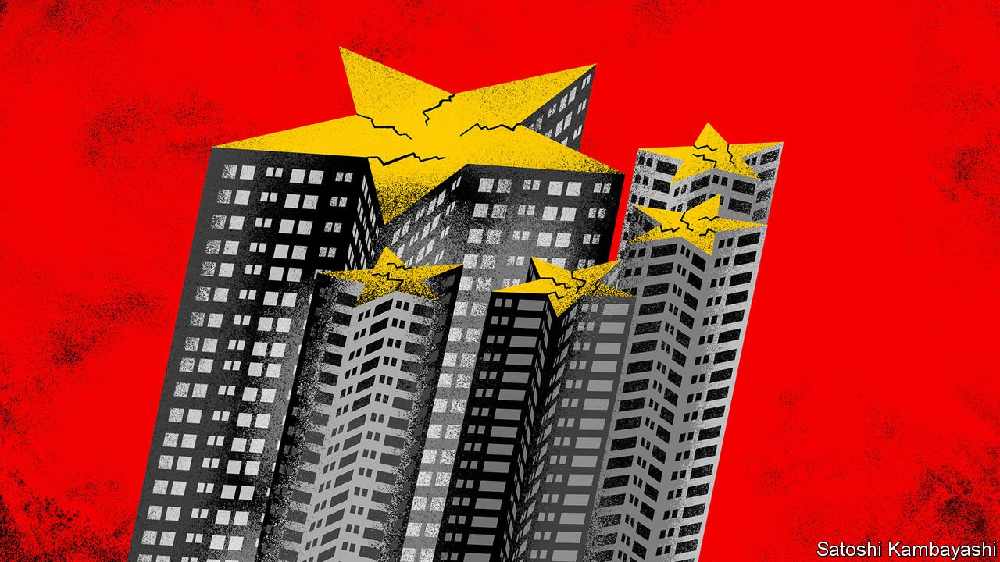
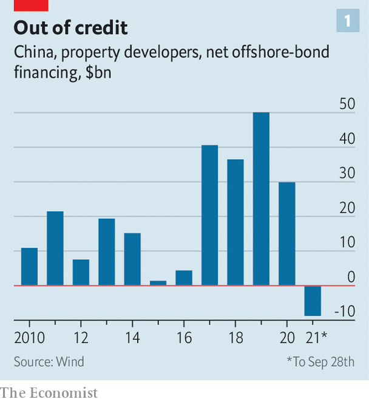
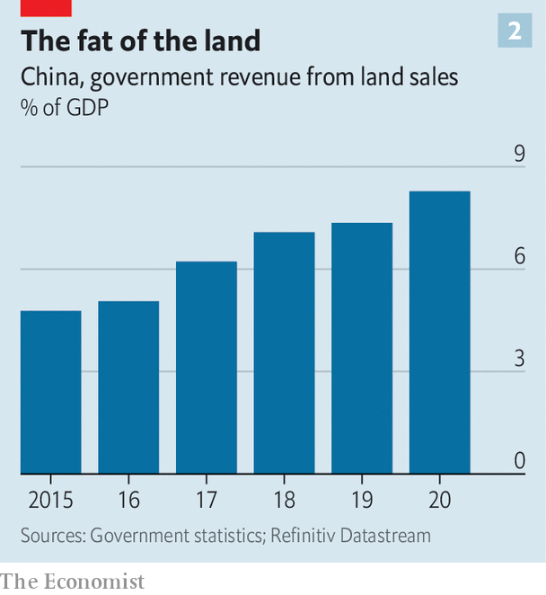

###### The property complex

# How a housing downturn could wreck China’s growth model 

##### Evergrande’s woes expose the economy’s unhealthy dependence on property 

 

> Sep 30th 2021 

ADD “MALICIOUS price-cutting” to the growing lexicon of Xi Jinping’s China. The phrase has cropped up in the past but is being increasingly used by provincial authorities to decry property developers’ attempts to slash home prices. Some developers, desperate to bring in revenue, are offering discounts of as much as 30%. Officials, fearing that the price cuts might frustrate recent homebuyers and lead to protests and distortions in the property market, regard the discounts as undermining social stability and have banned them. In the central city of Yueyang the government has told developers to stop increasing prices but also to refrain from reducing them by more than 15%.

In such cases both regulators and developers are walking a tightrope, teetering between sky-high prices and a damaging downturn. The property market is probably the single largest driver of the country’s economy. Urban Chinese have flocked to it as a haven. House prices have soared over the past 15 years, often by more than 10% a year in large cities. Yet developers have borrowed huge amounts in the process. The industry’s total debt is about 18.4trn yuan ($2.8trn, equivalent to 18% of GDP), according to Morgan Stanley, a bank. Housing costs, relative to incomes, now make large Chinese cities some of the least affordable places in the world.


These trends have collided with officials’ goals of reducing corporate indebtedness and inequality, which lie at the heart of Mr Xi’s mission to bring “common prosperity” to China. The campaign has already brought down several large real-estate companies as regulators have tightened their access to credit. The latest is Evergrande, a developer with about $300bn in liabilities that has started to miss payments on dollar bonds. (As The Economist went to press Evergrande seemed to have missed another offshore-bond payment, due on September 29th.) The fear for officials is not just that the unwinding of the group will unleash systemic financial risks. If the property sector were to tip into a correction, everything from local-government and household finances to the country’s growth model would be imperilled.

China’s leaders have cheered on the property boom for the best part of 30 years. When the central government overhauled the tax system in 1994, local authorities lost a large chunk of revenue. At the same time, local governments were prevented from issuing debt. Yet they were tasked with hitting high economic-growth targets, sometimes exceeding 10% a year. Selling land became one of the few things municipal officials could do to generate revenues, which would in turn finance roads and other public works. They could also set up companies that could borrow from banks and raise debt from other sources. This arrangement meant economic growth was tightly bound to booming property.

Between 1999 and 2007 the quantity of rural land transferred to urban use increased by an average annual rate of almost 23%, and public-land sales soared by an average of 31% a year. Soon the property market became the prime lever for controlling economic growth. During the global financial crisis much of China’s $586bn stimulus package came in the form of loans and shadow-banking funds for developers. “The property market was a vehicle for delivering the stimulus,” says Kevin Lai of Daiwa Capital Markets, a broker. By 2010 land sales accounted for more than 70% of municipal incomes a year, although the rate varied between regions.

The failure to break away from this setup is one of China’s biggest economic blunders of recent decades. The relationship between the property market and overall growth remains as strong as ever. Residential investment alone makes up 15% of GDP; the economic importance of property rises to 29% once construction and other related industries are added in, according to an estimate by Kenneth Rogoff of Harvard University and Yuanchen Yang of Tsinghua University. As a result, homebuyers and developers alike have considered the housing market too important to fail, finds Hanming Fang of the University of Pennsylvania. They have treated their investments as one-way bets.

The Evergrande crisis and some property indicators are beginning to threaten that long-held belief. Malicious price-cutting may be in the headlines, but only especially cash-strapped developers have resorted to it. Yet demand is weakening from its high base. One gauge is growth in prices, which has slowed in recent months. Another is the secondary market, where speculative investors cash out. In Shenzhen, a southern boomtown, transactions fell for four consecutive months to 2,423 in August, compared with a monthly average of 8,376 in 2020, according to Rhodium Group, a consultancy.

 


The easy stream of credit that kept construction sites buzzing is drying up. Access to bank and shadow-bank loans, as well as demand for on- and offshore bonds, is weakening for the industry in general, says Cedric Lai of Moody’s, a rating agency. Net offshore dollar-bond issuance has turned negative for developers for the first time in at least a decade (see chart 1). Land sales for residential projects declined in the first half of the year, mainly because of government limits on bank exposures to developers. S&amp;P, another rating agency, has downgraded many developers to junk. Moody’s says its outlook on China’s property sector is now negative.

 


Such news has grabbed the attention of local officials. Declining demand for homes and a shortage of funds will mean less demand for land. The development of a municipal-bond market over the past decade has helped some regions move away from land sales. But on the whole local officials have only become more addicted. Total government sales revenue has climbed since 2015 and reached about 8.3% of GDP in 2020 (see chart 2). Any decrease bodes ill for the economies of smaller cities.

Households, meanwhile, are on some measures more exposed to property than ever. In 2019 housing represented about 60% of their total assets (financial assets accounted for just 20%). This overreliance has driven up mortgage debt to about 76% of total household liabilities. As developers lost other forms of funding over the past five years they became heavily reliant on pre-sales income, where buyers pay for their homes, sometimes in full, months or years before completion. Between 2015 and July 2021 the share of pre-sale revenue as a source of funding for developers rose from 39% to 54%, according to Natixis, a French bank. Some of the people who paid in advance for Evergrande homes or bought one of the company’s wealth-management products have protested outside its offices.

Investors are now waiting for government action. Some expect that, as the economic outlook darkens, officials will ease monetary conditions. Most banks have used up government quotas for property-sector loans this year, says Zhang Zhiwei of Pinpoint Asset Management, a hedge fund based in Shanghai. The quotas will be renewed in January, leading to a burst in lending, he says. Raymond Yeung of ANZ, a bank, thinks that regulators are well enough informed of the risks that few other developers will encounter the same problems as Evergrande. A property slowdown might knock a half of a percentage point off GDP growth this year, he says. Mo Ji of Fidelity International, an asset manager, says she expects the turbulence to take a percentage point off growth.

The short-term outlook, however, might ignore a bigger secular shift. Mr Lai of Daiwa says the market is “very close to the end of the housing boom”, because the accumulation in debt cannot continue. Efforts to make China more equal could mean more moderate price rises in future, says Oxford Economics, a consultancy. Whether China’s unfavourable demographics can continue to support a market of this size over the next decade is an open question, reckons Mr Yeung.

Few options for decoupling economic growth from housing exist. China should have focused more of its construction on megacities, which tend to have diverse sources of funding and competent administrators, says Andy Xie, an economist. Instead local officials in small towns have squandered land revenues, often spending on vanity projects even as young workers leave for large cities. For the economy to end its unhealthy dependence on property development, it may be necessary for many local governments to cease to exist. ■

For more expert analysis of the biggest stories in economics, business and markets, , our weekly newsletter.

An early version of this article was published online on September 29th 2021

