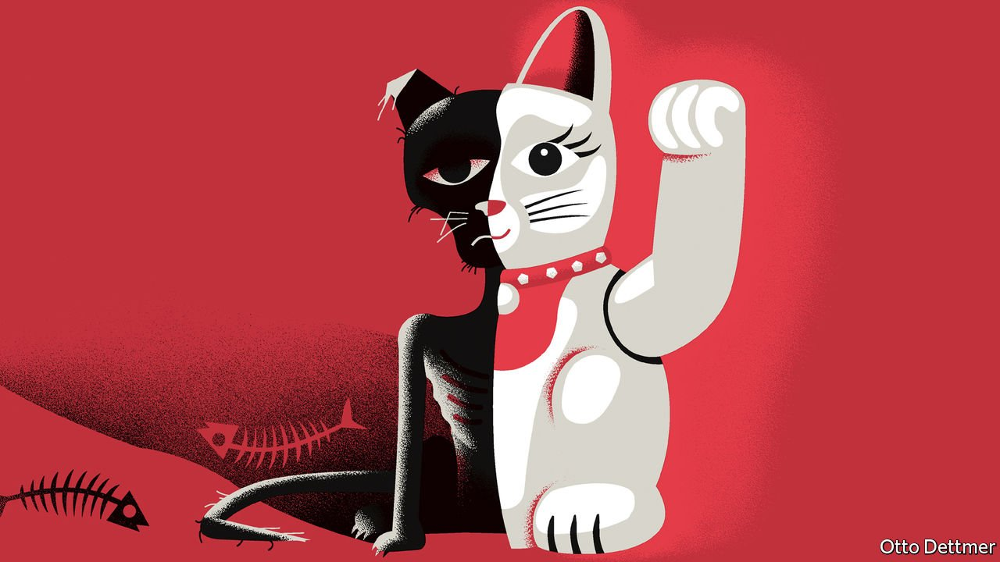
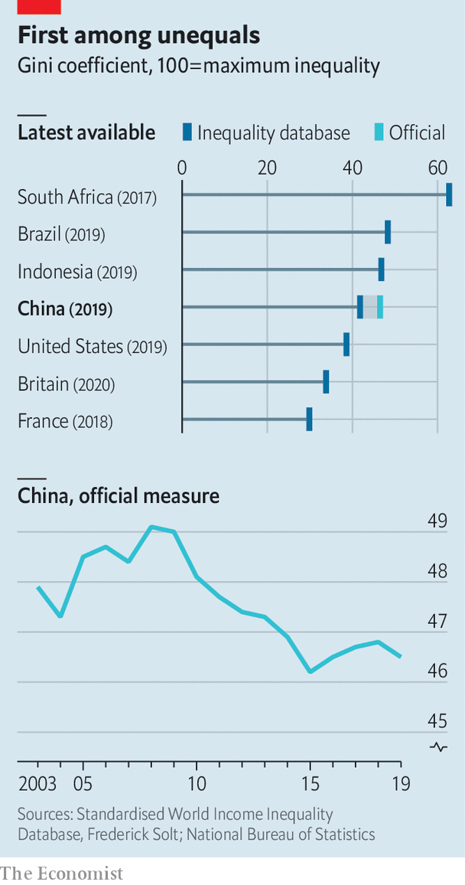

###### Free exchange

# Just how Dickensian is China? 

##### Inequality is better than it was. But it doesn’t feel that way 

 

> Oct 2nd 2021 

WITH ITS fast trains, super-apps, digital payments and techno-surveillance, China can seem like a vision of the future. But for some scholars, such as Yuen Yuen Ang of the University of Michigan, it is also reminiscent of the past. Its buccaneering accumulation of wealth and elaborate choreography of corruption recall America’s Gilded Age at the end of the 19th century, an era that takes its name from a novel by Mark Twain and Charles Warner.

China, including Hong Kong and Macau, now has 698 billionaires, according to Forbes, almost as many as America (724). The habits of the new rich could fill a novel in the spirit of Twain. Even the non-fiction accounts are outlandish. One billionaire, according to the book “Red Roulette” by Desmond Shum, offered the author’s well-connected wife a $1m ring as a gift. When she refused, he bought two anyway. One businessman remarked to Ms Ang that his neighbour’s dog will only drink Evian. Meanwhile, over 28% of China’s 286m migrant workers lack a toilet of their own. And in parts of rural China, 16-27% of pupils suffer from anaemia, according to a 2016 study, because they lack vitamins and iron.


None of this makes Xi Jinping, China’s ruler, happy. According to a leaked account by a professor who grew up with him, he is “repulsed by the all-encompassing commercialisation of Chinese society, with its attendant nouveau riche”. Mr Xi has begun to talk more frequently about “common prosperity”. In January, he declared that “we cannot allow the gap between the rich and the poor to continue growing…We cannot permit the wealth gap to become an unbridgeable gulf.”

 


Measuring China’s gaps and gulfs is tricky. The most common gauge of income inequality is the Gini coefficient, which has become popular despite being hard to interpret. One way to make sense of it is with a thought experiment. Suppose two people in a country are to meet at random. What will be the expected income gap between the two? If you know the income of everyone in the country, you can guess by calculating the average gap from every possible pairing. That expected gap can be expressed as a percentage of the society’s average income. Cut that percentage in half (to get to a number between 0 and 100) and you have the Gini coefficient. China’s official Gini is 46.5%, meaning that the expected gap will be 93% (ie, twice the Gini) of China’s average disposable income. Since average disposable income was 30,733 yuan ($4,449) in 2019, the expected gap would be about $4,138.

China’s official Gini is higher than that of many advanced countries, including America and Britain. An alternative calculated by the World Bank looks better (38.5% in 2016), because it takes account of cheaper prices in rural areas. Another source, the World Inequality Database overseen by Thomas Piketty and his colleagues, reports higher figures, because they look at pre-tax income and because they take extra pains to ferret out the unreported income of the rich. But, as Martin Ravallion of Georgetown University points out, the poor may also have unreported resources, which may be large relative to their paltry reported incomes.

Although the level of inequality differs between these measures, they all agree on one striking point. Inequality in China today is not as bad as it was about a decade ago. Indeed, some scholars have remarked on the “great Chinese inequality turnaround”.

Why then has concern about inequality turned up, even as inequality itself has turned around? Twain may offer one answer. One of the protagonists of “The Gilded Age” comforts himself with the thought that although he and his wife have to “eat crusts in toil and poverty”, his children will “live like the princes of the Earth.” Similarly, many Chinese may tolerate life on the lower rungs of society, if they think they or their children can climb up the ladder.

But that kind of social mobility seems to be slowing. Yi Fan and Junjian Yi of the National University of Singapore and Junsen Zhang of Zhejiang University have tried to calculate the persistence of income from one generation to the next. Chinese born in the 1970s inherited about 39% of any economic advantage enjoyed by their parents. Those born in the 1980s inherited over 44%. That is, if you knew one set of parents was 1% richer than an otherwise similar set of parents, you would expect their children to earn 0.44% more in their own careers than the other parents’ kids.

Inequality may also be more conspicuous than it was. As Mr Ravallion and Shaohua Chen of Xiamen University have pointed out, the decline in Chinese inequality since 2008 does not reflect softer divisions within cities. It results instead from a narrower gap between urban and rural China. People tend to be more conscious of social fault-lines within a city than they are of disparities between one far-flung place and another.

The guilted age

Mr Ravallion suggests another reason why China’s great inequality turnaround has gone unnoticed: people do not think in Ginis or percentages but in yuan and fen, dollars and cents. The expected income gap between two random Chinese may have declined from 98% of average income at inequality’s peak in 2008 to 93% now. But because average income has risen in that time, the expected gap in yuan terms is still far larger. The income per person of the top fifth of households was 10.7 times that of the bottom fifth in 2014. That ratio has since fallen a bit. But the gap in yuan has increased from 46,221 yuan in 2014 to 69,021 yuan in 2019.

The professor who grew up with Mr Xi speculated that if he became leader Mr Xi would “aggressively” tackle China’s gilded decadence, even “at the expense of the new monied class”. Mr Xi has already browbeaten some billionaires into public acts of philanthropy. The gestures will do little to shift the Gini coefficient. But they will make redistribution more conspicuous. Deng Xiaoping, one of Mr Xi’s predecessors, famously said that he did not care if cats were white or black as long as they caught mice. Mr Xi’s main opinion about cats is that he does not like them fat. ■

For more expert analysis of the biggest stories in economics, business and markets, , our weekly newsletter.

