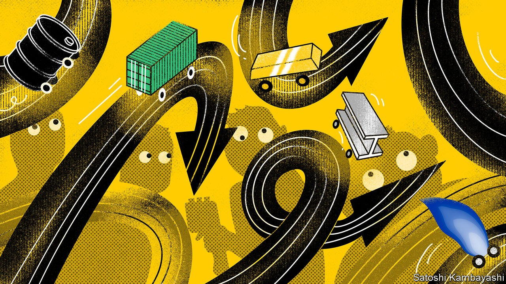

###### Buttonwood

# Making sense of the chaos in commodity markets 

##### The 2000s were about the supercycle. The 2020s are about supermayhem 

 

> Oct 2nd 2021 

THE WORLD championships of slot-car racing are a microcosm of mayhem. Tiny remote-controlled models of cars fly up, down and off a convoluted circuit faster than befuddled spectators can follow. Forecasting winners is impossible. This year’s race, due to be held in America, was cancelled owing to travel restrictions. But amateurs of high-risk betting might instead find consolation in the equally bewildering, rapidly changing world of commodities.

Until recently these seemed comfortably installed in the fast lane; the Dow Jones Commodity Index rose by about 70% in the year to June. But the rally has since run out of puff. Some materials, such as lithium, continue to climb. Other once-hot commodities have gone into reverse. The price of iron ore is down by 45% since its peak in mid-July; lumber, by 63% since early May.


Things used to be much simpler. During the 2000s China’s rise fuelled a commodity “supercycle”—a prolonged period of high prices. When Chinese growth ebbed in the mid-2010s the sustained boom ended. This time, however, no single motor is propelling commodities upward. Both supply and demand are being hit by a series of short-term shocks that are interacting in unpredictable ways, creating a sense of chaos.

Three categories of shock matter. The first is the stop-start, uneven nature of the economic rebound. China seemed on a tear early this year but has since faltered. America is going at full throttle, with Europe in its trail, but the Delta variant and supply bottlenecks may slow it down. Many poor countries have yet to pick up pace. All this creates sudden surges in demand for raw materials at a time when both producers and the shipping infrastructure, still disrupted by local bouts of covid-19, are already under strain. The price of copper was pushed up as demand recovered, but also because of mine closures in South America early in the pandemic. Freight futures, which investors, curiously, class as a commodity, have surged.

At the same time, governments are intent on speeding up the green transition. This creates demand for the wood and the metals used to construct wind and solar farms, and boosts natural gas, a popular bridge between the dirtiest fuels and clean ones. Lithium, used in electric-vehicle batteries, rose by 21% in September alone. The same underlying cause—climate change—is causing disruptive weather events. Snow in Brazil, for instance, has helped push coffee prices up by 22% since early July. In August Hurricane Ida shut down most of the offshore oil and gas output in the Gulf of Mexico.

Geopolitical tensions, the third driver, muddy the outlook further. Australia, a mining and farming giant, has entered a new alliance with America that is intended to contain China, its main customer, after the government in Beijing imposed embargoes on its prized exports. Russia is accused of limiting natural-gas sales to Europe to justify a controversial pipeline linking it to the continent. The European gas spot price has shot up by more than 80% since mid-August.

Combine these factors and you get an insight into the commodity chaos. Iron ore has cratered because China no longer wants so much steel. But coking coal, the other ingredient in steelmaking, is glowing hot because Mongolia, a big producer, is in lockdown.

Oil crossed $80 a barrel for the first time in three years on September 28th. Prices are high because OPEC and its allies are being unusually disciplined in limiting output, and shale wells in America, often quick to turn on the taps, are instead paying down debt. That would typically boost corn, the main component of American biofuel. But President Joe Biden is mulling a cut to the amount of biofuels refiners must blend into the total fuel pool, dampening demand. The price of palladium, used to make catalytic converters, has slumped by 25% in the past month because a shortage of microchips has halted car production.

Jean-François Lambert, a former head of commodity-trade finance at HSBC, a bank, reckons the mayhem could well last until 2025, when the pressures on the market will start to ease. That might be why few investors seem keen to bet on the direction of prices. Although commodity markets have attracted strong inflows since the start of the year, analysts at Capital Economics, a consultancy, reckon that is mostly down to the popularity of exchange-traded funds tracking gold. Considering the chaos in the world’s commodity markets, it’s no surprise that investors want a haven.

For more expert analysis of the biggest stories in economics, business and markets, , our weekly newsletter.

