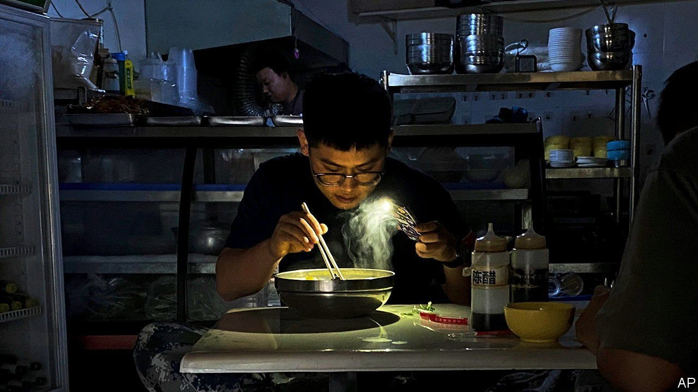
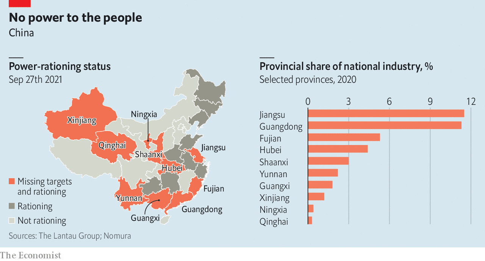

###### Xi’s electric

# The latest shock to China’s economy: power shortages 

##### At least 19 provinces have suffered power cuts in recent weeks 

 

> Oct 2nd 2021 

At least 19 of China’s provinces, including many of its industrial heartlands, have suffered power shortages in recent weeks, with some unplanned and indiscriminate cuts. In many parts of the country, the high price of coal is to blame. Ten provinces are also trying to meet strict environmental limits on energy consumption. Nomura, a bank, expects China’s GDP to shrink in the third quarter, compared with the second.

 


For more expert analysis of the biggest stories in economics, business and markets, , our weekly newsletter.

