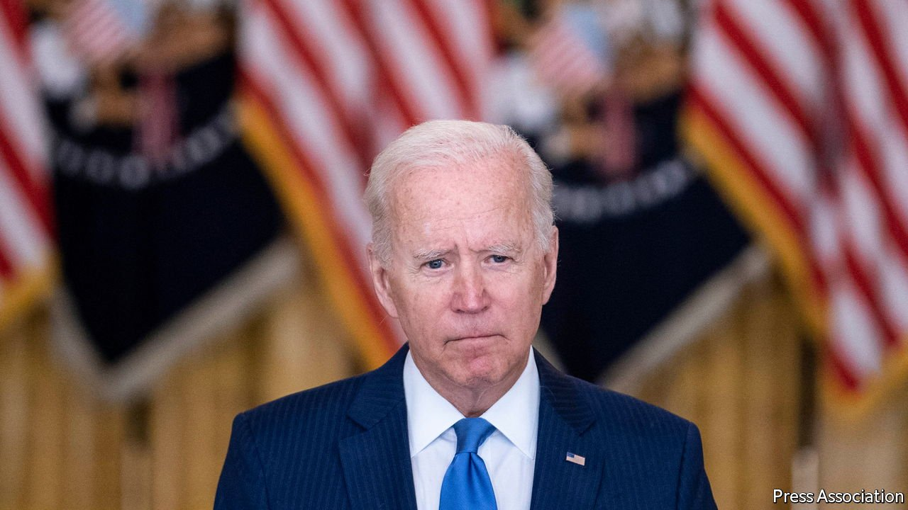
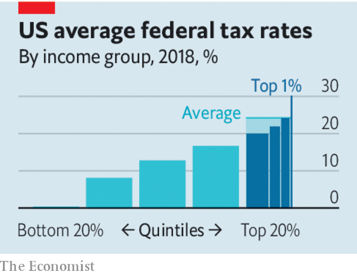

###### Ways and means

# America will never have a European-style welfare state without a VAT 

##### Democrats want European-style spending but without the efficient tax that makes it possible 

 

> Oct 2nd 2021 

AS GOVERNMENTS SPEND more, it becomes increasingly important that they design their taxes carefully. Large European welfare states such as Sweden or Germany rely on growth-friendly value-added taxes (VATs) to help raise the vast quantities of cash they dole out. America can get away with a tax system that is grossly inefficient and needlessly complex only because the amount of revenue it raises overall is relatively small.

Small, but growing. Democrats in the House of Representatives are working out how to pay for President Joe Biden’s proposed social-spending bill, under which America would take a step in the direction of Europe with cash handouts for parents, child-care subsidies, green investment and more money for health care. The bill will probably be watered down in the Senate, but its present size is $3.5trn (1.2% of projected GDP) over the next decade. To help pay for it, lawmakers are proposing the biggest rise in taxes since 1993.


The plan does little to move towards the efficient taxation that would be necessary were America ever to have the European-style welfare state to which many Democrats aspire. That is because the proposals have been crafted with the goal of raising taxes only on households with incomes in excess of $400,000. The left thinks the rich do not pay their fair share. They would like to raise the top rate of federal income tax from 37% to 39.6%, and introduce a new 3% levy on earnings over $5m. They also want to raise the rate of federal tax on corporate profits in excess of $5m, from 21% to 26.5% (glossing over the fact that wages will fall at least a bit as a result).  would raise the rate of capital-gains tax and introduce various new levies.

The federal government has some scope to raise more money from high earners. But the idea that the main problem with the existing system that tax rates are too flat is wrong. In 2018 the lowest fifth of earners on average paid no net federal taxes at all. The top 1% paid a total rate (ie, after all deductions) of 30%, according to the Congressional Budget Office. Include state and local levies, and high earners face a marginal tax rate on each extra dollar they take home—the rate that matters for work incentives—which is middling by rich-country standards. Tax refunds for poor families are exceptionally generous. In 2019 a single parent of two children earning two-thirds of average pay faced total net labour taxes of only 10%, according to analysis by the OECD, a club of mostly rich countries. In egalitarian Sweden the rate was nearly 33%.

 


Inefficiency is a bigger problem in America than the failure of rates to be sufficiently progressive. Myriad deductions allow the very rich to disguise labour income as lightly taxed capital income. And unwillingness to levy a VAT, which is a tax on consumption, means America relies on taxes that deter work and investment. America is one of only three rich countries to collect more than 70% of its tax revenue from labour income and corporate profits. Sales taxes, levied by states and localities, are the only significant taxes on consumption.

The plan does far too little to boost efficiency. On the upside it would curtail the carried-interest loophole which lets investment managers class their fees as capital gains not income. It would reduce tax evasion by increasing enforcement, such as through audits of the tax-returns of high-earners, which more than pays for itself. And it would try to get more money from “pass through” companies, shells which let many professionals treat their income as business profits, incurring a lower tax rate.

Yet much is wrong with the Democrats’ plans. They appear to have forgone closing one of the most costly loopholes, which writes off capital gains when assets are inherited. The rise in corporation tax would take the total rate, including average state and local levies, to 31%, the third-highest among rich countries. In the House they seem uninterested in a carbon tax to combat climate change. And although it is not yet in the plan, they are talking about lifting the cap on an exemption, from federally taxable income, of money used to pay state and local taxes. The cap was introduced in 2017 under Donald Trump. Lifting it would further subsidise high-tax states and almost exclusively benefit the rich. Democrats would be raising top income-tax rates while narrowing the tax base—the opposite of good tax policy.

America’s economy would survive these proposals. But its creaky and cumbersome tax code should not be asked to support the size of government that many Democrats want in the long term, which includes, say, government-funded universal health care. Republicans know this is implausible. They typically oppose VAT because they see it as too convenient a source of funds. Democrats dislike the tax because it is mildly regressive. But there is a reason VATs underpin European-style welfare states: there is no desirable alternative. ■

For more coverage of Joe Biden’s presidency, visit our dedicated 

