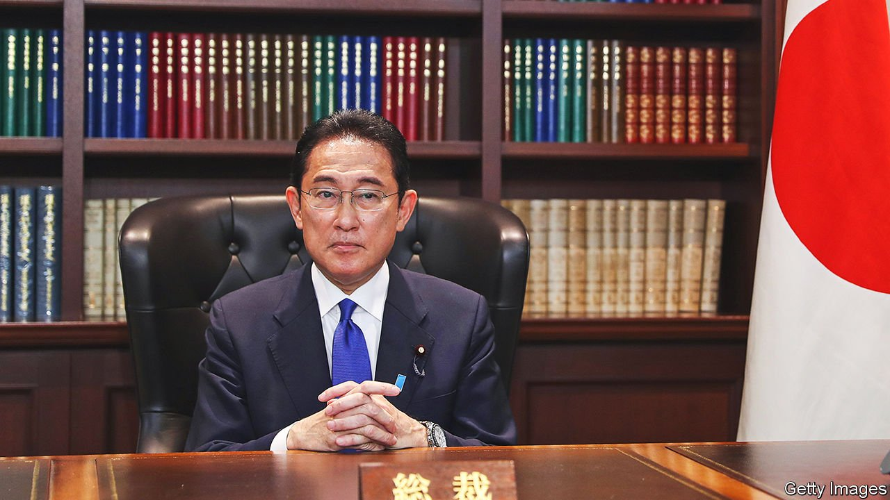

###### Uninspired

# Japan deserves better than an inoffensive prime minister 

##### Kishida Fumio won by looking as if he won’t rock the boat. But it needs rocking 

 

> Oct 2nd 2021 

“WE AVOIDED THE worst-case scenario,” ran one hashtag trending on Twitter after the election on September 29th of Kishida Fumio as president of Japan’s ruling party. For the right-wingers promoting the slogan, the “worst case” was Kono Taro, a popular and independent-minded minister who won the most votes in the first round of the election. They see him as too liberal to lead the inaptly named Liberal Democratic Party (LDP). But Japanese liberals were relieved, too. For them, the worst case was Takaichi Sanae, a nationalist firebrand.

The trait that propelled Mr Kishida to victory appears to be his inoffensiveness. His victory was engineered by a party establishment that cherishes the status quo. He is —and just as unlikely to make waves.


Indeed, the status quo is what precipitated the leadership election in the first place. After his predecessor, Abe Shinzo, stepped down last year because of ill health, Suga Yoshihide, the outgoing party president and prime minister, was seen by the party as a safe pair of hands. But his uninspiring handling of covid-19, to say nothing of his lack of charm, turned the Japanese public against him. Confronted by the possibility of a humiliating loss of seats in lower-house elections to be held in November, Mr Suga resigned on September 3rd. His replacement is also a pair of supposedly safe hands, if a slightly younger one. With Mr Kishida at the helm, the LDP may still suffer electorally, but the losses are likely to be smaller. The LDP considers that a victory.

It is not. Japan has avoided some of the worst pathologies of rich democracies, such as populism and extreme partisanship. Yet the ruling party’s persistent back-room dealmaking bodes ill for democracy. Because the opposition is a shambles, the LDP is extremely unlikely to lose power in the coming elections. That makes its internal elections almost a substitute for national ones. But the process, which in the second round boils down to a few hundred LDP parliamentarians choosing along mostly factional lines, leaves the party’s rank-and-file members, to say nothing of the voters, estranged from politics. Turnout in general elections has slipped from 69% in 2009 to less than 54% in 2017. The machinations that elevated Mr Kishida will only deepen the public’s disillusionment.

Who leads Japan matters. It is a big country, with 126m people and the third-largest economy in the world. It is a member of the G7 and the Quad, a security grouping formed as a counterweight to China in the Indo-Pacific. It has championed free trade in America’s absence, and currently holds the chair of the CPTPP, a trade pact that both China and Taiwan have applied to join. Yet it will be hard for Japan to take a leadership role on the global stage without a strong prime minister.

This week’s vote also augurs badly for Japan’s future. The country is stable, peaceful and prosperous. But it is ageing even faster than other mature democracies. Its labour force is shrinking; its pension and health-care costs are ballooning. A new leader needs bold ideas to deal with these ills, from boosting productivity to making the workplace more female-friendly. He also needs the charisma to sell such ideas to the public. He should be making hard choices to build on two of Mr Suga’s policies: overhauling the country’s outdated bureaucracy and coming up with a realistic plan to achieve its target of net-zero emissions by 2050. All this will take grit. Mr Kishida, a compromise candidate amenable to the LDP’s varied factions, has done little to suggest that he has it.

Given the pace of demographic and social change, Japan cannot afford a government that simply muddles through. Perhaps Mr Kishida will surprise his critics once he takes power. It seems more likely, though, that he will join a long list of unmemorable prime ministers. That is hardly the worst outcome of the election. But Japan can, and should, aim for something better. ■

