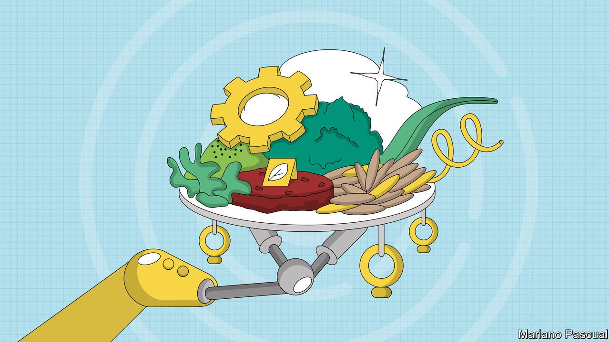

###### The future of food

# New ways to make food are coming—but will consumers bite? 

##### Consumers and governments should embrace new ways to make food 

 

> Oct 2nd 2021 

WHAT’S FOR dinner? The answer matters, at every level. Food connects the personal to the planetary. Agriculture uses half the world’s habitable land and accounts for more than 30% of global emissions. Food production links the great biogeochemical cycles of carbon and nitrogen, both on a planetary level and also in specific factories that combine natural gas with nitrogen and oxygen from the air to produce agricultural fertiliser on the one hand, and carbon dioxide for use in food processing on the other. When one such factory in Teesside, in northern England, recently threatened to shut down because of high natural-gas prices, the government had to step in to prevent food supply chains from collapsing.

Globally, food prices have risen in 13 of the past 15 months and are close to their peak of 2011, owing to poor weather, pandemic-related disruption and fallout from a swine-flu outbreak in China in 2018. In the longer term, the food system faces pressure from climate change, population growth and a shift towards more Westernised, meat-heavy diets.


Fortunately,  that promise to produce food in new ways, in large volumes with less inhumane factory farming and a lower environmental footprint. These range from bioreactors that grow meat to indoor “vertical” farms and new ways of producing fish. Such techniques could make a huge difference. Three-quarters of agricultural land is used for livestock, for example, so it is easy to see how steaks made from plant-based protein, or grown in vats from cells, could greatly reduce factory farming and land and water use, and produce .

Just because it is possible to make food in new ways does not mean people will be willing to eat it, however. Given food’s cultural importance, and the fact that it is ingested into the body, conservatism and scepticism are common reactions to new foodstuffs and production processes. In 17th-century Europe many people were loth to eat a new vegetable called the potato because it was not mentioned in the Bible, or because they feared it caused leprosy. Today, many European countries ban the cultivation and sale of genetically modified crops, even though they are widely grown and eaten elsewhere. And although much of the world considers insects a mouth-watering treat (and locust-eating is endorsed in the Bible), the very idea revolts many Western consumers.

At the same time as novel foods are shunned, traditional foods and farming lore are venerated. In California the fanciest restaurants aspire to recreate the humble diet of the Tuscan peasant. Many Western consumers are willing to pay extra for food produced by organic farming, in effect a historical re-enactment of pre-20th-century agriculture, because it avoids “chemicals”. (Everything is made of chemicals.)

Yet supposedly timeless food traditions are often shallower than they seem. In the “Columbian exchange” in the 16th century, food crops from the Americas rapidly spread around the world. Tomatoes and polenta, staples of the Italian diet, are American in origin and were unknown to the Romans or to Dante. Potatoes were eventually widely adopted in Europe (the invention of French fries helped). It is hard to imagine many Asian cuisines without chili peppers, but they too are American. Coffee from Arabia and tea from China were unknown in Europe before the 17th century.

The new foods and processes on offer today present opportunities to create delicious and sustainable new traditions. Western consumers should put aside their reservations about eating crickets and give plant-based burgers, 3D-printed steaks and vat-grown artificial tuna a try. Regulators, especially in Europe and America, should streamline their processes for approving cultured meat, be more open to gene-editing crops (as Britain said it would be this week), and speed up approval of edible insects for animal feed and human consumption. A wholesale reimagining of the food system is needed. But that will be possible only if both consumers and regulators are prepared to be more daring about what to eat for dinner. ■

