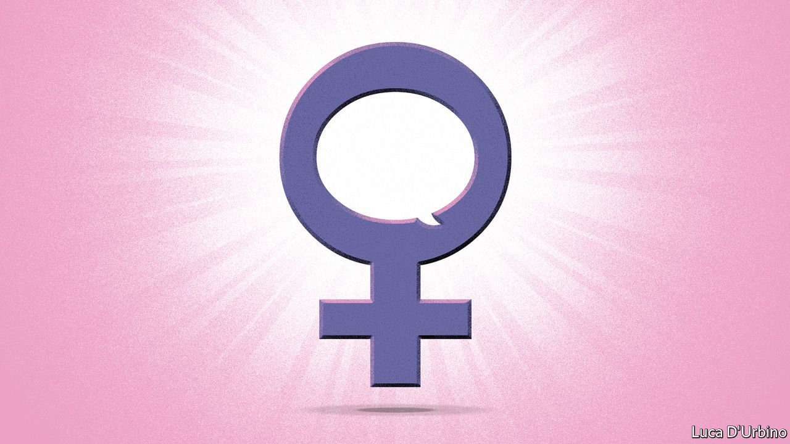

###### Sex and language

# Why the word “woman” is tying people in knots 

##### It is almost always women who are ordered to dispense with a useful word 

 

> Oct 2nd 2021 

“BODIES WITH vaginas” is an odd way to refer to half the human race. Yet it was the quote that the Lancet, a medical journal, chose to feature on the cover of its latest issue, telling readers that “historically, the anatomy and physiology” of such bodies had been neglected. After complaints about dehumanising language, the Lancet apologised. But it is not alone. A growing number of officials and organisations are finding themselves tongue-tied when it comes to using the word “woman”.

A British hospital has instructed staff on its maternity wards to offer to use the phrase “birthing people”. Alexandra Ocasio-Cortez, a member of America’s Congress, talks of “menstruating people”. On September 18th the American Civil Liberties Union (ACLU) republished a quote from Ruth Bader Ginsburg, a Supreme Court judge, on the anniversary of her death. The quote was a defence of a woman’s right to have an abortion. But the ACLU’s version—for which it, too, later apologised—replaced every instance of “women” with “people”. In Britain the opposition Labour Party is tying itself in very public knots over questions such as whether only women possess cervixes.


This linguistic shift is being driven by both compassion and fear. Compassion, because organisations are keen not to be seen to be excluding those whose sense of their gender does not match their sex, such as people who identify as trans or non-binary. And fear, because they are worried about attracting the wrath of online mobs should they be deemed to have violated a set of rapidly changing taboos about gender and sex that hardly existed five years ago—and which, outside a few rarefied circles, still don’t. Most dictionaries define a woman as an “adult human female”. Among some activists, this is a gross provocation, for they see it as denying that males can be women, too.

Language changes constantly (the word “taboo”, for instance, is an 18th-century import from Polynesia). But doctors, bosses and politicians should think carefully before throwing away widely understood words, or using them in new and radically different ways. In the rush to seem up to date, they risk doing a disservice to their own patients, employees and voters.

One reason is that many of the new terms come across as dehumanising. As the Lancet discovered, many people—trans men as much as anyone else—dislike being described as collections of ambulatory body-parts and secretions. More than a whiff of misogyny is in the air. It is striking that there is no comparably zealous campaign to abandon the word “men” in favour of “prostate-havers”, “ejaculators” or “bodies with testicles”. It is almost always women who are being ordered to dispense with a useful word they have used all their lives.

Furthermore, understanding could suffer. Medical advice, for instance, has to be clear and intelligible by all. That is why Britain’s National Health Service often prefers words like “stomach ache” to “dyspepsia”, or “heart attack” to “myocardial infarction”. One survey conducted by a cervical-cancer charity suggested that around 40% of women are unsure about the details of what exactly a cervix is. This implies that asking “people with cervixes” to turn up for screening appointments may not be clear or intelligible, especially to women who have English as their second language.

XX-rated

Most broadly of all, the point of language is to communicate. Insisting on unfamiliar or alien-sounding terms will make it harder to discuss issues that affect only or disproportionately girls and women, such as female genital mutilation, domestic violence, child marriage or the persistence of pay gaps.

Many countries are debating whether safety or fairness should sometimes trump inclusion. Should male prisoners, even violent ones, who identify as women be housed in women’s prisons, as may happen in America, Britain, Canada and elsewhere? Should women’s sports be reserved for biological females, or should any athlete who identifies as a woman be allowed to join a women’s rugby team?

Cowed by the insults and viciousness such discussions provoke, many people are fearful of taking part. If harshly policed, baffling and alien-sounding language is added to the price of joining the debate, even fewer will be willing to elevate their cephalic protuberance above the parapet. ■

