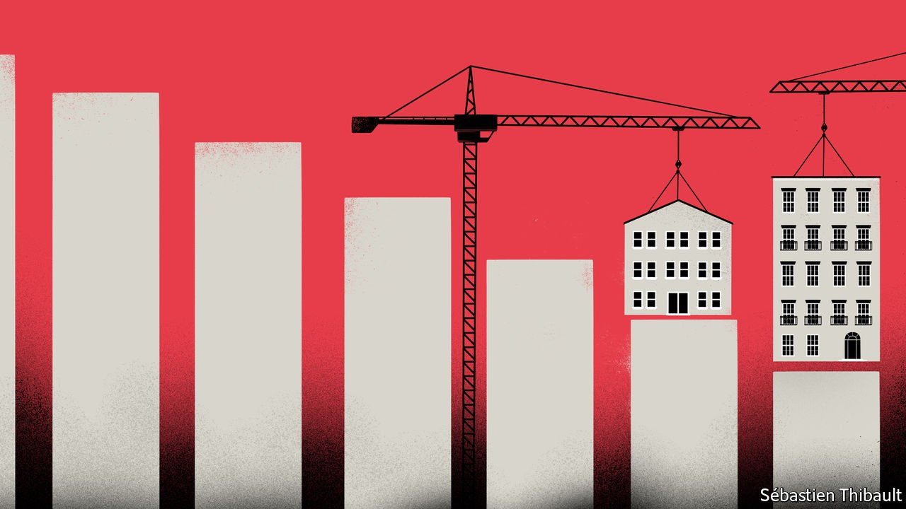
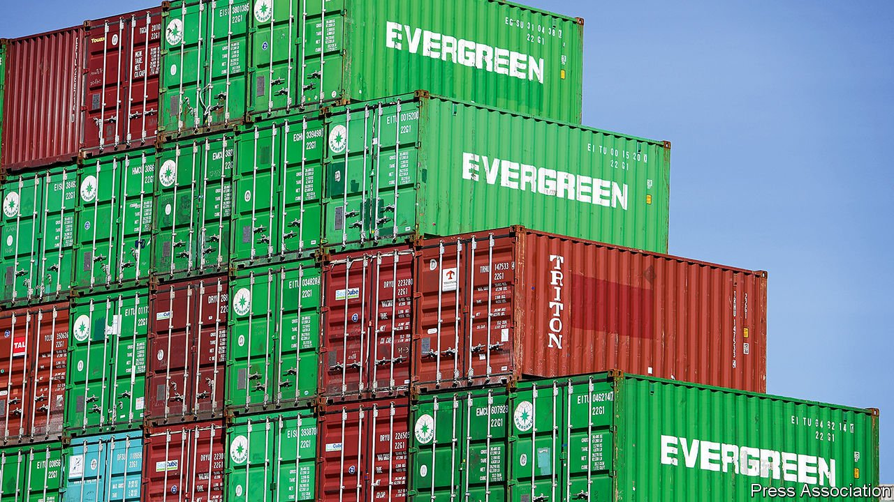

###### On the World Bank, housing, supply chains, expats, Islamic sites, the book index

# Letters to the editor 

##### A selection of correspondence 

 

> Oct 2nd 2021 


A controversial report

Your leader as well as your earlier article on the World Bank’s Doing Business report and China convey a false impression of Kristalina Georgieva’s role (“”, September 25th; “”, digital editions, September 17th). I was the senior director overseeing the report in 2017. Her direction to me was clear: verify the numbers without compromising the integrity of Doing Business. I was comfortable that the score for China was comparable to previous years’ scores. Contrary to your headline, at no point did I feel any pressure from her. The Economist got it wrong.


SHANTA DEVARAJAN

Georgetown University

Washington, DC

 


Home truths

The  column on the need for more housing took a binary approach to the problem by pitting public versus private solutions, with a strong bias for the private sector (September 11th). For example, it referred to Singapore’s “public” housing. The land in Singapore was not nationalised, but acquired with fair compensation for public purposes. Yes, 80% of the population live in this housing, but around 90% of adults also own their own homes. The ownership is of a lease, usually for 99 years.

Most of the apartments were built by the housing development board, offering subsidies to those on lower incomes to buy their flats. The more expensive apartments were built by private developers, but the leasehold model is the same, and the land under private development often belongs to the state. Only 5% of the population own landed or freehold property, naturally the most expensive on the island. Even so, some “public” apartments have changed hands for over 1m Singaporean dollars ($740,000) on the resale markets. Some “public” housing developments have even won international awards for their architecture.

ANDREW PURVES

London

The focus of the column, on urban cores packed with office blocks, implied that property investment and tax revenues could be affected negatively if jobs and people relocate because of the pandemic. The city-suburb dichotomy was superseded years ago. The challenge is how to make the best use of assets and unlock the potential of a city-region.

As Jane Jacobs observed in the 1960s and Sir Peter Hall years later, urban problems generate innovations. When problem-solving cycles are blocked, as they often are by centralised, top-down policies, cities are less able to leverage their agglomeration effects—density, specialisation, mobility and migration—into productivity-raising innovations. The climate-change transition and the growing scale of urban disasters call for a new paradigm. The paradigm shift that everyone was talking about after the financial crisis of 2007-09 remains a work in progress. Typically, paradigm shifts take a good 20 years to work out; we are halfway there.

JOSEF KONVITZ

OECD, urban affairs and regulatory policy (retired)

Saint-Mandé, France

 


Supply chains and workers

You argued that supply chains are adapting, not failing (“”, September 18th). This glosses over the extent of the world’s supply-chain woes, and especially the mistreatment of transport workers. Larger companies with a network of local resources have been able to adapt, but two years into this present crisis and the strain is now taking its toll. At best, it is blindly optimistic, and at worst unthinkingly callous, to presume that the basic market forces of supply and demand can provide a remedy.

Without workers, supply chains will grind to a halt. But instead of protecting them, governments have forced workers to remain on ships for a year or more and they are refused transit across borders. Unsurprisingly, we are seeing large numbers of them leave the industry, exacerbating the problem. If transport workers are not given urgent priority, the supply-chain crunch we are seeing in many parts of the world will only get worse, and then we will all be scuppered.

GUY PLATTEN

Secretary-general

International Chamber of Shipping

London

 


Expansive expats

Although expats might no longer be necessary (, September 18th), treating all countries in the same manner goes against much of what The Economist reports on so effectively each week: the idiosyncrasies that make countries dissimilar, and how to navigate them successfully either through a business, economic or cultural lens. I lived overseas for several years, after I studied business and the local language in school. Certainly some business can, and should be, carried out by transient employees, but retaining an expat sends an ongoing and positive communication message to headquarters as well as to the local office. Supporting these relationships, especially among Asian cultures, is sometimes more important then the business transactions themselves.

GREG STOLLER

Boston

 


Conserving Islamic sites

“” (September 4th) reported on Arab states that are wrecking old treasures. You barely mentioned Saudi Arabia, yet it has a long record of systematically destroying religious sites, most of which are important to the mainstream Islamic faith.

The most notable was the destruction of the religious shrines in the al-Baqi cemetery within the centre of Medina, which housed the tombs of Prophet Muhammad’s daughter and grandsons, as well as other family members. Its demolition in 1925 was ordered by the Al Saud regime based on their radical Wahhabi beliefs that shrines and graves should not be visited.

Despite repeated challenges by the mainstream Islamic community and offers to rebuild them, the Al Sauds stubbornly restrict access to the now flattened sites, as they see this as a challenge to their Wahhabi way of thinking. It is a shame that the Saudi government does not view these sites as economic opportunities in the same way they think about promoting sport and culture, helping avoid sectarian disparities in Islam. This is surely a responsibility for those who call themselves the custodians of Islam.

SYED ZAIDI

London

 


Subject matter

Your review of a book on the history of indexing suggested that search engines save time for looking things up (“”, September 4th). Have you never fallen down the Google rabbit hole? Looking for information about dragons’ teeth on the North Downs, I emerged much later listening to the songs of the Mountain Jews, via searches on invasion, gunpowder, Nobel, Azerbaijan and more. Time, joy and serendipity.

HELEN EDWARDS

London

Your wonderful review reminded me of an index entry I read once in the chemical rubber handbook:

Sea water; see water, sea

ELI GILBERT

New York

