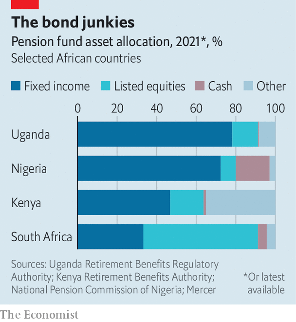

###### Building bridges

# African pension funds have grown impressively 

##### Their capital could help finance development 

 

> Oct 2nd 2021 

ON THE KAMPALA skyline workers can watch their savings climb into the air. Pension Towers, an office complex financed by the state-run provident fund, will be one of Uganda’s tallest buildings. Work began in 2008 and has been marred by fatal accidents, corruption allegations and budget overruns. The skyscraper illustrates the growing size of African pension pots—and the challenge of investing that money usefully.

This is a strange problem to have. The African Development Bank reckons that the continent needs $130bn-170bn of infrastructure spending a year to bring roads, water, power and internet to its people. Businesses are crying out for capital. What little they get often comes from foreigners, who are quick to pack their bags when things get tough. There is no such risk with local pension funds, which collectively manage around $350bn of assets in sub-Saharan Africa, according to RisCura, an investment firm. And yet many local funds say they struggle to find places to invest.


Pension funds have grown impressively in recent decades, for diverse reasons. In South Africa the government pumped cash into the civil service pension scheme to allay members’ worries about losing benefits at the end of apartheid. Its successor, the Government Employees Pension Fund (GEPF), is the largest in Africa, with assets of about $110bn. In Nigeria a mandatory pension system was introduced in 2004, and funds’ combined assets have grown nine-fold over the past 15 years, to $31bn.

Pension schemes typically cover only the small fraction of Africans who have formal jobs. But they can still be big fish in small ponds. In Namibia, for example, the value of retirement fund assets is larger than the country’s annual GDP.

 


What to do with all that money? Consider the choices laid out by Richard Byarugaba, the managing director of Uganda’s National Social Security Fund. It already owns a third of the shares traded freely on the local stock exchange, where only 16 companies are listed. An alternative is property, like the ill-fated Pension Towers, but building things is much more complicated than just “pumping concrete in”, he notes. So 78% of the fund’s investment is in bonds and the like, mostly government debt (see chart). In Africa, unlike in rich regions, that yields high returns.

This reliance on government securities is typical of fund managers almost everywhere except South Africa, which has uniquely deep capital markets. The Public Investment Corporation, which manages the assets of the GEPF, puts 41% of its investment into listed equities, as well as 7% into an unlisted portfolio that has drawn scrutiny for alleged improprieties. Pension pots in Botswana and Namibia also invest an unusual amount in equities, often abroad. The Botswana Public Officers Pension Fund could buy up the entire national debt and still have money to spare. Moemedi Malindah, its chief executive, says it would like to invest more locally, but options are limited: it had so much trouble finding private-equity managers that it had to run a programme to create them.

Talk of diversifying into alternative assets runs ahead of reality. In Nigeria, for example, pension funds put just 0.5% of their assets into infrastructure. That is partly because fund managers do not know how to assess the risks, says Wale Okunrinboye of Sigma Pensions, one of the largest funds in the country. It is a similar story when fund managers look at private equity. “Some of them want to dip their toes in the water but they’re just scared,” says Abi Mustapha-Maduakor, the chief executive of the African Private Equity and Venture Capital Association, an industry body.

There are efforts to change that. In Kenya more than 20 pension funds have formed a consortium to invest in infrastructure, pooling their capacity to spot duds. Governments and foreign donors are thinking of ways to take on some of the risk by issuing guarantees.

The long-term investment horizons of pension funds dovetail with the need for “patient capital” to build a continent. Yet the first job of a pension-fund manager is to protect the savings of future pensioners. The kind of public-private partnerships they might invest in have had mixed outcomes in Africa. Until there is a track record of success, most will continue simply to lend to governments and let the politicians build the roads instead. ■

