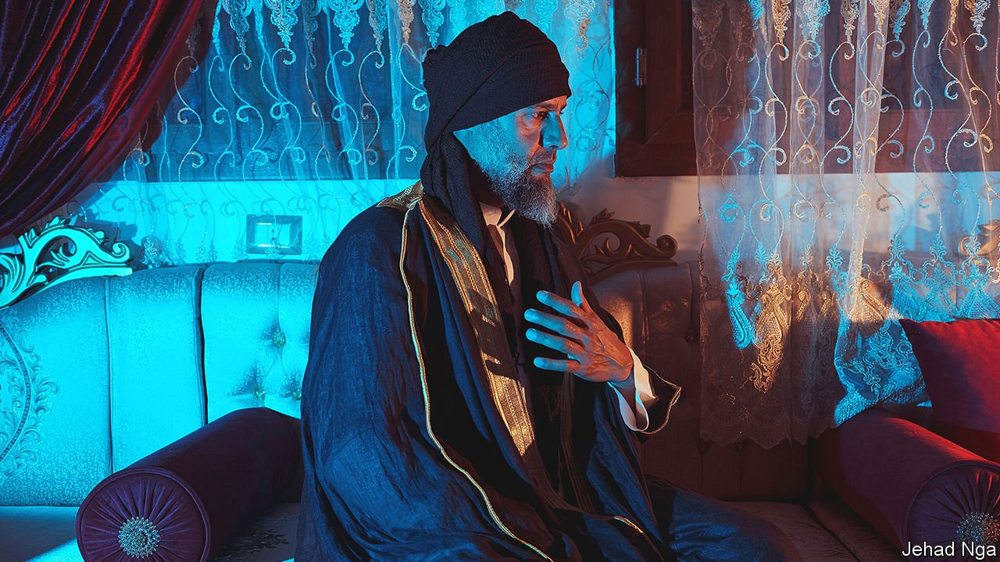

###### Zigzag in Zintan

# Could Libya be ruled again by a Qaddafi? 

##### A comeback by Muammar Qaddafi’s son Seif al-Islam can no longer be ruled out 

 

> Oct 2nd 2021 

TEN YEARS ago, when Muammar Qaddafi met a grisly end after 42 years in power, no one thought that a member of his family might ever end up back in charge of Libya. During the Arab spring a wave of euphoria washed across the country after the dictator’s demise. His seven sons were captured, killed or fled into exile. Seif al-Islam, the second eldest, was caught by a militia, put in a prison cage, indicted by the International Criminal Court at The Hague, and sentenced to death by Libya’s new regime.

The national mood may, however, be changing. Many Libyans look back on the Qaddafi era as a time of stability, however brutal the regime and however bizarre the dictator’s pronouncements. After a decade of civil strife it now seems possible that Seif (pictured), the most able of Qaddafi’s surviving sons, may be edging his way back into politics. He evidently believes he can negotiate his way around the indictments he still faces at home and abroad and may yet be allowed to compete in the presidential and general elections scheduled for the end of this year. Some think he could win.


The recent release of another brother, Saadi, from a prison in Tripoli, the capital, suggests that, as factions manoeuvre in the run-up to the elections, the Qaddafi family may no longer be pariahs. Once hated as the preposterous head of Libya’s football federation, Saadi was promptly flown to Turkey, a leading backer of the current fragile government in Tripoli. All charges against him, including one for murder, were dropped.

According to a report in the New York Times in Julyby Robert Worth, who met Seif in May, he is no longer behind bars, but now lives in a comfy limboland, half prisoner, half guest, under the control of a militia in Zintan, a mountainous region 180km (112 miles) south-west of Tripoli, out of reach of the government. Supporters insist Seif is a free man. “He’s not under house arrest…he can come and go,” says Muhammad Alghoddi, who manages Seif’s political office from Germany.

Plainly he is plotting a return to power. “I’ve been away from the Libyan people for ten years,” Seif told the New York Times. “You need to come back slowly, slowly. Like a striptease. You need to play with their minds a little.” The militia harbouring Seif apparently became disenchanted with the various regimes and militias that replaced his father and now treats him as a bargaining chip.

None of the more credible candidates has yet to declare his candidacy for December’s presidential election, in part because the election law has yet to be finalised. Mr Alghoddi says Seif is considering entering the race. “There’s no reason why a Qaddafi cannot lead Libya again,” he says.

Some observers agree. “Seif al-Islam comes at a time when Libyan politics needs a saviour,” says Alice Gower of Azure Strategy, a consultancy in London. The Qaddafis’ Green Movement broadcasts rousing speeches on a satellite channel based in Cairo, harking back to the dictator’s supposedly golden era. It is a message that may resonate among disappointed Libyans. Though 1.2m barrels of oil are pumped every day, electricity still cuts off for hours on end. Inflation is soaring. To most of Libya’s 7m people, prosperity and security, let alone democracy, are a distant mirage.

Turkey’s is not the only government that may consider letting the Qaddafi family back into the fray. Russia may be pondering whether to restore its old ties with it. The United Arab Emirates and Egypt may be looking for an alternative to Khalifa Haftar, a former general based in Libya’s east who has long been their candidate. But last year he tried and failed to topple the government in Tripoli.

The front-runners in December’s presidential election have been busy trying to have each other disqualified. Aguila Saleh, the parliament’s speaker, oversaw the passage of a law that would bar dual nationals and soldiers from running—which should rule out Mr Haftar, who is thought to be an American citizen. (Mr Haftar says he no longer formally commands his Libyan National Army based in the east.) Mr Saleh is also keen to undermine the current prime minister, Abdul Hamid Dbeibeh, probably Libya’s most popular politician, by refusing to pass his proposed budget.

When Mr Dbeibeh became prime minister in February under a deal negotiated by the UN, he promised not to run for any office after his term ends. But he may change his mind. Once head of one of the biggest state-owned companies under the old dictator, he too has renewed his ties with the Qaddafi family. He has returned to their original owners (including his family) properties that had been seized from members of Qaddafi’s regime after the dictator was overthrown. There are murmurs that his government may free some of Qaddafi’s closest comrades, including his intelligence chief. The interior minister is said to be in touch with the Qaddafi family. The prosecution of the alleged perpetrators of the massacre of more than 1,200 political prisoners in 1996 has been shelved.

Libya has been relatively peaceful since the UN brokered a ceasefire to end the civil war a year ago. Libyans can again travel between its eastern and western halves. Yet no one is betting on the election taking place as planned on December 24th. The militias that have terrorised the populace for the past decade remain untamed. Turkey and Russia, each with its favourites, may prefer to scupper the elections and preserve their spheres of influence. Still, amid the geopolitical manoeuvring and the dearth of any other banner that might unify Libya’s squabbling factions, the Qaddafis may yet creep back into the fray. ■

