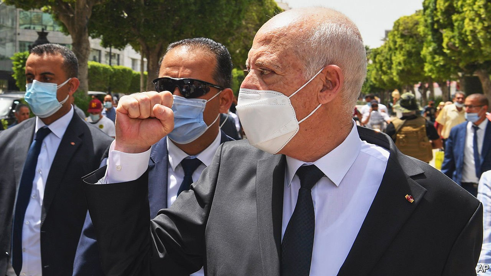
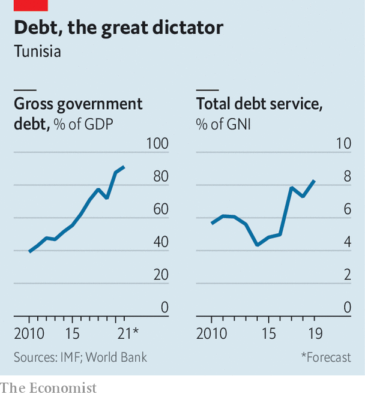

###### Fiddling while Carthage burns

# Kais Saied plans to transform Tunisia. It may go bust first 

##### The president rules by decree as the economy seizes up 

 

> Oct 2nd 2021 

BEFORE HE SENT a tank to bar the doors of parliament, Kais Saied was a law professor who preached fealty to the constitution. It may seem a contradiction, but contradictions helped propel Mr Saied (pictured) to the Tunisian presidency in 2019. He was a populist with a patrician manner, a self-styled democrat who disdained political parties and parliamentary elections. Some dubbed him Robocop, for his demeanour and conservative views; others saw Robespierre sharpening his guillotine.

On September 22nd Mr Saied said he would suspend much of the constitution and rule by decree. This codifies a power grab that began in July, when he assumed emergency powers. Parliament will remain frozen and its members denied their salaries. At some point, Mr Saied says, he will amend the constitution and change the political system. Until then it is less Jacobin, more Sun King.


The president’s actions have come in for criticism from prominent Tunisians and some Western governments. The country’s powerful labour union, the UGTT, said his decree was a “threat to democracy”. There have been small protests in the capital, Tunis.

Perhaps the bigger threat comes from the mismatch between Mr Saied’s actions and the people’s aspirations—and the fact that he is repeating the mistakes of the lawmakers he usurped. In 2018 and 2019 Arab Barometer, a pollster, asked citizens of 12 Arab countries to name the main characteristic of a democracy. Tunisians, more than any other group, cited the economy: 55% said a democratic government was one that “ensured job opportunities for all”. Just 10% cited free and fair elections.

No surprise, then, that so many Tunisians supported or tolerated Mr Saied’s actions in July. The democratic system set up after the 2011 revolution has failed to produce jobs. Growth has been below 3% since 2012. Last year, thanks to covid-19, the economy shrank by 8%. Unemployment is officially 18%. A weak dinar has contributed to high inflation (currently 6.2%).

 


Mr Saied’s most pressing problem is Tunisia’s fiscal mess (see chart). Public debt has climbed from 39% of GDP in 2010 to 88%. During the same period the dinar has lost half its value. The country looks stuck in a debt trap, with a total budget deficit of 9% of GDP and annual debt-service payments of 7-9% of GDP. Transfers to wobbly state-owned firms take another 7-8% of GDP and subsidies a further 5%. Then there are public wages, which have reached 18% of GDP. Almost all government revenue goes on these items, leaving little for investment or social spending.

The government began talks with the IMF in May. In exchange for $4bn (10% of GDP) it offered to trim public wages and phase out food and fuel subsidies. It hoped to wrap up a deal before a planned bond issue in October. Instead Mr Saied has paused negotiations; the price of Tunisian bonds has plunged. Some wonder if Tunisia will go the way of Lebanon, which defaulted and has seen its economy collapse.

Previous governments paid little heed to such problems. Since the revolution, politics has been defined by an ideological struggle between Islamists and secularists. On economics, there was often little to distinguish parties. Any attempt to cut subsidies or state salaries meets fierce opposition from the UGTT. Half-measures do not work: liberalising the exchange rate and imposing new taxes were enough to anger citizens, but not to fix a broken economy.

Yet two months after grabbing power Mr Saied has announced little in the way of an economic programme, apart from inchoate plans to fight corruption and use the proceeds to fund development. His strategy for lowering inflation is to ask businesses to offer discounts. Economics is not his strong suit, and he has had little help. On September 29th, after two months of delay, he appointed a prime minister, Najla Bouden Romdhane. She is the first woman to hold the job, but also a little-known professor of geophysics. It is unclear how much power she will wield.

Indeed, not much is clear about Mr Saied’s plans. He has spoken before about his vision of democracy, with voters choosing non-partisan candidates to local councils and indirect elections for higher office. In his telling this would lead to lawmakers chosen on merit rather than party affiliation or ideology. Tunisians can debate the merits of this idea. One of the many problems with the ancien régime, after all, was its centralised nature. Local governments, which ought to play a large role in economic policy, were instead seen as a source of plum jobs for loyalists. A more devolved system could help remedy this.

But changing the system will be a long and contentious process, in a country facing imminent crisis. What exists today, after Mr Saied’s decrees, is a highly centralised regime led by an academic with neither the expertise nor the inclination to solve Tunisia’s economic problems. The government has seized up: even trivial matters now require approval from the presidential palace. Critics of Tunisia’s young democracy are fond of pointing out that it has produced ten governments in ten years, none of them terribly effective. This is true enough, but it bears remembering that what came before—one-man rule for 23 years—was hardly a success either. ■

