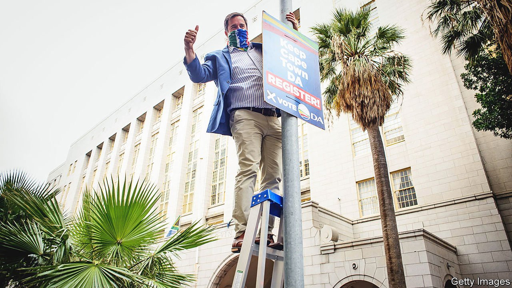
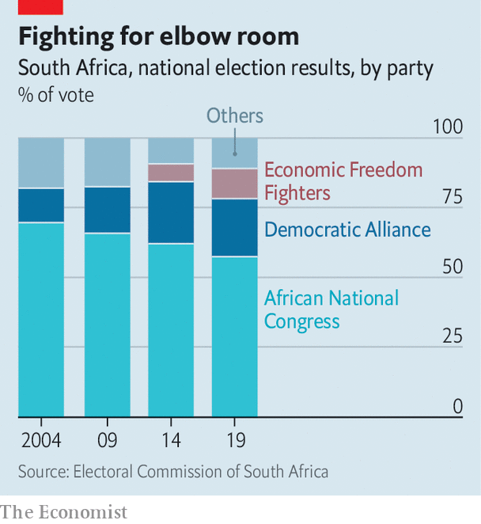

###### When the ANC withers

# South Africa’s main opposition sees coalitions ahead 

##### Will a weakening ruling party team up with liberals or the thuggish far left? 

 

> Oct 2nd 2021 

JOHN STEENHUISEN’S office in South Africa’s parliament is the lair of a political animal. The leader of the Democratic Alliance (DA), the country’s main opposition party, has election memorabilia from around the world and two large photographs of John F. Kennedy. Smaller snaps show the 45-year-old alongside British politicians, including David Cameron. A book by the former prime minister is on Mr Steenhuisen’s desk.

In Britain works by Mr Cameron are perhaps more common in charity shops than in politicians’ offices. But Mr Steenhuisen is looking ahead to when the African National Congress (ANC) falls below 50% in a general election. Though the next one is not until 2024, local elections on November 1st may serve as a bellwether. Polls suggest the ANC will win less than half of the vote in a nationwide election for the first time. That would suggest it may soon need others in order to govern nationally under South Africa’s system of proportional representation. Hence the collected wisdom, such as it is, of the man who led a coalition government in Britain.


Mr Steenhuisen (pictured) wants to work with pragmatic ANC politicians. “South Africa is in such a deep crisis that it’s going to need the rational centre,” he says. The former chief whip says there have been “feelers from the ANC side”. But many in the ruling party would rather join with the second-largest opposition party, the hard-left and thuggish Economic Freedom Fighters (EFF). If that were to happen, says Mr Steenhuisen, “that’s going to put South Africa on the fast burn towards Venezuela or Zimbabwe.”

Talk of coalition shows how far the DA has come. From 1961 to 1974 Helen Suzman of the Progressive Party, one of the DA’s forerunners, was the lone anti-apartheid voice in the all-white parliament. In the first post-apartheid elections in 1994, the Democratic Party, as it was then, won 2%. Two decades later the DA won 22%. Its growth came mostly from winning over majorities of minorities: whites, “coloured” (ie, mixed-race) South Africans and those of Indian descent, who together are about a fifth of the population.

The DA does less well among the majority, though. It had a black leader, Mmusi Maimane, but he was unceremoniously ejected in 2019 after disappointing election results. It has also vacillated over whether to support race-based policies.

 


Newer recruits are generally more sympathetic to ANC laws on, say, affirmative action than classical liberals, who dislike policies that treat people primarily as members of a group rather than as individuals. “The DA says it wants to be colour-blind, but that means wanting to retain the status quo,” argues Mr Maimane, who has now left the party. Another former black politician in the DA says: “I reject this notion that liberalism is about the fetishisation of the individual. That’s very convenient for white people and for men.”

This muddle has hurt the party’s brand. It lost hundreds of thousands of Afrikaner voters in 2019 without adding many black ones. “The DA has a major trust issue,” says Dawie Scholtz, a psephologist. He notes that, in focus groups, voters often say they like certain policies but change their minds when they learn the proposals are from the DA. “The distrust is racial: it is based on distrust about whether the party actually wants to deliver for black people.”

Many in the DA feel that the party is treated unfairly. Tony Leon, a former leader, points out that it has the country’s most racially diverse parliamentary caucus. In South Africa, he adds, voters make choices based on identity, which makes it hard for the DA, a party that he says tries to appeal to the nation as a whole, rather than to any particular racial or ethnic group.

Others in the party point out that its divisions are minor compared with those of the ANC, whose factional battles sparked mass civil unrest in July. They feel that their position on inequality is simple. Rather than race-based policies that have enriched a black elite, better to target help on the basis of need. “You don’t need a proxy for poverty,” argues Mr Steenhuisen.

Moreover, given the ANC’s decline, the DA has only to hang on to its support to become more relevant. But would its voters stomach a coalition with the ANC? Mr Steenhuisen says he would avoid the error of the Liberal Democrats in the British coalition of 2010-15, when that party lost votes by reneging on its key pledge to scrap university tuition fees. The DA would stick to its “core principles”, such as a market economy, respect for the rule of law and policies that do not target a particular race. But Mr Steenhuisen adds that the state of the country demands hard-headedness: “If the house is burning then it doesn’t matter if you’re a Marxist or a classical liberal. Your life is going to get worse.” ■

