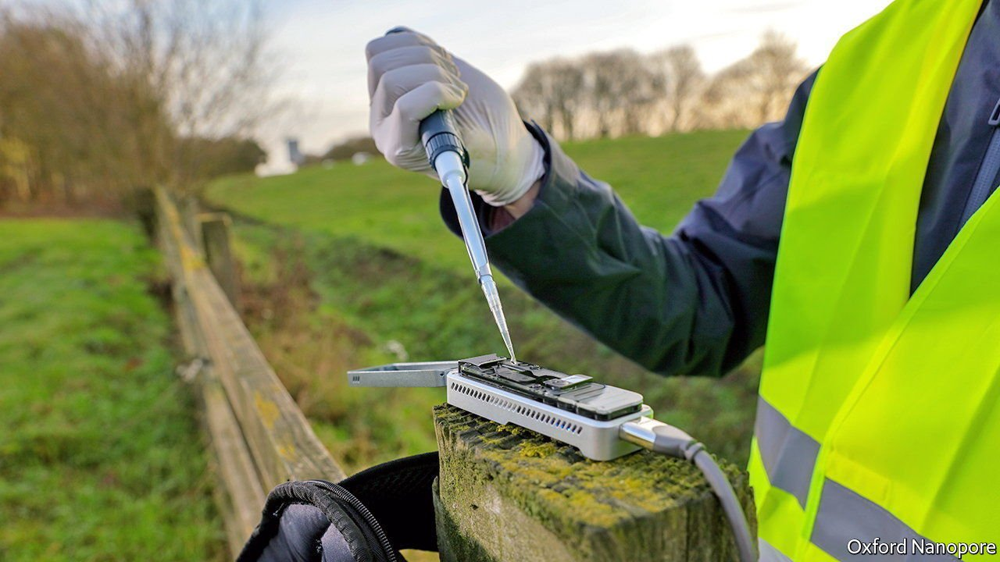
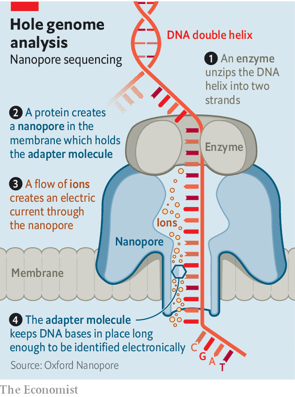

###### Nanopore gene sequencing

# An ambitious unicorn hopes to up-end DNA analysis 

##### The technology pulls genetic material through holes in proteins 

 

> Oct 2nd 2021 

GENETICISTS LIKE to compare progress in their field with the breakneck speed of innovation in computing. There, large, slow mainframes developed into fast, midsized desktops and then into the pocket-sized supercomputers known as smartphones. Similarly, the sequencing of the first human genome was announced, amid great pomp and fanfare, in 2003. It had taken 13 years and cost around $3bn. Two decades on, sequencing a human genome will set you back around $600, and might be done within a week.

Gordon Sanghera, boss of Oxford Nanopore, a firm based in the eponymous British university town, thinks, however, there is room for more. As The Economist went to press his company was set to make its debut on the London Stock Exchange. Its technology, nanopore sequencing, can cut the cost of gene analysis and reduce the time involved from days to hours or even minutes. At the same time, just as smartphones did with computing, it can make gene sequencers small enough to fit in a pocket rather than on a desktop.


Nanopore sequencing employs engineered versions of proteins that, in nature, open holes in cell membranes to allow ions (electrically charged atoms of things like potassium and chlorine) in and out. These proteins are used to punch holes in a membrane separating two chambers full of liquid, and an electrical current is applied. The DNA to be sequenced is then fed through the hole (see diagram). DNA stores its information using four different chemical bases, abbreviated as A, C, G and T. Each has a different shape, and partially blocks the pore in a different way. That causes different fluctuations in the current, allowing the sequence of bases to be read.

 


The idea of nanopore sequencing dates back to 1990s, says Dr Sanghera. But commercialising it has taken many years. One trick is to ensure DNA molecules move through pores at a predictable speed—and never go backwards—something the firm has solved with a specially designed molecular ratchet. Integrating the biological bits of the technology with the silicon ones has been tricky. And a pore does not, by itself, sense individual bases, but combinations of them. Translating those signals is done with the help of machine learning, a technology that has come into its own only in the past few years.

Nanopore sequencing offers several advantages over other approaches. Its compactness is one. Oxford Nanopore’s smallest product, the MInION, is the size of a chunky mobile phone. Existing sequencers resemble fridge-freezers or (at best) microwave ovens. The MInION’s minuteness permits field analyses, with no need to send samples off to a distant laboratory. It has been used everywhere from Norwegian glaciers to Welsh coal mines to the International Space Station.

Another advantage is speed. Previous technologies have chopped DNA into fragments, made copies and tagged them with fluorescent chemicals. That takes time. The record for sequencing an entire human genome is believed to be 13 hours. Oxford Nanopore reckons it can cut this routinely to a handful of hours. And the nanopore approach also provides a continuous read-out. Other methods deliver a result only at the end.

Chopping DNA into tiny fragments, meanwhile, makes it hard to work out what is going on in regions made up of repetitive sequences. Nanopore-based devices can read pieces of DNA millions of bases long, offering a clearer picture of what is happening. And they can sense methylation—a chemical modification of bases that is an important means by which gene expression is regulated in a body.

Launch sequence

On paper, nanopore sequencing sounds transformative. Whether that will come to pass in reality remains to be seen. Like all good tech startups, Oxford Nanopore has yet to turn a profit, though it hopes to do so within five years. (Its losses last year were £73m, or $98m, on revenues of £114m.) Julian Roberts, an analyst at Jefferies, a bank, says the world market for gene sequencing is worth perhaps $7.5bn a year and is growing “in the low teens [per cent] per year—healthy, but not spectacular”. It is dominated by Illumina, a firm based in San Diego.

But, says Mr Roberts, as with computers, better technology may create new uses, making the market bigger. Cheap, real-time gene sequencing could boost everything from cancer treatment (researchers in Norway are looking to use it to read the genomes of brain tumours during surgery) to environmental modelling to disease surveillance (the usefulness of sequencing in the covid-19 pandemic has put this application, in particular, uppermost in many epidemiologist’s minds).

The firm’s choice to list in London rather than America goes against conventional wisdom, which holds that America offers savvier investors who are more prepared to tolerate losses today for the prospect of a big payout tomorrow. And it hopes, for now, to stay British. Its shareholding structure gives Dr Sanghera (or, if he is unavailable, two other senior managers) the ability to block unwelcome takeovers. Mr Roberts points to the example of Solexa, a British firm bought by Illumina in 2006 for $600m. These days, Solexa’s technology is a foundation of Ilumina’s business, and the American company is worth $64bn. ■

