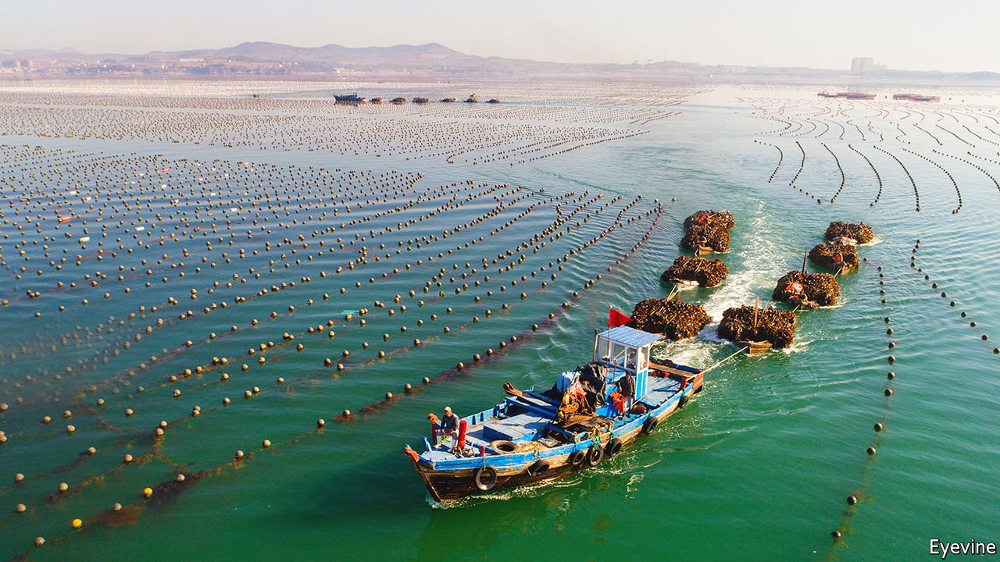
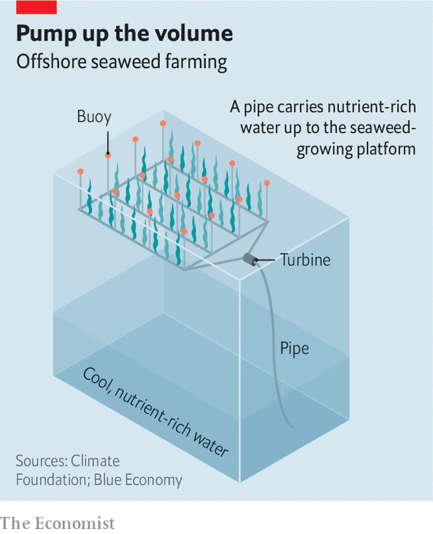

###### Aquaculture

# Floating offshore farms should increase production of seaweed 

##### And they might even help alleviate climate change 

 

> Sep 30th 2021 

IN MANY PLACES where seaweed used to thrive, often growing in vast “forests”, it is disappearing. The cause is global warming, which, by heating the ocean’s upper layer, reduces its density through thermal expansion—thus making it more buoyant. That extra buoyancy means it is less likely to mix with cooler, denser and more nutrient-rich waters below. This is bad for the marine environment in general. More specifically, it is bad for commercial seaweed farming, a business with revenues of (depending on whom you ask) between $6bn and $40bn a year.

The algae involved, particularly kelp, are popular in Asian cuisine. They are also used as fertiliser, and are processed into carrageenan, a natural binder and emulsifier employed in foods, cosmetics and drugs. Most are grown either on the seabed or on ropes attached to it (see picture above). But some are cultivated on small floating platforms.


To counter the effects of surface heating, which are particularly pronounced in the tropics, researchers are trying to improve the floating-platform approach by assisting the upwelling of cooler waters to stimulate algal growth on such platforms. This would also increase the area available for seaweed farms, by allowing them to be located well away from coastlines. An experimental floating farm installed in August, off the coast of the Philippines, by a group led by the Climate Foundation, an American charity, is one of the largest attempts so far to do this.

Pictures of a floating world

Artificial stimulation of upwelling is not a new idea. It has been touted for years as a way to regenerate kelp forests, in particular. And for good reason. With enough nutrients, fronds of giant kelp, which grow to an average length of about 30 metres, can elongate by more than 50cm a day. Only now, however, is upwelling-stimulation being attempted seriously.

The foundation’s test platform has an area of 100 square metres. It employs solar-powered turbines to suck water up from a depth of several hundred metres through flexible, cylindrical pipes. The foundation plans to experiment with wind-powered and wave-powered turbines, too.

 


If this works, which early results suggest it does, and can be scaled up, not only could such technology boost seaweed production, it might also help ecosystems that depend on seaweed forests. And—at least in theory—if part of the harvest were sacrificed by sinking it into the deep ocean, that might act as a novel form of carbon capture and storage which could help slow the warming that caused the problem in the first place.

According to Brian von Herzen, who runs the foundation, the organisation carried out smaller-scale experiments, using similar technology, in 2020. These showed that seaweed grows four times faster on platforms irrigated with upwelled water than on equivalent, unirrigated platforms. Moreover, it continues to grow during the warmest months of the year, when seaweed not so irrigated actually shrinks.

Dr von Herzen and his colleagues hope to use experience gathered from their latest rig to develop a platform that would cover an entire hectare of the ocean’s surface—100 times the area of the one just launched. To that end, they are collaborating with the Marine Bioproducts Cooperative Research Centre, a public-private partnership in Australia. At this scale, the partners estimate, a seaweed farm could pay for itself within five years.

Moreover, seaweed farms bring benefits beyond the immediate value of their crop. Seaweed is a habitat for many marine creatures, including fish. Some of these can be harvested for food. Indeed, for artificial upwelling to bring about that desirable state of affairs it may not even be necessary to farm seaweed. Ocean artUp, a project led by the Helmholtz Centre for Ocean Research in Kiel, Germany, is experimenting with the use of upwelling to encourage the growth of the small, planktonic creatures eaten by sardines.

That could help restore stocks of these fish, which are shrinking rapidly in both the Atlantic Ocean and the Mediterranean Sea. Ocean artUp, which began in 2017 and is scheduled to run until the end of this year, has concentrated on simulating and measuring exactly how artificial upwelling affects the quantities of nutrients transferred between ocean layers. One thing the project’s researchers have discovered is that if you pump too hard, some of the upwelled water simply drops back into the depths, without mixing properly. Stirring the ocean in this way may thus require the design of floating water-mixers, too, to keep the nutrients at the surface.

Meanwhile, in San Francisco, Otherlab, an independent research laboratory, is working on an underwater robot intended to screw large tethers firmly into the seabed, to ensure that floating seaweed farms stay put, and can better survive stormy weather. Otherlab is part of a consortium paid for by ARPA-e, an American-government agency that is exploring the idea of using seaweed as a source of biofuel.

Those squeamish about anything that smacks of geoengineering—in other words, technology intended to change the world’s climate in ways that oppose global warming—view artificial upwelling with scepticism. They argue that it could damage other parts of ocean ecosystems, and might even create unwanted side-effects that end up accelerating climate change rather than slowing it. Proponents, conversely, see these early efforts, at least, as simply restoring upwelling that has been suppressed by climate change.

Stratified, not stirred

A study published last year in Nature Climate Change, by a team of researchers from America and China, suggested that the overall stratification of the world’s oceans has increased by 5% since 1960, with up to 20% more stratification in the tropics. This is despite any countervailing effect of the more extreme weather that global warming brings, which leads to greater churning of the oceans. Any such churning is overwhelmed by the extra buoyancy of the warmer surface layers.

Cooling the ocean surface by encouraging upwelling might also have a direct effect on the local air temperature. Warmer surface waters keep the atmosphere above warmer, too. Cooler waters do the reverse. But the technology would have to be deployed on a vast scale—over millions of hectares of the ocean’s surface—before it had a noticeable effect on the atmosphere.

As Dr von Herzen, who does not advocate geoengineering, points out, any such plans would face more than just economic barriers. The London Protocol, an international legal framework that regulates marine pollution, sets stringent limits on deliberate geoengineering of the oceans. The protocol does, however, tolerate justifiable commercial exploitation, along with some carbon capture.

If large-scale seaweed farming were, nevertheless, to be considered for geoengineering, there would be a certain irony in that fact. To do this would mean dumping the algae thus grown on the ocean floor, to stop the carbon in them returning to the atmosphere. That would probably work in the short term. But it was just such a process of sedimentation of organic matter which, over millions of years, produced modern-day petroleum fields. And it is their oil, furiously pumped up for over a century, that has generated much of the excess of greenhouse gases of which the world is now trying to rid itself. ■

For more coverage of climate change, register for The Climate Issue, our fortnightly , or visit our 

An early version of this article was published online on September 29th 2021

