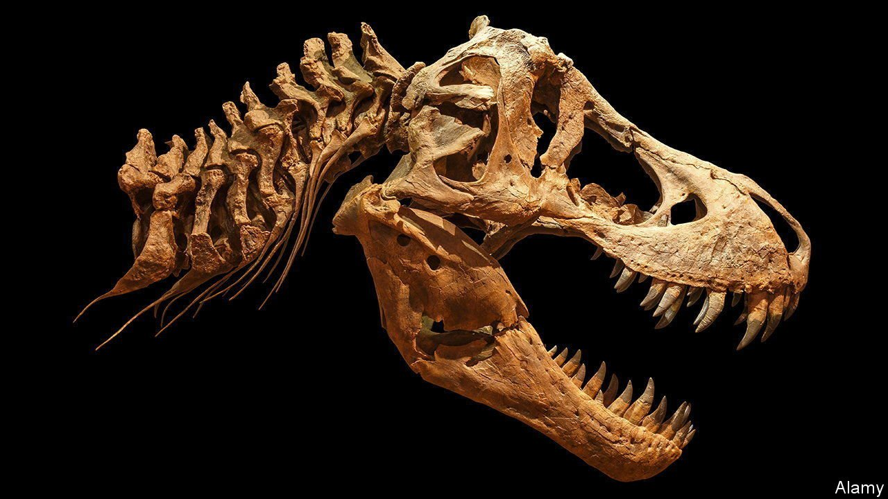

###### Dinosaur love bites

# Tyrannosaurs may have nibbled each other when mating 

##### That is the message of bite marks on their jaws 

 

> Sep 29th 2021 

HOW DO PORCUPINES mate? Very carefully! An old joke, but one that applies even more forcefully to creatures with big, sharp teeth than it does to those with big, sharp spines. And few creatures have had teeth bigger and sharper than those of Tyrannosaurus rex.

How tyrannosaurs mated will never be known for sure. But Caleb Brown of the Royal Tyrrell Museum of Palaeontology, in Alberta, Canada, thinks, as he describes in Paleobiology, that it might have involved what amounts to the ultimate in love-biting. Previous examinations of tyrannosaur skull bones have revealed scars that look as if they were delivered by other tyrannosaurs. Aware of the fact that many animal species bite one another during battles over access to mates, and sometimes even bite their mates during courtship (an endearment from which Homo sapiens is not exempt), he and his colleagues thought it worth looking at these bites in more detail.


They therefore tracked down every tyrannosaur skull fragment that they could lay their hands on—528 bones from 202 individuals. They identified 324 wounds grievous enough to have damaged the bones in question, but which also showed signs of healing, and thus indicated that they had not been fatal (which wounds inflicted during the mating fights and rituals of living species rarely are). Measuring the sizes and shapes of these wounds confirmed that they were probably tyrannosaur bites.

Tellingly, such bites seemed confined to older animals. Skull bones that clearly belonged to animals which were unlikely to have been sexually mature, of which the team obtained 18, showed no signs of having been bitten. Bites started to appear on the skulls of tyrannosaurs which were half the size of adults, with three of 17 such specimens (18%) showing relevant healed bites. In fully grown adults that proportion rose to 60%.

Nor were wounds distributed at random. They were, rather, concentrated around the centre and base of the lower jaw. This indicates they were inflicted from a particular, consistent posture. That, in turn, suggests the bites involved were part of a ritual. Whether this was ritual fighting between males for access to females or was part of the process by which males and females checked each other out in a search for suitable mates is impossible to determine—not least because no one has worked out a way to identify the sex of a tyrannosaur skull. What does seem clear, however, is that not all sharp-toothed dinosaurs behaved in this way. When Dr Brown and his colleagues looked at the skulls of smaller carnivorous dinosaurs like Velociraptor, they found no evidence of these animals biting each other’s faces.

An early version of this article was published online on September 29th 2021

