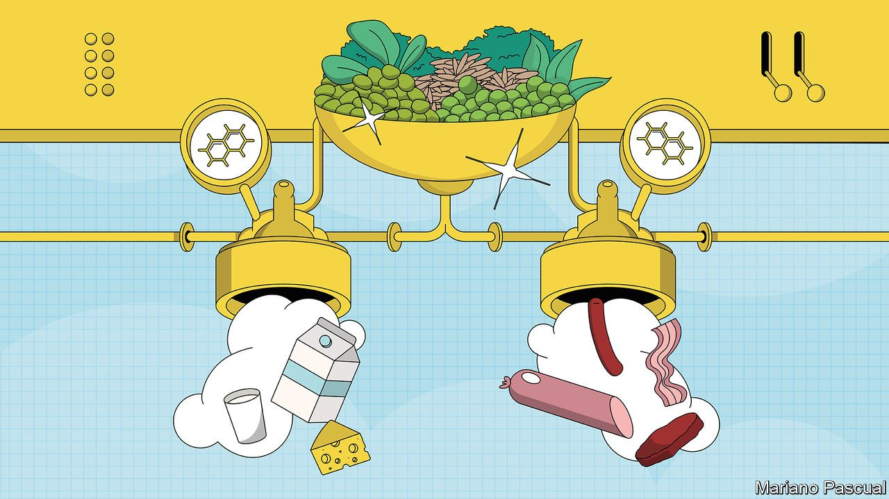
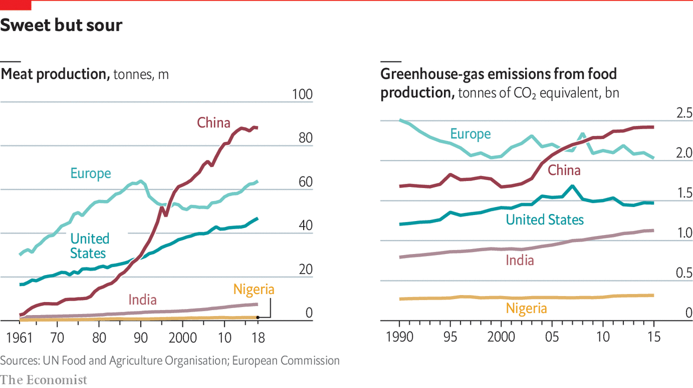

###### Mooving on

# Cows are no longer essential for meat and milk 

##### You can do it all with plants 

 

> Sep 28th 2021 

IT’S LUNCHTIME in El Segundo, a small coastal town in Los Angeles County, around 130km west of where the McDonald brothers opened their first burger stand in 1948. Burgers are on the menu today. They come three to a tray, glistening in their brioche buns, piled high with lettuce, tomatoes, cheese and a creamsicle-orange sauce that tastes like mayonnaise-mellowed ketchup. Alongside them are other greatest hits from American fast-food menus: sausages nestled into long hot-dog buns with sautéed bell peppers and onions; sausage patties on flat English muffins; deep-fried chunks of white meat that look and taste like chicken nuggets.

Nothing on the table contains animal products. The brioches are vegan; what looks like meat is made from pea protein. Everything was, as American fast-food usually is, delicious after the first bite and regret-inducing by the third. Though the nuggets were slightly softer than chicken, the burger lacked beef’s mineral funk and the sausage lacked pork’s telltale grease, all were a far cry from the worthy-tasting frozen pucks of compressed grains and seasonings, desiccated beany cylinders and mulchy “tenders” that once were the only meatless burger, sausage and chicken substitutes on the market.


All of these products began their not-exactly-life in the laboratories just down the hall from where they were served, at the research and development headquarters of Beyond Meat. Ethan Brown founded the firm back in the worthy-puck days of 2009. The company now sells its products in more than 80 countries, with net revenues in 2020 of $406.8m, up more than 36% from the previous year. Having gone public in 2019 it is now worth $7bn.

Impossible Foods, its main rival in the plant-based meat market, has yet to go public; it reportedly plans to do so later this year or early next. The companies are not following exactly the same strategy. Impossible began at the high end; it has partnered with chefs such as David Chang—whose Momofuku empire spans America, Canada and Australia. Beyond has focused on more popular fast-food chains such as, in America, McDonald's and Pizza Hut. But both are available in a wide range of American supermarkets, their wares displayed right next to the ground beef.

Cowless beef is following the path of cowless dairy. Milks made from soya and other plants were until recently an oddity consumed mainly by then-rare vegans and the lactose-intolerant. They are now offered at coffee bars and shelved in grocery aisles around the world. This is great news for those who cannot digest cow’s milk—a majority of the world’s population. It has also, rather surprisingly, proved popular with a great many people not thus constrained. That is good news for coffee-bar owners: plant-based milks are more profitable than the cow-based variety. The non-dairy-dairy business is worth $20bn a year worldwide. In 2020 plant-based milks accounted for 15% of America’s milk market by value.

Making meat and milk substitutes from plant-based ingredients is neither new nor complicated. It is mainly a matter of rearranging and re-proportioning the basic materials from which both plants and animals are made—proteins, fats and carbohydrates such as sugars and starch. Meat is mostly muscle, and muscle is mostly protein with a side order of fat. Asian Buddhists who eschew animal protein have been kneading flour and water together, washing away the starch and making mock meat from wheat gluten, a protein, for more than 1,500 years. Milk is fat, protein, sugars, minerals and water. Soy milk—the fluid left after grinding soaked soybeans, which contain fat, protein and sugars, with water—has been consumed in China for centuries.

Henry Ford, an early industrialiser of plant-based milks as well as a carmaker, production-system innovator and anti-Semite, saw animals as factories rearranging plant components in a way that could easily be improved on. “It is a simple matter,” he wrote, “to take the same cereals that the cows eat and make them into a milk which is superior to the natural article and much cleaner.” Oats, for example, can be mixed with water, mechanically milled, treated with enzymes that turn their starches into sugars and filtered to remove the bran.

Milking it

That an array of grains, beans and tree nuts can be treated similarly is, at a basic biological level, not all that surprising. The nutrients in seeds and grains provide energy and raw material to the next generation of plants—just as milk provides the same benefits to baby mammals. That liquidising the former might provide something like the latter makes sense. But not all dairy alternatives are created equal. Rice milk is almost nutrient-free; coconut milk abounds in saturated fat; oat milk is low in sugar, and normally has some added, along with minerals and vitamins—but unlike cow’s milk it is a source of fibre. The costs of production vary, too, both financially and environmentally. Almond milk is exceptionally resource-intensive. It takes more than four litres of water to produce an almond—and most of the world’s almonds are grown in drought-stricken California.

Many consumers believe these products to be better for their health, the environment and the well-being of animals than dairy milk. As the range of plants milked has increased, the likelihood of a consumer finding one to their particular taste has gone up. So has the pleasure that comes from having a particular taste indulged. Specifying your milk signals individuality. All this has helped push plant-based milks well beyond a vegan and lactose-intolerant niche.

Plant-based foods aim to follow them. The scientists at Beyond Meat and its competitors take Ford’s approach; they look at the components of an animal product, in this case meat, and work out how to replace them with components derived directly from plants. But they work at a far higher level of sophistication. “We think of our [food] as a tech product,” says Dennis Woodside, Impossible’s president.

Details of the plant-based-meat producers’ methods—which components they pull from where, and how they process and combine them—are proprietary. But making ground meat without animals first requires that proteins from plants such as peas or soybeans be isolated, usually by hulling and milling the legumes into flour. The isolated protein then gets mixed with binders such as potato starch, fats such as coconut oil, salt and other flavours so that it approximates the appearance, taste and texture of that to which it is an alternative. The need to understand their progress in this direction makes the scientists working on them, as one technician at Beyond’s El Segundo labs put it, “experts in meat.” Know thine enemy.

After lunch a team of Beyondists cooks a nubbin of plant-based beef in a sealed glass test tube, then punctures the seal with a syringe to measure the flavour compounds with a gas chromatograph. Another loads a Beyond Burger into a floor-to-ceiling vice called the “e-mouth” which measures how much force is needed to squeeze it. A third examines lunar-looking images taken with a microscope of raw and cooked animal and pea proteins with different additives and under various sorts of pressure—all in the service of making the products as indistinguishable from animal meat as possible.

What Beyond does not do, but Impossible does, is add an extra component called haem: a ring-shaped molecule with an iron atom at its heart. The iron is catnip to oxygen molecules, which flock to it; as a result haem is incorporated into various proteins that are in the business of carrying oxygen molecules around, including haemoglobin, found in blood, and myoglobin, found in muscle. When meat is cooked, according to one of Impossible’s patents, the haem it contains catalyses a wide range of chemical reactions between other molecules in the meat, producing a characteristic suite of flavours and odours obtainable in no other way.

Though plants have neither blood nor muscle, they too can have uses for haem. Soybeans make a haem-carrying protein called leghaemoglobin in their roots to soak up oxygen that might otherwise interfere with the soil microbes making the nitrogen products the plants need. Impossible has engineered the haem-making genes from soy into a widely used yeast; it adds the molecules thus produced to its burgers, giving them a “bloody” look and producing distinctive flavours on cooking.

Mr Brown of Beyond, whose burgers get their redness from beet extract, calls genetic modification “a shortcut” that risks “unintended consequences”. There is no evidence that the use of haem produced in genetically modified yeast has any such consequences. The yeast involved has long been used to make various enzymes for the food-processing industry. America’s Food and Drug Administration is happy with the Impossible Burger, and most taste tests have found it the most beef-like of the crop.

The presence of an ingredient made by means of genetic modification, though, means that Impossible has yet to crack some markets, including Europe and (so far) China. Beyond, for its part, has opened production facilities in the Netherlands and China, where it makes Beyond Pork, a product specifically designed for the burgeoning Chinese market.

Telling porkies

If your taste in pig meats runs more towards rashers than mince, neither company, as yet, has an offering for you. But others do. In a modest industrial park in upstate New York, Gavin McIntyre stops before a broad tray, perhaps eight centimetres deep, that holds what looks like an unusually well-sculpted snow mound: solid and stark white, rising above the top of the tray in a gentle hillock. The substance feels doughy but solid, and slightly sticky.

This is neither a plant nor an animal. It is a mycelium—a network of fungal fibres. Usually, mycelium grows into mushrooms. But by manipulating growing conditions, mycelium can be made to grow into other shapes fairly quickly. Mr McIntyre’s firm, Atlast, harvests thousands of kilograms of mycelium in slab form, grown on agricultural and forestry waste products, every 14 days. The slabs are brined, smoked, flavoured and sliced into what his company calls “bacon without the oink”. It hits the mark. While plant-based bacons can be all shattering crunch and salt, mycelium bacon has a satisfying chew and a deep umami taste. On its own, nobody would mistake it for the real thing (not nearly greasy enough), but in a sandwich or salad, with mayonnaise or a creamy dressing to balance out its leanness, it fills the role admirably.

 


Atlast is not the only firm trying to turn fungus into meat. Meati, a five-year-old startup in Boulder, Colorado, produces a stunningly realistic chicken breast, well seasoned with just the right fibrous chewiness and residual umami funk. Other companies offer mycelium steaks, which are less successful. Though they look the part, the lack of fat gives them an excessively uniform mouthfeel. It is a bit like eating Bovril-soaked pressed tofu—not bad at all, but also not steak.

The market for such things already goes well beyond the ranks of vegans; Mr Brown cites studies that found the vast majority of people who bought Beyond’s products also buy animal protein. Indeed some vegetarians and vegans look on the new meat substitutes with a certain scorn. What do they offer that tofu and beans do not? The answer, obviously, is carefully contrived, delicious meatiness.

A lot of people looking for the authentic in their food perceive the healthy, the natural, the pure and the environmentally friendly as one and the same. Non-meat meats are a place where that beguiling gestalt breaks down. Many are highly processed products—the antithesis of the purity prized by those who favour whole foods. Yes, they are plant-based. But making those plants meaty removes much of what is healthy about plants. “Once processed into solely protein, legumes and beans no longer exist”, Larissa Zimberoff, a journalist, argues in her magnificent book “Technically Food”.

That said, the foods that the most popular plant-based meats are intended to replace—burgers, breaded chicken, sausages and the like—are not particularly healthy, either. There is, though, one big difference. Meat alternatives, true to their tech-industry inspiration, can be continually upgraded, as the Beyond labs in El Segundo show. The Impossible burger currently on the market also feels and tastes more like meat than the one available just a few years ago. Once producers have taste and texture licked, they can turn their attention to health in various ways. Making things more meat-like and at the same time more healthy is not impossible, if the market wants such things.

Continuous improvement and the R&amp;D needed to provide it, though, add to a basic problem for the meat alternatives: price. Ground meat, sausages and the like are cheap. The better plant-based burgers remain more expensive in most markets than standard beef—closer to the price of organic, grass-fed beef. Though they are clearly preferable in terms of greenhouse-gas emissions, and infinitely better in terms of reduced animal suffering, those costs are externalised. The cost visible at the checkout is, for many consumers, the one that matters most.

How far prices can come down and quality further improve has yet to be seen. Meat and dairy incumbents are hedging their bets. Major meat producers such as Cargill, JBS and Tyson Foods have their own plant-based lines, just as Danone and Chobani are getting into plant-based milks. But “strategically,” says Florian Schattenmann, chief technology officer at Cargill, “we see this as an ‘and’ story. A car manufacturer does not only make minivans.” Just as carmakers produce different models for different consumer needs, so meat producers increasingly understand they need plant-based as well as animal offerings.

The alternative view is that, in carmaking terms, this is not a matter of additional product lines but of a new sort of drive train for everything. In this view meat alternatives are to raising livestock what batteries and electric motors are to the fuel tank and internal-combustion engine: a successor technology that will find its way into all the products, rather than be a distinct product line itself. “Ultimately,” says Impossible’s Mr Woodside, “we want to replace the animal.” That is a worthy aim, but one that might require a bit of help from the animals themselves. ■

 This article was changed on September 29th to show the correct fast-food chains where Beyond burgers are available, and to reflect that Beyond do their tests on plant-based beef.


Mooving on: Cows are no longer essential for meat and milk*


